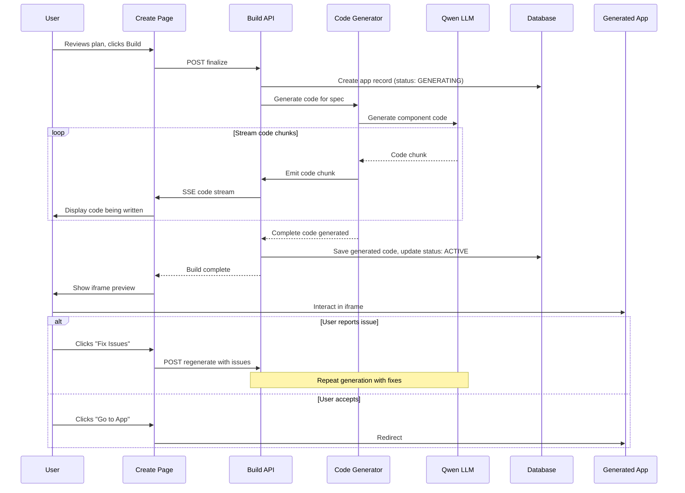

# Add Code Generation & Live Preview System

## Problem Statement

The current system shows a mockup preview BEFORE the app is built, which is illogical. Users need to see the actual built app after generation, with the ability to iterate on issues.

## Current vs. Proposed Flow

**Current Flow:**

```
Questions → Build Spec → Generate Plan → Show Mockup Preview → Click "Build" → Create DB Record → Redirect
```

**Proposed Flow:**

```
Questions → Build Spec → Generate Plan → Click "Build" → [CODE GENERATION WITH STREAMING] → Live Preview in Iframe → Report Issues OR Accept → Redirect
```

## Architecture Overview



## Implementation Plan

### 1. Add Generated Code Storage to Database Schema

**File:** `prisma/schema.prisma`

Add fields to the `App` model:

```prisma
model App {
  // ... existing fields ...
  generatedCode Json?    // Store generated component code
  generationLog  Json?    // Log of generation process
  buildStatus   BuildStatus @default(PENDING)
}

enum BuildStatus {
  PENDING
  GENERATING
  ACTIVE
  FAILED
}
```

Run migration: `npx prisma migrate dev --name add_generated_code`

### 2. Create Code Generator Module

**New File:** `src/lib/scaffolder/code-generator.ts`

This module generates React component code from the ProjectSpec:

```typescript
export interface GeneratedCode {
  pageComponent: string;      // Main page.tsx code
  formComponent?: string;      // Optional separate form component
  tableComponent?: string;     // Optional separate table component
  chartComponent?: string;     // Optional separate chart component
  types?: string;              // TypeScript types
}

export interface CodeGenerationChunk {
  type: 'status' | 'code' | 'complete' | 'error';
  component?: 'page' | 'form' | 'table' | 'chart' | 'types';
  content: string;
  progress: number;
}

export async function* generateAppCode(
  spec: ProjectSpec,
  appId: string
): AsyncGenerator<CodeGenerationChunk>
```

**Key responsibilities:**

- Build LLM prompts for generating React components
- Stream code generation process
- Yield chunks with component type and content
- Parse and validate generated code
- Return complete `GeneratedCode` object

**Code Generation Strategy:**

- Generate a single `page.tsx` file that contains all logic
- Include inline TypeScript interfaces for data types
- Use existing primitive components when beneficial
- Generate custom components when needed for specific features
- Include proper imports, type safety, and error handling

### 3. Update Finalize API to Generate Code

**File:** `src/app/api/scaffolder/route.ts`

Modify `handleFinalize` function:

**Current:**

```typescript
async function handleFinalize(userId: string, conversationId: string) {
  // Load spec
  // Validate spec
  // Create app record
  // Redirect
}
```

**New:**

```typescript
async function handleFinalize(userId: string, conversationId: string) {
  // Load spec and validate
  
  // Create app with GENERATING status
  const app = await prisma.app.create({
    data: {
      userId,
      name: spec.name,
      description: spec.description,
      spec: spec as unknown as object,
      config: appConfig as unknown as object,
      data: [],
      status: 'ACTIVE',
      buildStatus: 'GENERATING', // NEW
    },
  });
  
  emitStatus(conversationId, 'build', 'Starting code generation...', {
    progress: 10,
  });
  
  // Generate code with streaming
  const generatedCode: GeneratedCode = {
    pageComponent: '',
    types: '',
  };
  
  for await (const chunk of generateAppCode(spec, app.id)) {
    if (chunk.type === 'status') {
      emitStatus(conversationId, 'build', chunk.content, {
        progress: chunk.progress,
      });
    } else if (chunk.type === 'code') {
      // Emit code chunk for real-time display
      emitCodeChunk(conversationId, {
        component: chunk.component,
        code: chunk.content,
        progress: chunk.progress,
      });
      
      // Accumulate code
      if (chunk.component === 'page') {
        generatedCode.pageComponent += chunk.content;
      } else if (chunk.component === 'types') {
        generatedCode.types += chunk.content;
      }
    } else if (chunk.type === 'complete') {
      break;
    } else if (chunk.type === 'error') {
      throw new Error(chunk.content);
    }
  }
  
  // Save generated code
  await prisma.app.update({
    where: { id: app.id },
    data: {
      generatedCode: generatedCode as unknown as object,
      buildStatus: 'ACTIVE',
    },
  });
  
  emitStatus(conversationId, 'build', 'Code generation complete!', {
    severity: 'success',
    progress: 100,
  });
  
  return NextResponse.json({
    success: true,
    app: {
      id: app.id,
      name: app.name,
      url: `/apps/${app.id}`,
      generatedCode,
    },
  });
}
```

### 4. Add Code Streaming Endpoint

**New File:** `src/app/api/scaffolder/code-stream/[conversationId]/route.ts`

Similar to status SSE, but streams generated code chunks:

```typescript
export interface CodeChunk {
  id: string;
  component: 'page' | 'form' | 'table' | 'chart' | 'types';
  code: string;
  progress: number;
  timestamp: string;
}

// SSE endpoint for streaming generated code
export async function GET(
  request: NextRequest,
  { params }: { params: { conversationId: string } }
)

export function emitCodeChunk(
  conversationId: string,
  chunk: Omit<CodeChunk, 'id' | 'timestamp'>
)
```

### 5. Create Code Display Component

**New File:** `src/components/scaffolder/CodeViewer.tsx`

Displays streaming code generation:

```typescript
interface CodeViewerProps {
  conversationId: string;
  onComplete?: (code: GeneratedCode) => void;
}

export function CodeViewer({ conversationId, onComplete }: CodeViewerProps)
```

**Features:**

- Connects to code stream SSE endpoint
- Displays code chunks with syntax highlighting (use `prism-react-renderer` or `react-syntax-highlighter`)
- Shows which component is being generated
- Accumulates code in tabs (Page, Form, Table, etc.)
- Displays progress bar
- Toggleable between "Status View" and "Code View"

### 6. Create Live Preview Component

**New File:** `src/components/scaffolder/LivePreview.tsx`

Shows the generated app in an iframe with controls:

```typescript
interface LivePreviewProps {
  appId: string;
  appName: string;
  onReportIssue?: () => void;
  onAccept?: () => void;
}

export function LivePreview({ appId, appName, onReportIssue, onAccept }: LivePreviewProps)
```

**Features:**

- Iframe pointing to `/apps/${appId}?preview=true`
- Responsive controls: mobile/tablet/desktop view toggle
- Action buttons:
  - "Report Issue & Regenerate" - Opens issue dialog
  - "Accept & Go to App" - Redirects to app
- Loading states
- Error handling if app fails to load

### 7. Update Create Page UI Flow

**File:** `src/app/(main)/create/page.tsx`

Modify the finalization flow:

**Remove:**

- Early AppPreview component (the mockup)
- Immediate redirect after finalize

**Add:**

- Code generation phase with CodeViewer
- Live preview phase with LivePreview component
- Issue reporting dialog
- State management for generation phases

**New States:**

```typescript
const [buildPhase, setBuildPhase] = useState<'idle' | 'generating' | 'preview' | 'complete'>('idle');
const [generatedCode, setGeneratedCode] = useState<GeneratedCode | null>(null);
const [showCodeView, setShowCodeView] = useState(false); // Toggle between status and code
```

**UI Flow:**

```typescript
{buildPhase === 'generating' && (
  <>
    {/* Toggle between status and code view */}
    <div className="flex gap-2 mb-4">
      <Button onClick={() => setShowCodeView(false)} variant={!showCodeView ? 'primary' : 'ghost'}>
        Status View
      </Button>
      <Button onClick={() => setShowCodeView(true)} variant={showCodeView ? 'primary' : 'ghost'}>
        Code View
      </Button>
    </div>
    
    {showCodeView ? (
      <CodeViewer 
        conversationId={conversationId}
        onComplete={(code) => {
          setGeneratedCode(code);
          setBuildPhase('preview');
        }}
      />
    ) : (
      <StatusPanel
        messages={statusMessages}
        currentPhase={currentPhase}
        showTechnicalDetails={showTechnicalDetails}
        onToggleTechnical={setShowTechnicalDetails}
      />
    )}
  </>
)}

{buildPhase === 'preview' && generatedAppId && (
  <LivePreview
    appId={generatedAppId}
    appName={state?.spec?.name || 'Your App'}
    onReportIssue={handleReportIssue}
    onAccept={() => router.push(`/apps/${generatedAppId}`)}
  />
)}
```

### 8. Implement Dynamic Code Execution

**Challenge:** How to render generated code dynamically?

**Option A: Write to Filesystem (Complex)**

- Write generated code to `src/app/apps/[appId]/generated/` directory
- Requires filesystem write permissions
- Next.js needs to recompile
- Not ideal for production

**Option B: Dynamic Component Evaluation (Preferred)**

- Store generated code in database
- Use `new Function()` or eval in controlled environment
- Create a wrapper component that executes the code
- More flexible and production-ready

**New File:** `src/app/apps/[appId]/generated-runtime.tsx`

```typescript
'use client';

export function GeneratedRuntime({ 
  code, 
  appId, 
  spec, 
  initialData 
}: GeneratedRuntimeProps) {
  // Safely evaluate and render generated code
  // Provide context (appId, spec, data) to generated component
  // Handle errors gracefully
}
```

**Update:** `src/app/apps/[appId]/page.tsx`

```typescript
export default async function AppPage({ params }: PageProps) {
  // ... auth and loading ...
  
  const generatedCode = app.generatedCode as unknown as GeneratedCode | null;
  
  if (generatedCode?.pageComponent) {
    // Use generated code runtime
    return (
      <GeneratedRuntime
        code={generatedCode.pageComponent}
        appId={app.id}
        spec={spec}
        initialData={data}
      />
    );
  } else {
    // Fallback to primitive runtime
    return (
      <AppRuntime
        appId={app.id}
        name={app.name}
        description={app.description}
        spec={spec}
        initialData={data}
      />
    );
  }
}
```

### 9. Add Issue Reporting & Regeneration

**New File:** `src/app/api/scaffolder/regenerate/route.ts`

```typescript
POST /api/scaffolder/regenerate
{
  appId: string;
  issues: string; // User-described issues
}

// Loads existing spec and generated code
// Calls LLM with issues as context
// Generates fixed code
// Updates app record
// Returns new code
```

**UI Component:** Issue reporting dialog in LivePreview

```typescript
<Dialog open={showIssueDialog}>
  <DialogContent>
    <h3>Describe the issues you're experiencing</h3>
    <textarea 
      value={issueDescription}
      onChange={(e) => setIssueDescription(e.target.value)}
      placeholder="e.g., The date picker isn't showing, the table columns are in the wrong order..."
    />
    <Button onClick={handleRegenerateWithIssues}>
      Regenerate with Fixes
    </Button>
  </DialogContent>
</Dialog>
```

### 10. Update StatusPanel Phase

**File:** `src/components/ui/StatusPanel.tsx`

The 'build' phase now represents actual code generation. Update PHASE_INFO if needed to reflect this.

## Code Generation Prompt Strategy

The LLM prompt for code generation should include:

1. **Context:** Full ProjectSpec (fields, views, config)
2. **Requirements:** 

   - Generate a complete Next.js page component
   - Use TypeScript with proper types
   - Include form for data entry
   - Include views (table, chart) based on spec
   - Use Tailwind CSS for styling
   - Follow the project's design system (colors from spec)

3. **Constraints:**

   - Must be a single page.tsx file
   - Must export default async function
   - Must handle data CRUD via `/api/apps/[appId]/data`
   - Must be production-ready with error handling

4. **Examples:** Provide 1-2 examples of well-structured generated pages

## Testing Strategy

1. **Code Generation Test:**

   - Create test spec
   - Generate code
   - Verify code is syntactically valid TypeScript
   - Check for required imports and exports

2. **Streaming Test:**

   - Monitor SSE connections
   - Verify code chunks arrive in order
   - Check progress updates

3. **Preview Test:**

   - Generate simple app
   - Load in iframe
   - Verify it renders correctly
   - Test CRUD operations work

4. **Iteration Test:**

   - Report issue
   - Verify regeneration triggers
   - Check that fixes are applied

## Migration Path

**Phase 1: Add Code Generation (Keep Fallback)**

- Implement code generation system
- Keep existing primitive runtime as fallback
- Apps without generated code use primitives

**Phase 2: Gradual Rollout**

- New apps use code generation
- Existing apps continue using primitives
- Monitor performance and issues

**Phase 3: Full Transition (Optional)**

- Regenerate existing apps with code gen
- Deprecate primitive-only mode

## Security Considerations

1. **Code Execution:**

   - Generated code runs client-side only
   - No server-side eval
   - Sandbox iframe with restricted permissions

2. **Code Storage:**

   - Validate generated code before storing
   - Check for malicious patterns
   - Limit code size

3. **LLM Safety:**

   - Validate LLM responses
   - Have fallback for generation failures
   - Rate limit regeneration requests

## Files to Create/Modify

**New Files:**

1. `src/lib/scaffolder/code-generator.ts` - Core code generation logic
2. `src/app/api/scaffolder/code-stream/[conversationId]/route.ts` - Code streaming endpoint
3. `src/app/api/scaffolder/regenerate/route.ts` - Regeneration with fixes
4. `src/components/scaffolder/CodeViewer.tsx` - Code display component
5. `src/components/scaffolder/LivePreview.tsx` - Iframe preview component
6. `src/app/apps/[appId]/generated-runtime.tsx` - Dynamic code executor

**Modified Files:**

1. `prisma/schema.prisma` - Add code storage fields
2. `src/app/api/scaffolder/route.ts` - Update handleFinalize
3. `src/app/(main)/create/page.tsx` - New UI flow
4. `src/app/apps/[appId]/page.tsx` - Support generated code
5. `src/components/scaffolder/index.ts` - Export new components

## Success Criteria

- [ ] Code generation produces syntactically valid React components
- [ ] Code streaming shows real-time progress
- [ ] Users can toggle between status view and code view
- [ ] Live preview loads generated app in iframe
- [ ] Preview is interactive and functional
- [ ] Users can report issues and trigger regeneration
- [ ] Regeneration applies fixes successfully
- [ ] Accept button redirects to working app
- [ ] System gracefully handles generation failures