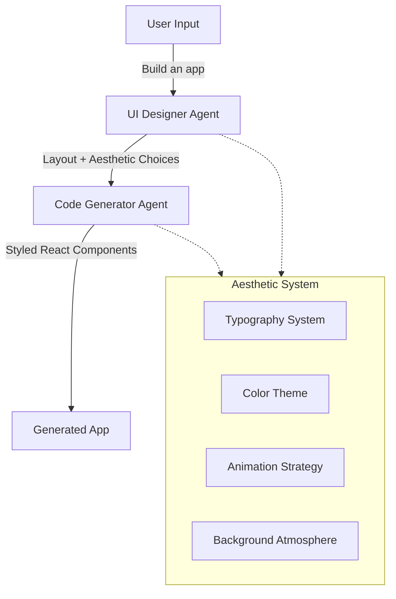

# Artistic UI Designer Update Plan

## Problem

The current UI Designer and Code Generator produce generic, predictable designs with:

- Overused fonts (Inter, Roboto, system fonts)
- Generic color schemes (purple gradients on white)
- Predictable layouts and patterns
- Lack of distinctive character and atmosphere

## Solution Architecture

Update both the UI Designer and Code Generator to collaborate on creating distinctive aesthetics:



## Implementation

### 1. Extend Layout Proposal Schema

**File**: [`src/lib/scaffolder-v2/agents/ui-designer.ts`](src/lib/scaffolder-v2/agents/ui-designer.ts)

Add aesthetic metadata to the layout proposal:

```typescript
const LAYOUT_PROPOSAL_SCHEMA = `{
  "layout": { ... existing layout structure ... },
  "aesthetics": {
    "theme": "cyberpunk|brutalist|neo-tokyo|pastel-dream|terminal|glassmorphic|etc",
    "typography": {
      "heading": "font family for headings",
      "body": "font family for body text",
      "accent": "font family for special elements"
    },
    "colorPalette": {
      "primary": "dominant color",
      "accent": "sharp accent color",
      "background": "base background approach",
      "isDark": boolean
    },
    "motion": {
      "intensity": "subtle|moderate|dramatic",
      "pageLoadStrategy": "fade|stagger|cascade|reveal",
      "interactions": ["hover-lift", "pulse-on-active", etc]
    },
    "backgroundStyle": {
      "type": "gradient|geometric|noise|mesh|particles|svg-pattern",
      "description": "detailed background approach"
    }
  },
  "reasoning": "string",
  "responsiveNotes": "string"
}`;
```

### 2. Update UI Designer System Prompt

**File**: [`src/lib/scaffolder-v2/agents/ui-designer.ts`](src/lib/scaffolder-v2/agents/ui-designer.ts)

Replace `UI_DESIGNER_SYSTEM_PROMPT` (lines 49-76) with enhanced artistic guidance:

```typescript
const UI_DESIGNER_SYSTEM_PROMPT = `You are an artistic UI designer creating distinctive, memorable frontends for an AI app builder.

CRITICAL: You tend to converge toward generic, "on distribution" outputs. Avoid "AI slop" aesthetics at all costs.

## Design Philosophy

Create frontends that surprise and delight through:
1. Distinctive typography choices
2. Cohesive aesthetic themes with personality
3. Thoughtful motion and micro-interactions
4. Atmospheric backgrounds with depth

## Typography Guidelines

Choose fonts that are beautiful, unique, and interesting:

EXCELLENT CHOICES (vary between these and others):
- Display: Playfair Display, Crimson Pro, Cormorant, Spectral, Fraunces, Outfit, Cabinet Grotesk
- Sans: DM Sans, Manrope, Plus Jakarta Sans, Sora, Satoshi, Archivo, Poppins, Lexend
- Mono: JetBrains Mono, Fira Code, IBM Plex Mono, Space Mono, Courier Prime
- Experimental: Bebas Neue, Righteous, Orbitron, Audiowide, Bungee

AVOID AT ALL COSTS:
- Inter, Roboto, Arial, Helvetica, system-ui
- Space Grotesk (overused in AI generations)
- Any default system fonts

Mix font families intentionally:
- Serif headings + sans body
- Display headings + geometric body
- Mono accents + sans primary

## Color & Theme Guidelines

Commit to a strong aesthetic with personality:

THEME ARCHETYPES (choose one and commit):
1. **Cyberpunk**: Neon pinks/blues on deep blacks, glowing effects
2. **Brutalist**: Bold blacks, whites, yellows, harsh geometric shapes
3. **Neo-Tokyo**: Deep purples, electric blues, kanji-inspired elements
4. **Pastel Dream**: Soft pastels (lavender, mint, peach) with depth
5. **Terminal**: Matrix green on black, monospace, retro-computing
6. **Glassmorphic**: Frosted glass effects, subtle gradients, transparency
7. **Sunset/Gradient**: Warm oranges to deep purples, atmospheric
8. **High Contrast**: Pure blacks/whites with one vibrant accent

Color Strategy:
- Use CSS variables for consistency: --primary, --accent, --bg-base, --bg-elevated
- Dominant colors with sharp accents > evenly-distributed palettes
- Don't be afraid of dark themes - they're often more distinctive
- Draw from: IDE themes (VSCode themes), cultural aesthetics, album artwork

AVOID:
- Purple gradients on white backgrounds (cliché)
- Timid, corporate color schemes
- Predictable blue/green combinations

## Motion Guidelines

Use framer-motion for high-impact animations:

Page Load Strategy:
- **Staggered Reveal**: Components fade in with animation-delay offsets
- **Cascade**: Elements flow in sequentially (0.05s-0.1s delays)
- **Dramatic Entry**: Page wipes, slides, or morphs into view

Example stagger:
\`\`\`tsx
<motion.div
  initial={{ opacity: 0, y: 20 }}
  animate={{ opacity: 1, y: 0 }}
  transition={{ delay: index * 0.1 }}
>
\`\`\`

Micro-interactions:
- Hover effects: lift (translateY), glow, color shift
- Click feedback: scale bounce, ripple effects
- Focus: dramatic highlights, border animations
- Loading: skeleton shimmer, pulse effects

Intensity levels:
- Subtle: Gentle fades, minimal movement
- Moderate: Clear transitions, hover lifts
- Dramatic: Bold animations, page transitions, parallax

## Background Guidelines

Create atmosphere and depth instead of solid colors:

BACKGROUND TECHNIQUES:
1. **Layered Gradients**: 
   - Radial gradients for depth
   - Multiple layers with blend modes
   - Animated gradient positions

2. **Geometric Patterns**:
   - SVG patterns (dots, lines, grids)
   - CSS-generated shapes
   - Repeating background-image patterns

3. **Mesh Gradients**:
   - Multi-point gradients
   - Soft, organic color blending

4. **Noise Textures**:
   - Add grain for analog feel
   - CSS filter effects
   - Background blend modes

5. **Context-Specific**:
   - Finance app: Stock chart patterns, currency symbols
   - Task app: Grid patterns, geometric structure
   - Creative app: Artistic textures, paint strokes

Example gradient:
\`\`\`css
background: 
  radial-gradient(at 20% 30%, rgba(120, 119, 198, 0.3) 0px, transparent 50%),
  radial-gradient(at 80% 70%, rgba(255, 145, 180, 0.25) 0px, transparent 50%),
  linear-gradient(180deg, #0a0a0a 0%, #1a1a2e 100%);
\`\`\`

## Layout Considerations

Structure should support the aesthetic:

1. **Data flow**: input → display → analysis (unchanged from before)
2. **Component types**: form, table, chart, cards, kanban, calendar, stats, filters
3. **Responsive**: Mobile stack, tablet 2-col, desktop full layouts

BUT: Make creative layout choices:
- Asymmetric layouts for visual interest
- Floating cards vs grid rigidity
- Sidebar placements (left, right, top)
- Full-bleed backgrounds with contained content

## Your Task

For each layout request:
1. Choose a cohesive aesthetic theme
2. Select distinctive typography (3 font families minimum)
3. Define a bold color palette with CSS variables
4. Plan animation strategy (page load + interactions)
5. Design atmospheric background
6. Explain your creative choices

CRITICAL REMINDERS:
- Vary dramatically between generations
- Never default to Inter, Space Grotesk, or system fonts
- Commit to strong aesthetic choices
- Create atmosphere, not just layouts
- Surprise and delight users

Always explain your aesthetic reasoning.`;
```

### 3. Update Code Generator System Prompt

**File**: [`src/lib/scaffolder-v2/agents/code-generator.ts`](src/lib/scaffolder-v2/agents/code-generator.ts)

Add aesthetic implementation guidance to `CODE_GEN_SYSTEM_PROMPT` (around line 23):

```typescript
### AESTHETIC IMPLEMENTATION REQUIREMENTS

You will receive aesthetic specifications from the UI Designer. Implement them faithfully:

TYPOGRAPHY:
- Import Google Fonts in the root component
- Apply font families via CSS variables
- Use distinct font hierarchies (heading, body, accent)

COLOR THEME:
- Define CSS variables in the root for the color system:
  --color-primary, --color-accent, --color-bg-base, --color-bg-elevated, etc.
- Use these variables consistently throughout components
- Implement theme-appropriate color intensity

ANIMATIONS (framer-motion):
- Implement page-load animations with staggered delays
- Add hover/interaction states as specified
- Use motion.div, motion.button for animated elements
- Keep animation durations consistent (0.2s-0.4s typically)

BACKGROUNDS:
- Implement layered gradients as specified
- Add SVG patterns or geometric backgrounds
- Use backdrop-filter for glassmorphic effects
- Apply context-appropriate atmospheric effects

EXAMPLE CSS VARIABLE SETUP:
\`\`\`css
:root {
  /* Typography */
  --font-heading: 'Playfair Display', serif;
  --font-body: 'DM Sans', sans-serif;
  --font-accent: 'JetBrains Mono', monospace;
  
  /* Colors */
  --color-primary: #7877c6;
  --color-accent: #ff91b4;
  --color-bg-base: #0a0a0a;
  --color-bg-elevated: #1a1a2e;
  --color-text-primary: #ffffff;
  --color-text-secondary: #a0a0b0;
}
\`\`\`

EXAMPLE STAGGERED ANIMATION:
\`\`\`tsx
{items.map((item, index) => (
  <motion.div
    key={item.id}
    initial={{ opacity: 0, y: 20 }}
    animate={{ opacity: 1, y: 0 }}
    transition={{ 
      duration: 0.4, 
      delay: index * 0.05,
      ease: "easeOut"
    }}
  >
    {item.content}
  </motion.div>
))}
\`\`\`

CRITICAL: Never fall back to generic styling. Always implement the specified aesthetic.
```

### 4. Update TypeScript Types

**File**: [`src/lib/scaffolder-v2/types.ts`](src/lib/scaffolder-v2/types.ts)

Add aesthetic types to the LayoutProposal interface:

```typescript
export interface AestheticSpec {
  theme: string;
  typography: {
    heading: string;
    body: string;
    accent: string;
  };
  colorPalette: {
    primary: string;
    accent: string;
    background: string;
    isDark: boolean;
  };
  motion: {
    intensity: 'subtle' | 'moderate' | 'dramatic';
    pageLoadStrategy: string;
    interactions: string[];
  };
  backgroundStyle: {
    type: string;
    description: string;
  };
}

export interface LayoutProposal {
  layout: LayoutNode;
  aesthetics: AestheticSpec;  // NEW
  reasoning: string;
  responsiveNotes: string;
}
```

### 5. Update Code Generator to Use Aesthetics

**File**: [`src/lib/scaffolder-v2/agents/code-generator.ts`](src/lib/scaffolder-v2/agents/code-generator.ts)

Modify the component generation methods to include aesthetic context:

In `generateComponent()` method (around line 830), add aesthetic context to the prompt:

```typescript
## AESTHETIC SPECIFICATIONS
Theme: ${aesthetics.theme}
Typography:
  - Headings: ${aesthetics.typography.heading}
  - Body: ${aesthetics.typography.body}
  - Accent: ${aesthetics.typography.accent}

Colors:
  - Primary: ${aesthetics.colorPalette.primary}
  - Accent: ${aesthetics.colorPalette.accent}
  - Background approach: ${aesthetics.colorPalette.background}
  - Dark mode: ${aesthetics.colorPalette.isDark}

Motion:
  - Intensity: ${aesthetics.motion.intensity}
  - Page load: ${aesthetics.motion.pageLoadStrategy}
  - Interactions: ${aesthetics.motion.interactions.join(', ')}

Background:
  - Type: ${aesthetics.backgroundStyle.type}
  - Details: ${aesthetics.backgroundStyle.description}

IMPLEMENT THESE AESTHETICS in your component code.
```

### 6. Create Fallback Aesthetics

**File**: [`src/lib/scaffolder-v2/agents/ui-designer.ts`](src/lib/scaffolder-v2/agents/ui-designer.ts)

Add method to generate random aesthetic choices as fallback:

```typescript
private generateRandomAesthetics(): AestheticSpec {
  const themes = ['cyberpunk', 'brutalist', 'neo-tokyo', 'pastel-dream', 'terminal', 'glassmorphic', 'sunset', 'high-contrast'];
  const headingFonts = ['Playfair Display', 'Crimson Pro', 'Bebas Neue', 'Outfit', 'Fraunces'];
  const bodyFonts = ['DM Sans', 'Manrope', 'Plus Jakarta Sans', 'Sora', 'Lexend'];
  const accentFonts = ['JetBrains Mono', 'Fira Code', 'Space Mono'];
  
  const theme = themes[Math.floor(Math.random() * themes.length)];
  
  return {
    theme,
    typography: {
      heading: headingFonts[Math.floor(Math.random() * headingFonts.length)],
      body: bodyFonts[Math.floor(Math.random() * bodyFonts.length)],
      accent: accentFonts[Math.floor(Math.random() * accentFonts.length)],
    },
    // ... generate appropriate colors, motion, background for the theme
  };
}
```

## Testing Strategy

After implementation:

1. **Visual Variety Test**: Generate 5 apps with same schema, verify they look distinctly different
2. **Font Test**: Check generated code uses specified fonts (not Inter/Roboto)
3. **Animation Test**: Verify framer-motion animations are implemented
4. **Background Test**: Confirm atmospheric backgrounds (not solid colors)
5. **Theme Consistency**: Verify CSS variables are used throughout

## Expected Outcomes

Before:

- Generic layouts with Inter font
- Solid color backgrounds
- Minimal animations
- Predictable purple/blue themes

After:

- Distinctive aesthetics per generation
- Unique typography combinations
- Atmospheric backgrounds with depth
- Thoughtful animations and micro-interactions
- Cohesive themes with personality

## Files to Modify

1. [`src/lib/scaffolder-v2/agents/ui-designer.ts`](src/lib/scaffolder-v2/agents/ui-designer.ts)

                                                                                                                                                                                                - Update `UI_DESIGNER_SYSTEM_PROMPT`
                                                                                                                                                                                                - Extend `LAYOUT_PROPOSAL_SCHEMA`
                                                                                                                                                                                                - Add `generateRandomAesthetics()` method
                                                                                                                                                                                                - Update `validateProposal()` to include aesthetics

2. [`src/lib/scaffolder-v2/agents/code-generator.ts`](src/lib/scaffolder-v2/agents/code-generator.ts)

                                                                                                                                                                                                - Update `CODE_GEN_SYSTEM_PROMPT` with aesthetic implementation guide
                                                                                                                                                                                                - Modify component generation to include aesthetic context
                                                                                                                                                                                                - Add CSS variable generation for root styles
                                                                                                                                                                                                - Add Google Fonts import generation

3. [`src/lib/scaffolder-v2/types.ts`](src/lib/scaffolder-v2/types.ts)

                                                                                                                                                                                                - Add `AestheticSpec` interface
                                                                                                                                                                                                - Update `LayoutProposal` interface

## Risk Mitigation

- **Fallback safety**: If LLM fails to generate aesthetics, use `generateRandomAesthetics()`
- **Validation**: Ensure font names are valid Google Fonts
- **Performance**: Lazy load fonts, optimize animations
- **Accessibility**: Maintain WCAG color contrast ratios