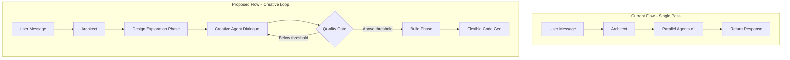

# Unlock Creative App Generation in V2 Pipeline

## Problem Analysis

The v2 pipeline generates rigid CRUD interfaces due to three core issues:

### 1. Code Generator Hardcodes CRUD

The `CodeGeneratorAgent` ([code-generator.ts](src/lib/scaffolder-v2/agents/code-generator.ts)) enforces CRUD in multiple places:

- **Lines 959-978**: `extractComponentSpecs()` always ensures form + table exist
- **Lines 500-543**: `generateAPIClient()` hardcodes fetch/create/update/delete
- **Lines 549-623**: `generateHooks()` hardcodes CRUD hooks
- **Lines 1327-1348**: `createDefaultLayout()` always outputs form + table

### 2. Fixed Component Types

[types.ts](src/lib/scaffolder-v2/types.ts) lines 83-92 defines only 9 component types:

```typescript
type ComponentType = 'form' | 'table' | 'chart' | 'cards' | 'kanban' | 'calendar' | 'stats' | 'filters' | 'custom';
```

The `custom` type exists but falls back to a placeholder - it's not truly custom.

### 3. Single-Pass Architecture

The pipeline in [route.ts](src/app/api/scaffolder-v2/route.ts) `executeParallelPipeline()` (lines 828-935):

- Runs agents once per user message
- No iterative design refinement
- No agent-to-agent dialogue for creative exploration

---

## Solution Architecture



---

## Implementation

### Phase 1: Remove CRUD Constraints

**1.1 Make CRUD optional in Code Generator**

Modify [code-generator.ts](src/lib/scaffolder-v2/agents/code-generator.ts):

- Add `AppCapabilities` interface to specify what the app needs:
  ```typescript
  interface AppCapabilities {
    needsDataEntry: boolean;      // Generate form
    needsDataList: boolean;       // Generate table/cards
    needsDataVisualization: boolean; // Generate charts
    needsCRUD: boolean;           // Generate full CRUD API
    customViews: CustomViewSpec[]; // Freeform custom components
  }
  ```

- Modify `extractComponentSpecs()` to respect capabilities instead of forcing form + table

- Make `generateAPIClient()`, `generateHooks()` conditional on `needsCRUD`

**1.2 Enable truly custom components**

- Change `custom` component type to accept a full LLM-generated component spec
- Add `CustomViewSpec` type for freeform component definitions:
  ```typescript
  interface CustomViewSpec {
    name: string;
    description: string;
    dataRequirements: string[];
    interactionModel: string;
    visualStyle: string;
  }
  ```


**1.3 Update UI Designer to propose flexible layouts**

Modify [ui-designer.ts](src/lib/scaffolder-v2/agents/ui-designer.ts) prompt to:

- Not assume form + table structure
- Ask what views the app actually needs
- Support multi-page/multi-view apps

---

### Phase 2: Add Creative Design Loop

**2.1 Create Design Exploration Agent**

New file: `src/lib/scaffolder-v2/agents/design-explorer.ts`

Purpose: Autonomously explore design possibilities through internal dialogue before committing.

Key responsibilities:

- Generate 3+ distinct design concepts
- Self-critique each concept
- Refine based on critique
- Produce final design with confidence score

**2.2 Add Creative Iteration Loop**

Modify [adaptive-architect.ts](src/lib/scaffolder-v2/agents/adaptive-architect.ts):

```typescript
interface CreativeLoop {
  maxIterations: number;       // e.g., 5
  qualityThreshold: number;    // e.g., 0.8
  currentIteration: number;
  designConcepts: DesignConcept[];
  selectedConcept?: DesignConcept;
}
```

Add `runCreativeLoop()` method that:

1. Generates multiple design concepts
2. Has agents critique each concept
3. Selects or synthesizes best approach
4. Iterates until quality threshold met

**2.3 Implement Quality Gate**

New file: `src/lib/scaffolder-v2/creative-quality-gate.ts`

Evaluates design quality on:

- Creativity/uniqueness score (not generic CRUD)
- Completeness (handles user's actual needs)
- Polish (aesthetic coherence)
- Functionality (will it work?)

Only allows building when score exceeds threshold.

---

### Phase 3: Enable Agent Dialogue

**3.1 Add agent-to-agent communication**

Modify the pipeline to support dialogue between agents:

```typescript
interface AgentDialogue {
  from: AgentType;
  to: AgentType;
  message: string;
  context: Record<string, unknown>;
}

class DialogueOrchestrator {
  async facilitateDialogue(
    initiator: BaseAgent,
    responder: BaseAgent,
    topic: string,
    maxTurns: number
  ): Promise<DialogueResult>;
}
```

Example dialogue flow:

1. UI Designer proposes heat map visualization
2. Code Generator asks: "What library should I use for heat maps?"
3. UI Designer responds: "Use react-activity-calendar for GitHub-style heat maps"
4. Code Generator confirms understanding

**3.2 Update Architect for multi-turn orchestration**

Modify [adaptive-architect.ts](src/lib/scaffolder-v2/agents/adaptive-architect.ts):

- Add `orchestrateCreativeSession()` for multi-turn agent coordination
- Track design evolution across iterations
- Know when to stop iterating (convergence detection)

---

### Phase 4: Update Prompts for Creativity

**4.1 Architect prompt updates**

Add to [adaptive-architect.ts](src/lib/scaffolder-v2/agents/adaptive-architect.ts) system prompt:

```
## Creative Design Philosophy

You are NOT building a simple CRUD app. You are designing a polished, creative application.

Before building:
1. EXPLORE at least 3 different design approaches
2. CRITIQUE each approach for creativity and user experience  
3. SYNTHESIZE the best elements into a final design
4. VALIDATE the design meets the user's actual needs (not generic CRUD)

Quality Gate:
- Do NOT proceed to code generation until design creativity score >= 80%
- If design is too generic (form + table + basic CRUD), iterate further
- The goal is a POLISHED end product, not speed
```

**4.2 Code Generator prompt updates**

Update [code-generator.ts](src/lib/scaffolder-v2/agents/code-generator.ts) system prompt:

```
## Flexible Generation

You generate ONLY what the app actually needs. Do NOT default to CRUD.

For each app, determine:
- What views does the user need? (NOT assumed form + table)
- What data operations are required? (NOT assumed full CRUD)
- What custom visualizations would enhance the experience?

Example: A habit tracker with GitHub-style heat map needs:
- A habit entry form (minimal)
- A heat map visualization (primary view)
- A habit completion button (daily interaction)
- An optional settings/edit panel (burger menu)

NOT: A form on the left, a table on the right, full CRUD API
```

---

## Key Files to Modify

| File | Changes |

|------|---------|

| [code-generator.ts](src/lib/scaffolder-v2/agents/code-generator.ts) | Make CRUD optional, support custom components |

| [adaptive-architect.ts](src/lib/scaffolder-v2/agents/adaptive-architect.ts) | Add creative loop, agent dialogue |

| [ui-designer.ts](src/lib/scaffolder-v2/agents/ui-designer.ts) | Remove form+table assumptions |

| [types.ts](src/lib/scaffolder-v2/types.ts) | Add AppCapabilities, CustomViewSpec |

| [route.ts](src/app/api/scaffolder-v2/route.ts) | Integrate creative loop before building |

## New Files to Create

| File | Purpose |

|------|---------|

| `design-explorer.ts` | Creative exploration agent |

| `creative-quality-gate.ts` | Quality threshold enforcement |

| `dialogue-orchestrator.ts` | Agent-to-agent communication |

---

## Example: Habit Tracker with Heat Map

**User prompt**: "a personal habit tracker with a GitHub-like heat map"

**Current output** (CRUD):

- Form to add habits
- Table listing all habits
- Full CRUD API

**Proposed output** (Creative):

1. **Design exploration** generates 3 concepts:

   - Concept A: Heat map primary, floating add button
   - Concept B: Calendar view with habit overlays
   - Concept C: Streak-focused with gamification

2. **Agents dialogue** to refine Concept A:

   - Designer: "Use react-activity-calendar for heat map"
   - Coder: "I'll generate a HabitHeatMap component"
   - Designer: "Add a floating action button for daily check-in"

3. **Quality gate** passes (creativity: 85%)

4. **Generated app**:

   - `HabitHeatMap.tsx` - GitHub-style contribution graph
   - `DailyCheckIn.tsx` - Floating button for today's completion
   - `HabitSetup.tsx` - Initial habit configuration (shown once)
   - `SettingsMenu.tsx` - Burger menu for editing habits
   - Minimal API: just track completions, no full CRUD