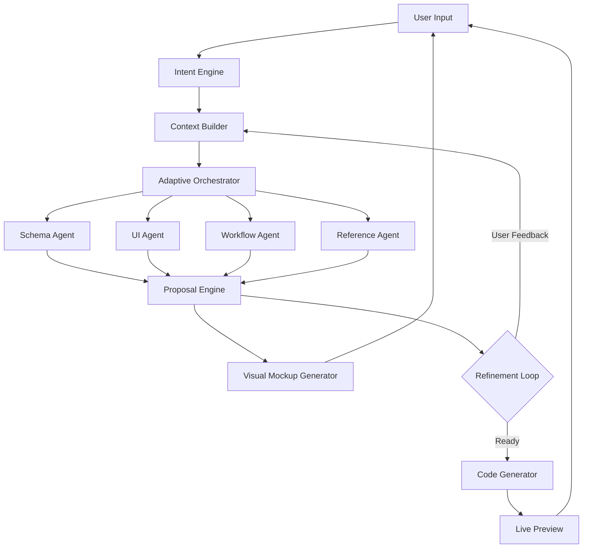
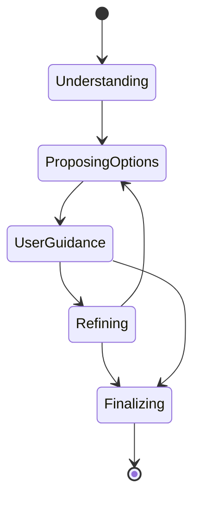
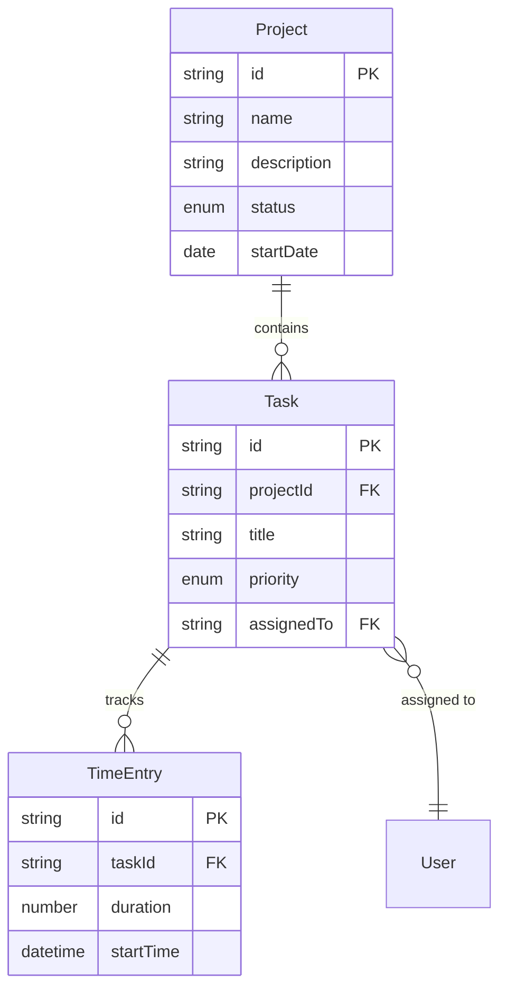

# Dynamic AI Pipeline: Fully Adaptive App Builder

## Vision

Transform the current sequential pipeline into a **truly adaptive system** where:

- **No fixed phases** - Continuous refinement loop instead of rigid steps
- **Parallel agents** - Schema, UI, and workflow agents collaborate simultaneously  
- **Guided exploration** - LLM proposes multiple options, user picks direction
- **Visual-first** - Show mockups early and often instead of text descriptions
- **Context-aware** - Learn from references ("like Trello"), handle unusual requirements
- **Maximum flexibility** - Support multi-entity apps, complex layouts, workflows

## System Architecture



## Core Components

### 1. Intent Engine (Enhanced)

**Purpose**: Understand complex, unusual, and multi-faceted requirements

**Capabilities**:

- **Reference understanding**: "Like Trello but simpler", "Similar to Notion tables"
- **Multi-entity detection**: "Track projects with tasks, each task has subtasks"
- **Workflow detection**: "When status changes to done, archive after 30 days"
- **Layout hints**: "Dashboard with charts on top", "Kanban style"
- **Complexity analysis**: Simple tracker vs. full workflow system

**Implementation** ([src/lib/scaffolder-v2/agents/intent-engine.ts](src/lib/scaffolder-v2/agents/intent-engine.ts)):

```typescript
interface EnhancedIntent {
  // Basic intent
  description: string;
  domain: string;
  
  // Entity structure
  entities: EntityIntent[];
  relationships: RelationshipIntent[];
  
  // UI hints
  layoutHints: string[];
  referenceApps: string[];
  
  // Workflow requirements
  workflows: WorkflowIntent[];
  automations: AutomationIntent[];
  
  // Complexity
  complexity: 'simple' | 'moderate' | 'complex';
  confidence: number;
}

interface EntityIntent {
  name: string;
  purpose: string;
  suggestedFields: string[];
  isPrimary: boolean;
}

interface RelationshipIntent {
  from: string;
  to: string;
  type: 'one-to-one' | 'one-to-many' | 'many-to-many';
  cascadeDelete?: boolean;
}

interface WorkflowIntent {
  trigger: string;
  conditions: string[];
  actions: string[];
}
```

**Example**:

- User: "I want a project tracker like Trello but with time tracking per card"
- Intent Engine detects:
  - Reference: Trello → Kanban layout
  - Entities: Project (boards), Task (cards), TimeEntry
  - Relationships: Project → Tasks (one-to-many), Task → TimeEntries (one-to-many)
  - Layout hint: Kanban board
  - Additional feature: Time tracking integration

### 2. Adaptive Orchestrator

**Purpose**: Coordinate agents without fixed phases

**Key Innovation**: **Decision Graph** instead of linear phases



**Implementation** ([src/lib/scaffolder-v2/agents/adaptive-orchestrator.ts](src/lib/scaffolder-v2/agents/adaptive-orchestrator.ts)):

```typescript
interface OrchestratorState {
  // Current focus
  currentFocus: 'understanding' | 'proposing' | 'refining' | 'finalizing';
  
  // Agent activity (parallel)
  activeAgents: Set<AgentType>;
  agentResults: Map<AgentType, AgentProposal>;
  
  // Decision tree
  decisionPath: Decision[];
  branchPoints: BranchPoint[];
  
  // Proposals
  activeProposals: Proposal[];
  acceptedProposals: Proposal[];
}

interface Decision {
  id: string;
  question: string;
  userChoice: string;
  impact: string[];
  timestamp: Date;
}

interface BranchPoint {
  id: string;
  question: string;
  options: ProposalOption[];
  canCombine: boolean; // Can user select multiple?
}

interface Proposal {
  id: string;
  type: 'schema' | 'layout' | 'workflow' | 'combined';
  title: string;
  description: string;
  preview?: string; // SVG or HTML mockup
  confidence: number;
  alternatives?: Proposal[]; // Other options
}
```

**Orchestration Strategy**:

1. **Parallel Agent Activation**: When intent is understood, activate ALL relevant agents simultaneously:
   ```typescript
   // Instead of: schema → ui → code (sequential)
   // Do: schema + ui + workflow (parallel)
   
   const [schemaProposals, layoutProposals, workflowProposals] = 
     await Promise.all([
       schemaAgent.propose(intent),
       uiAgent.propose(intent),
       workflowAgent.propose(intent)
     ]);
   ```

2. **Smart Proposal Combining**: Combine compatible proposals into coherent options:
   ```typescript
   // Option A: Simple tracker with table view
   // Option B: Dashboard with charts and stats
   // Option C: Kanban board (detected from reference)
   ```

3. **Continuous Refinement**: No "approval" gates - just iterative improvement:

   - User: "Add priority field"
   - System: Updates schema + shows updated mockup immediately
   - No phase transition, just refinement

### 3. Multi-Entity Schema Agent

**Purpose**: Design complex data models with relationships

**Enhanced Capabilities**:

- Multiple related entities
- Foreign keys and cascades
- Computed fields across entities
- Validation rules across relationships

**Implementation** ([src/lib/scaffolder-v2/agents/schema-designer.ts](src/lib/scaffolder-v2/agents/schema-designer.ts) - extend):

```typescript
interface MultiEntityProposal {
  entities: Schema[];
  relationships: EntityRelationship[];
  reasoning: string;
  
  // Visual representation
  erdDiagram: string; // Mermaid ERD
}

interface EntityRelationship {
  from: string;
  to: string;
  type: 'one-to-one' | 'one-to-many' | 'many-to-many';
  foreignKey: string;
  relatedField: string;
  onDelete: 'cascade' | 'set-null' | 'restrict';
  onUpdate: 'cascade' | 'restrict';
}
```

**Example Output**:



### 4. Visual Mockup Generator

**Purpose**: Generate interactive visual mockups early

**Key Innovation**: SVG-based mockups that update in real-time

**Implementation** ([src/lib/scaffolder-v2/mockup/generator.ts](src/lib/scaffolder-v2/mockup/generator.ts)):

```typescript
interface Mockup {
  type: 'desktop' | 'mobile' | 'tablet';
  svg: string;
  interactive: boolean;
  hotspots?: Hotspot[]; // Clickable areas
}

interface Hotspot {
  id: string;
  coordinates: { x: number; y: number; width: number; height: number };
  action: string; // What this represents
  refinementType: 'add' | 'modify' | 'remove' | 'move';
}

class MockupGenerator {
  // Generate mockup from layout + schema
  async generate(
    layout: LayoutNode,
    schemas: Schema[],
    style: 'wireframe' | 'detailed' = 'wireframe'
  ): Promise<Mockup>
  
  // Update mockup based on refinement
  async updateMockup(
    mockup: Mockup,
    change: RefinementChange
  ): Promise<Mockup>
  
  // Generate multiple alternatives
  async generateAlternatives(
    intent: EnhancedIntent
  ): Promise<Mockup[]>
}
```

**Mockup Examples**:

- **Wireframe mode**: Clean, simple boxes showing layout structure
- **Detailed mode**: Colors, typography, realistic components
- **Interactive**: Click hotspots to refine specific areas

### 5. Workflow & Automation Agent

**Purpose**: Handle state machines, business logic, automations

**Capabilities**:

- State machine definitions
- Triggered actions
- Scheduled jobs
- Conditional logic
- Email/notification triggers

**Implementation** ([src/lib/scaffolder-v2/agents/workflow-agent.ts](src/lib/scaffolder-v2/agents/workflow-agent.ts)):

```typescript
interface WorkflowDefinition {
  name: string;
  trigger: WorkflowTrigger;
  conditions: WorkflowCondition[];
  actions: WorkflowAction[];
}

interface WorkflowTrigger {
  type: 'field-change' | 'time-based' | 'manual' | 'webhook';
  config: Record<string, unknown>;
}

interface WorkflowCondition {
  field: string;
  operator: 'equals' | 'not-equals' | 'greater-than' | 'less-than' | 'contains';
  value: unknown;
}

interface WorkflowAction {
  type: 'update-field' | 'send-email' | 'create-record' | 'delete-record' | 'webhook';
  config: Record<string, unknown>;
}

// Example: Auto-archive completed tasks after 30 days
const autoArchiveWorkflow: WorkflowDefinition = {
  name: 'Auto-archive completed tasks',
  trigger: {
    type: 'time-based',
    config: { schedule: 'daily', time: '02:00' }
  },
  conditions: [
    { field: 'status', operator: 'equals', value: 'completed' },
    { field: 'completedAt', operator: 'less-than', value: 'now - 30 days' }
  ],
  actions: [
    { type: 'update-field', config: { field: 'archived', value: true } }
  ]
};
```

### 6. Reference Learning Agent

**Purpose**: Understand and adapt from app references

**Capabilities**:

- Analyze reference apps mentioned by user
- Extract patterns from popular apps (Trello, Notion, etc.)
- Adapt patterns to user's specific needs

**Implementation** ([src/lib/scaffolder-v2/agents/reference-agent.ts](src/lib/scaffolder-v2/agents/reference-agent.ts)):

```typescript
interface ReferencePattern {
  appName: string;
  patterns: {
    layout: string; // 'kanban' | 'table' | 'calendar' | 'dashboard'
    dataModel: string; // 'hierarchical' | 'flat' | 'relational'
    interactions: string[]; // ['drag-drop', 'inline-edit', etc.]
  };
  adaptations: string[]; // How to adapt for this use case
}

class ReferenceAgent extends BaseAgent {
  private knownPatterns: Map<string, ReferencePattern>;
  
  async analyzeReference(userInput: string): Promise<ReferencePattern | null> {
    // Extract app names: "like Trello", "similar to Notion"
    const references = this.extractReferences(userInput);
    
    // Return known patterns
    return this.knownPatterns.get(references[0]);
  }
  
  private extractReferences(input: string): string[] {
    // Use LLM to extract: "like X", "similar to Y", "X-style"
    // Or match against known apps: Trello, Notion, Asana, etc.
  }
}
```

**Built-in Patterns**:

```typescript
const KNOWN_PATTERNS: ReferencePattern[] = [
  {
    appName: 'Trello',
    patterns: {
      layout: 'kanban',
      dataModel: 'hierarchical', // boards → lists → cards
      interactions: ['drag-drop', 'card-modal', 'quick-add']
    }
  },
  {
    appName: 'Notion',
    patterns: {
      layout: 'flexible-views', // table, board, gallery, calendar
      dataModel: 'relational', // linked databases
      interactions: ['inline-edit', 'block-based', 'templates']
    }
  },
  {
    appName: 'Asana',
    patterns: {
      layout: 'list-detail', // list + sidebar detail
      dataModel: 'hierarchical', // projects → sections → tasks
      interactions: ['subtasks', 'dependencies', 'timeline']
    }
  }
];
```

### 7. Context Builder

**Purpose**: Build and maintain rich context throughout the conversation

**Key Innovation**: **Semantic Context Graph** instead of simple message history

**Implementation** ([src/lib/scaffolder-v2/context/builder.ts](src/lib/scaffolder-v2/context/builder.ts)):

```typescript
interface ContextGraph {
  // User preferences learned over time
  preferences: UserPreferences;
  
  // Current conversation artifacts
  artifacts: {
    schemas: Schema[];
    layouts: LayoutNode[];
    workflows: WorkflowDefinition[];
    mockups: Mockup[];
  };
  
  // Refinement patterns
  refinementPatterns: RefinementPattern[];
  
  // Decision history
  decisions: Decision[];
  
  // Implicit understanding
  implicitKnowledge: ImplicitKnowledge;
}

interface UserPreferences {
  preferredLayouts: string[]; // ['dashboard', 'table']
  complexity: 'minimal' | 'moderate' | 'detailed';
  explicitness: 'show-everything' | 'smart-defaults';
}

interface RefinementPattern {
  trigger: string; // What user said
  category: string; // 'add-field' | 'change-layout' | etc.
  frequency: number; // How often this pattern appears
}

interface ImplicitKnowledge {
  // Learned from behavior
  likelyNextAction: string;
  missedRequirements: string[]; // Things user might want but didn't mention
  designPreferences: Record<string, unknown>;
}
```

### 8. Smart Proposal Engine

**Purpose**: Generate and rank proposals for user guidance

**Key Innovation**: **Multi-dimensional scoring** to rank proposals

**Implementation** ([src/lib/scaffolder-v2/proposals/engine.ts](src/lib/scaffolder-v2/proposals/engine.ts)):

```typescript
interface ScoredProposal extends Proposal {
  scores: {
    relevance: number; // How well it matches intent (0-1)
    completeness: number; // How complete the proposal is (0-1)
    simplicity: number; // How simple to understand (0-1)
    feasibility: number; // How easy to implement (0-1)
    uniqueness: number; // How different from other proposals (0-1)
  };
  overallScore: number;
}

class ProposalEngine {
  // Generate multiple proposals
  async generateProposals(
    context: ContextGraph,
    intent: EnhancedIntent
  ): Promise<ScoredProposal[]> {
    // Generate 3-5 diverse proposals
    const proposals = await this.diverseGeneration(context, intent);
    
    // Score each proposal
    const scored = proposals.map(p => this.scoreProposal(p, context, intent));
    
    // Sort by overall score
    return scored.sort((a, b) => b.overallScore - a.overallScore);
  }
  
  // Combine proposals based on user selections
  async combineProposals(
    selected: string[],
    proposals: Proposal[]
  ): Promise<Proposal> {
    // Intelligently merge selected proposals
  }
  
  private scoreProposal(
    proposal: Proposal,
    context: ContextGraph,
    intent: EnhancedIntent
  ): ScoredProposal {
    // Multi-dimensional scoring
    const relevance = this.scoreRelevance(proposal, intent);
    const completeness = this.scoreCompleteness(proposal, intent);
    const simplicity = this.scoreSimplicity(proposal);
    const feasibility = this.scoreFeasibility(proposal);
    const uniqueness = this.scoreUniqueness(proposal, proposals);
    
    // Weighted average
    const overallScore = 
      relevance * 0.35 +
      completeness * 0.25 +
      simplicity * 0.15 +
      feasibility * 0.15 +
      uniqueness * 0.10;
    
    return {
      ...proposal,
      scores: { relevance, completeness, simplicity, feasibility, uniqueness },
      overallScore
    };
  }
}
```

## User Experience Flow

### Example: Complex Multi-Entity App

**User Input**: "I want a project management tool like Trello but with time tracking per card and automatic reporting"

**System Response** (all happening in parallel):

1. **Intent Engine** analyzes:

   - Reference: Trello → Kanban layout
   - Entities: Project (Board), Task (Card), TimeEntry, Report
   - Relationships: Project → Tasks, Task → TimeEntries
   - Workflows: Auto-generate weekly reports
   - Complexity: Moderate-to-complex

2. **Parallel Agent Work** (happens simultaneously):

   - **Schema Agent**: Designs 4-entity data model with relationships
   - **UI Agent**: Creates Kanban layout + time tracking widget + report dashboard
   - **Workflow Agent**: Defines auto-report generation workflow
   - **Reference Agent**: Analyzes Trello patterns, adapts for time tracking

3. **Proposal Engine** combines results into 3 options:

**Option A: Trello-style (Simple)**

   - Kanban board with time entry form in card details
   - Basic weekly report as table view
   - *Mockup shown: Kanban board with time form*

**Option B: Enhanced Trello (Recommended)**

   - Kanban board with inline time tracking
   - Rich dashboard with charts and reports
   - Automatic weekly email reports
   - *Mockup shown: Kanban + Dashboard split view*

**Option C: Time-first Dashboard**

   - Dashboard-centric with time tracking front and center
   - Kanban board as secondary view
   - Advanced reporting with filters
   - *Mockup shown: Dashboard with time stats*

4. **User Picks**: Option B (Enhanced Trello)

5. **Refinement Loop**:

   - User: "Add priority field to tasks"
   - System: Updates schema, regenerates mockup instantly
   - User: "Move time tracking to sidebar"
   - System: Updates layout, shows new mockup
   - User: "Reports should include billable hours"
   - System: Adds field, updates workflow

6. **Finalize**: When user says "looks good" or "build it"

## Implementation Strategy

### Phase 1: Foundation (Week 1-2)

**Goal**: Build core adaptive infrastructure

1. **Intent Engine Enhancement**

   - File: [src/lib/scaffolder-v2/agents/intent-engine.ts](src/lib/scaffolder-v2/agents/intent-engine.ts)
   - Extract multi-entity detection
   - Add reference app parsing
   - Detect workflow requirements

2. **Adaptive Orchestrator**

   - File: [src/lib/scaffolder-v2/agents/adaptive-orchestrator.ts](src/lib/scaffolder-v2/agents/adaptive-orchestrator.ts)
   - Replace phase-based logic with decision graph
   - Implement parallel agent coordination
   - Add proposal ranking system

3. **Context Builder**

   - File: [src/lib/scaffolder-v2/context/builder.ts](src/lib/scaffolder-v2/context/builder.ts)
   - Build semantic context graph
   - Track refinement patterns
   - Learn user preferences

### Phase 2: Agents & Proposals (Week 3-4)

**Goal**: Enhance agents and proposal system

4. **Multi-Entity Schema Agent**

   - Extend: [src/lib/scaffolder-v2/agents/schema-designer.ts](src/lib/scaffolder-v2/agents/schema-designer.ts)
   - Add relationship modeling
   - Generate ERD diagrams
   - Cross-entity validation

5. **Enhanced UI Agent**

   - Extend: [src/lib/scaffolder-v2/agents/ui-designer.ts](src/lib/scaffolder-v2/agents/ui-designer.ts)
   - Support multi-entity layouts
   - Advanced component library
   - Responsive design proposals

6. **Proposal Engine**

   - File: [src/lib/scaffolder-v2/proposals/engine.ts](src/lib/scaffolder-v2/proposals/engine.ts)
   - Multi-dimensional scoring
   - Diverse proposal generation
   - Proposal combination logic

### Phase 3: Visual & Workflow (Week 5-6)

**Goal**: Add visual mockups and workflows

7. **Mockup Generator**

   - File: [src/lib/scaffolder-v2/mockup/generator.ts](src/lib/scaffolder-v2/mockup/generator.ts)
   - SVG wireframe generation
   - Real-time mockup updates
   - Interactive hotspots

8. **Workflow Agent**

   - File: [src/lib/scaffolder-v2/agents/workflow-agent.ts](src/lib/scaffolder-v2/agents/workflow-agent.ts)
   - State machine definitions
   - Triggered actions
   - Automation rules

9. **Reference Agent**

   - File: [src/lib/scaffolder-v2/agents/reference-agent.ts](src/lib/scaffolder-v2/agents/reference-agent.ts)
   - Built-in app patterns
   - Reference extraction
   - Pattern adaptation

### Phase 4: Code Generation (Week 7-8)

**Goal**: Enhanced code generation for complex apps

10. **Advanced Code Generator**

    - Extend: [src/lib/scaffolder-v2/agents/code-generator.ts](src/lib/scaffolder-v2/agents/code-generator.ts)
    - Multi-entity CRUD
    - Relationship handling
    - Workflow execution engine
    - Advanced layout rendering

11. **Component Library Expansion**

    - File: [src/components/primitives/advanced/](src/components/primitives/advanced/)
    - Kanban board
    - Advanced charts
    - Inline editors
    - Drag-and-drop

### Phase 5: UI & Polish (Week 9-10)

**Goal**: Beautiful, intuitive UI for the adaptive system

12. **Enhanced ConversationalScaffolder**

    - File: [src/components/scaffolder-v2/ConversationalScaffolder.tsx](src/components/scaffolder-v2/ConversationalScaffolder.tsx)
    - Mockup viewer
    - Proposal selector
    - Refinement interface
    - Decision history

13. **Visual Mockup Viewer**

    - File: [src/components/scaffolder-v2/MockupViewer.tsx](src/components/scaffolder-v2/MockupViewer.tsx)
    - Interactive SVG display
    - Hotspot interactions
    - Device preview (mobile/tablet/desktop)
    - Comparison view

## Key Files to Create/Modify

### New Files

```
src/lib/scaffolder-v2/
├── agents/
│   ├── intent-engine.ts (NEW)
│   ├── adaptive-orchestrator.ts (NEW)
│   ├── workflow-agent.ts (NEW)
│   └── reference-agent.ts (NEW)
├── context/
│   └── builder.ts (NEW)
├── proposals/
│   ├── engine.ts (NEW)
│   └── types.ts (NEW)
├── mockup/
│   ├── generator.ts (NEW)
│   ├── svg-builder.ts (NEW)
│   └── templates.ts (NEW)
└── workflow/
    ├── engine.ts (NEW)
    ├── dsl.ts (NEW)
    └── executor.ts (NEW)

src/components/scaffolder-v2/
├── MockupViewer.tsx (NEW)
├── ProposalSelector.tsx (NEW)
├── RefinementInterface.tsx (NEW)
└── DecisionHistory.tsx (NEW)

src/components/primitives/advanced/
├── KanbanBoard.tsx (NEW)
├── InlineEditor.tsx (NEW)
└── DragDropList.tsx (NEW)
```

### Modified Files

```
src/lib/scaffolder-v2/
├── agents/
│   ├── orchestrator.ts (MODIFY → adaptive-orchestrator.ts)
│   ├── schema-designer.ts (EXTEND for multi-entity)
│   ├── ui-designer.ts (EXTEND for advanced layouts)
│   └── code-generator.ts (EXTEND for workflows)
├── types.ts (EXTEND for new features)
└── state.ts (EXTEND for context graph)

src/components/scaffolder-v2/
└── ConversationalScaffolder.tsx (MAJOR REFACTOR)
```

## Success Metrics

**Quantitative**:

- Reduce average time to working app by 40%
- Support complex (3+ entity) apps
- Handle 90% of unusual requirements without fallback
- User satisfaction score > 4.5/5

**Qualitative**:

- "Feels magical" - system understands complex requirements
- "Visual-first" - see the app taking shape early
- "Guided but not rigid" - clear options without hand-holding
- "Handles anything" - supports unusual requirements

## Risk Mitigation

**Risk**: Too complex, overwhelming users

**Mitigation**: Progressive disclosure, default to simpler proposals first

**Risk**: Parallel agents produce conflicting proposals

**Mitigation**: Proposal engine checks compatibility, flags conflicts

**Risk**: Mockups raise expectations beyond what can be generated

**Mitigation**: Wireframe mode by default, clear "preview" labeling

**Risk**: Workflow engine is complex to implement correctly

**Mitigation**: Start with simple triggers, expand incrementally

## Future Enhancements (Post-MVP)

- **Visual editor**: Click-and-drag layout editor
- **Template marketplace**: Share and reuse patterns
- **API integration**: Connect to external services
- **Real-time collaboration**: Multiple users building together
- **Version history**: Branch and merge app versions
- **AI pair programming**: "Show me the code" mode for developers