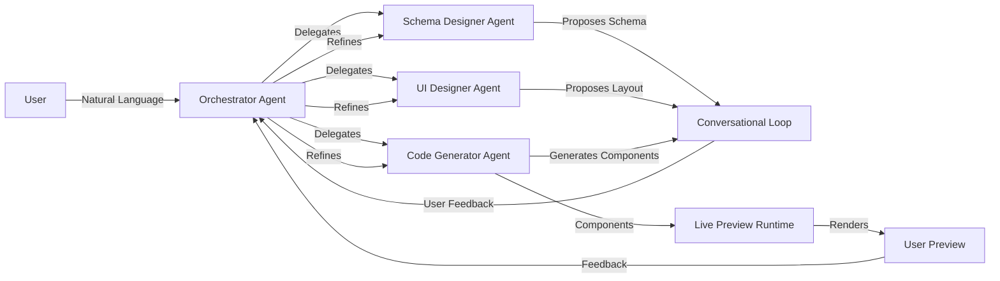
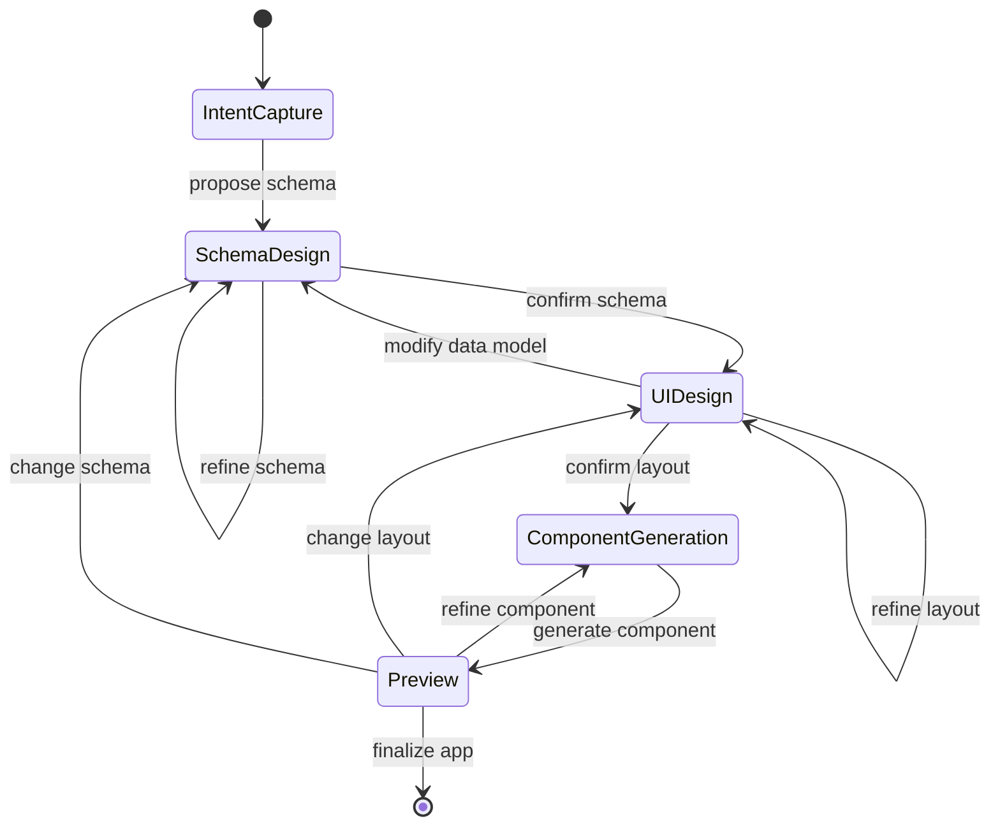
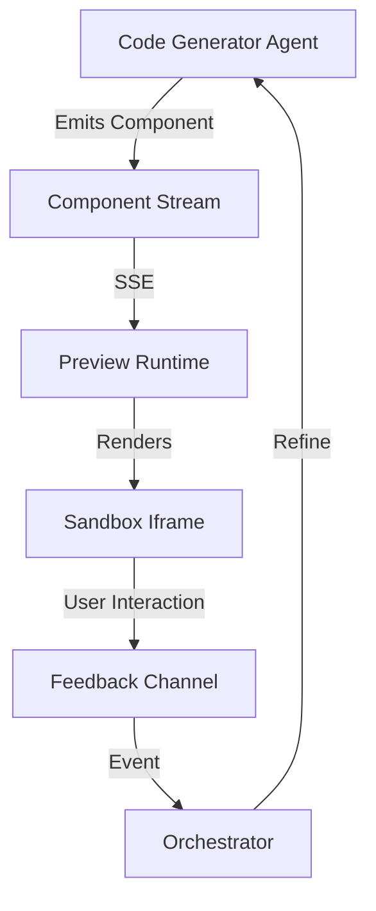

# Dynamic AI Pipeline Architecture

## Executive Summary

Transform the rigid template-based pipeline into a flexible, conversational system that fully leverages LLM capabilities. The new system will run in parallel with the existing one, allowing gradual migration and A/B testing.

## Current System Analysis

### Rigidities in Current Pipeline

**Parse → Probe → Picture → Plan → Build** is linear and template-bound:

1. **Template-Driven Categories**: 8 predefined categories (expense, habit, project, health, learning, inventory, time, custom) with hardcoded field definitions
2. **Fixed Question Sets**: [`question-engine.ts`](src/lib/scaffolder/question-engine.ts) has predetermined questions per category (e.g., `q_fields`, `q_categories`, `q_visualization`)
3. **Static Blueprint Building**: [`blueprint.ts`](src/lib/scaffolder/blueprint.ts) uses fallback strategies with hardcoded field/view mappings
4. **Monolithic Code Generation**: Generates single `page.tsx` file with all logic inline
5. **No Iteration**: Once you answer questions, you can't refine without regenerating

### Strengths to Preserve

- Status streaming system ([`status-emitter.ts`](src/lib/scaffolder/status-emitter.ts))
- Error handling with recovery ([`scaffolder-errors.ts`](src/lib/error-handling/scaffolder-errors.ts))
- Live code streaming to UI ([`code-stream/[conversationId]/route.ts`](src/app/api/scaffolder/code-stream/[conversationId]/route.ts))
- Retry logic and fallback mechanisms
- Prisma schema with conversation state tracking

---

## New Architecture: "Intent-to-App 2.0"

### High-Level Flow



### Core Principles

1. **No Templates**: AI generates custom schemas from natural language
2. **Conversational**: Back-and-forth refinement at every stage
3. **Incremental**: Build and preview one component at a time
4. **Modular**: Generate separate, composable components
5. **Multi-Agent**: Specialized AI models/prompts for different tasks

---

## Multi-Model Agent Architecture

### Agent Roles

#### 1. Orchestrator Agent

**Purpose**: Coordinates other agents, maintains conversation context, decides next steps

**Model**: Lightweight reasoning model (e.g., Qwen2.5-7B-Instruct or Claude Haiku)

**Responsibilities**:

- Parse user intent and maintain conversation state
- Decide which agent to invoke next
- Detect when user wants to refine vs. proceed
- Aggregate agent outputs into coherent responses

**Implementation**:

```typescript
// src/lib/scaffolder/agents/orchestrator.ts
export class OrchestratorAgent {
  async processUserMessage(
    message: string,
    conversationState: ConversationState
  ): Promise<OrchestratorDecision> {
    // Determines: schema_design | ui_design | code_gen | refinement | complete
  }
}
```

#### 2. Schema Designer Agent

**Purpose**: Create custom data models from natural language

**Model**: Strong reasoning model (e.g., Qwen2.5-Coder-32B or GPT-4)

**Capabilities**:

- Generate field definitions with types, validations, relationships
- Propose indexes for performance
- Suggest computed fields and aggregations
- Create relationship schemas (1-to-many, many-to-many)

**Example Dialogue**:

```
User: "I want to track my book collection"
Schema Agent: "I'll create a Book schema with title, author, genre, 
  pages, rating, and reading status. Should I also track:
 - Reading dates (start/finish)?
 - Notes/reviews?
 - Purchase info (price, where bought)?
 - Series information?"
```

**Implementation**:

```typescript
// src/lib/scaffolder/agents/schema-designer.ts
export class SchemaDesignerAgent {
  async proposeSchema(
    description: string,
    existingSchemas?: Schema[]
  ): Promise<SchemaProposal> {
    // Returns: fields, relationships, computed properties, indexes
  }
  
  async refineSchema(
    currentSchema: Schema,
    userFeedback: string
  ): Promise<SchemaProposal> {
    // Iteratively refine based on feedback
  }
}
```

#### 3. UI Designer Agent

**Purpose**: Create layouts and component arrangements

**Model**: Vision-capable model or specialized UI model (e.g., multimodal Qwen or Claude)

**Capabilities**:

- Generate layout structures (single-column, multi-column, tabs, sidebars)
- Propose component types (forms, tables, cards, charts, kanban, calendar)
- Suggest responsive breakpoints
- Create navigation patterns

**Example Dialogue**:

```
User: "I want the form on the left and a table on the right"
UI Agent: "I'll create a 2-column layout:
 - Left: 40% width, sticky form with your 8 fields
 - Right: 60% width, sortable table with pagination
  
  On mobile, should the form be:
  A) Above the table
  B) In a slide-out panel
  C) On a separate tab?"
```

**Implementation**:

```typescript
// src/lib/scaffolder/agents/ui-designer.ts
export class UIDesignerAgent {
  async proposeLayout(
    schema: Schema,
    userPreferences?: string
  ): Promise<LayoutProposal> {
    // Returns: layout structure, component placements, responsive rules
  }
  
  async refineLayout(
    currentLayout: Layout,
    userFeedback: string
  ): Promise<LayoutProposal> {
    // Adjust based on feedback
  }
}
```

#### 4. Code Generator Agent

**Purpose**: Generate modular, production-ready React components

**Model**: Specialized code generation model (e.g., Qwen2.5-Coder-32B)

**Capabilities**:

- Generate separate component files (not monolithic)
- Include proper TypeScript types
- Add accessibility attributes
- Implement proper error boundaries
- Generate API routes for data operations

**Component Types Generated**:

- Form components with validation
- Table components with sorting/filtering
- Chart components with multiple view types
- Card/list components
- Modal/dialog components
- Custom visualizations

**Implementation**:

```typescript
// src/lib/scaffolder/agents/code-generator.ts
export class CodeGeneratorAgent {
  async generateComponent(
    componentSpec: ComponentSpec,
    schema: Schema
  ): Promise<GeneratedComponent> {
    // Returns: component code, types, tests, styles
  }
  
  async generateAPIRoute(
    schema: Schema,
    operations: CRUDOperation[]
  ): Promise<GeneratedRoute> {
    // Returns: route handler code
  }
}
```

### Agent Communication Protocol

**Context Passing**:

```typescript
interface ConversationState {
  intent: ParsedIntent;
  schemas: Schema[];
  layout: Layout;
  components: ComponentSpec[];
  generatedCode: Record<string, string>;
  userFeedback: Message[];
  currentPhase: 'schema' | 'ui' | 'code' | 'refinement';
}
```

**Decision Logic**:

```typescript
// Orchestrator determines next agent based on:
1. Conversation phase
2. User message content (keywords, questions, refinements)
3. Completion status of each phase
4. User confirmation signals
```

---

## Dynamic Schema Generation

### No More Templates

Replace [`CATEGORY_TEMPLATES`](src/lib/scaffolder/parser.ts#L265-L298) with LLM-driven schema generation.

### Schema Generation Process

**Step 1: Intent Analysis**

```typescript
// Instead of mapping to predefined categories
const intent = await orchestrator.analyzeIntent(userMessage);
// Returns: {
//   domain: string,  // e.g., "personal finance", "book tracking"
//   entities: EntityDescription[],
//   relationships: RelationshipHint[],
//   userGoals: string[]
// }
```

**Step 2: Schema Proposal**

```typescript
const schemaProposal = await schemaAgent.proposeSchema({
  domain: intent.domain,
  entities: intent.entities,
  description: userMessage
});

// Returns:
{
  schemas: [
    {
      name: "Book",
      fields: [
        { name: "id", type: "string", generated: true, primaryKey: true },
        { name: "title", type: "string", required: true, searchable: true },
        { name: "author", type: "string", required: true, searchable: true },
        { name: "isbn", type: "string", unique: true, validation: { pattern: "ISBN regex" } },
        { name: "pages", type: "number", validation: { min: 1 } },
        { name: "rating", type: "number", validation: { min: 0, max: 5 } },
        { name: "status", type: "enum", options: ["To Read", "Reading", "Finished"] },
        { name: "startedAt", type: "date", nullable: true },
        { name: "finishedAt", type: "date", nullable: true },
        { name: "notes", type: "text", nullable: true }
      ],
      computedFields: [
        { name: "daysToRead", formula: "finishedAt - startedAt", type: "number" }
      ],
      relationships: [
        { type: "belongsTo", target: "User", foreignKey: "userId" }
      ]
    }
  ],
  reasoning: "Based on book tracking, I included standard bibliographic fields, 
    reading progress tracking, and personal notes. The computed field calculates 
    reading duration automatically."
}
```

**Step 3: Iterative Refinement**

```typescript
// User: "Actually, I also want to track book series"
const refinedSchema = await schemaAgent.refineSchema(schemaProposal, {
  feedback: "add series tracking",
  currentSchema: schemaProposal.schemas[0]
});

// Returns updated schema with:
// - series field (string)
// - seriesPosition field (number)
// - relationship to Series entity (if complex)
```

### Schema Validation Engine

**Dynamic Validation Generation**:

```typescript
// src/lib/scaffolder/schema/validator-generator.ts
export function generateFieldValidator(field: FieldDefinition): ValidatorFunction {
  // Generate Zod schema or custom validator based on field type and constraints
  const validators = [];
  
  if (field.required) validators.push(z.string().min(1));
  if (field.validation?.pattern) validators.push(z.string().regex(field.validation.pattern));
  if (field.validation?.min) validators.push(z.number().min(field.validation.min));
  
  return z.pipe(...validators);
}
```

### Relationship Handling

**Support Multi-Entity Apps**:

```typescript
// User: "I want to track books and authors separately"
const schemas = await schemaAgent.proposeRelatedSchemas({
  primaryEntity: "Book",
  relatedEntities: ["Author"],
  relationships: ["Book belongsTo Author", "Author has many Books"]
});

// Generates:
{
  schemas: [
    { name: "Book", fields: [...], relationships: [{ type: "belongsTo", target: "Author" }] },
    { name: "Author", fields: [...], relationships: [{ type: "hasMany", target: "Book" }] }
  ],
  junctionTables: [] // For many-to-many if needed
}
```

---

## Iterative Conversational Flow

### Replace Linear Pipeline with Conversation Graph

**Current**: Parse → Probe → Picture → Plan → Build (one direction)

**New**: Flexible graph where user can jump between phases



### Conversational Turn Management

**Orchestrator Decision Tree**:

```typescript
// src/lib/scaffolder/agents/orchestrator.ts
async determineNextAction(
  userMessage: string,
  state: ConversationState
): Promise<AgentAction> {
  // Classify user intent from message
  const intent = await this.classifyIntent(userMessage, state);
  
  switch (intent.type) {
    case 'REFINEMENT':
      // User wants to change something already proposed
      return {
        agent: this.getResponsibleAgent(intent.subject), // schema, ui, or code
        action: 'refine',
        target: intent.subject
      };
    
    case 'APPROVAL':
      // User is happy, move to next phase
      return {
        agent: this.getNextAgent(state.currentPhase),
        action: 'propose',
      };
    
    case 'QUESTION':
      // User has questions, stay in current phase
      return {
        agent: state.currentAgent,
        action: 'clarify',
        question: userMessage
      };
    
    case 'NEW_REQUIREMENT':
      // User adds new requirement
      return {
        agent: 'schema',
        action: 'extend',
        requirement: userMessage
      };
  }
}
```

### Natural Language Refinement Examples

**Schema Refinement**:

```
User: "I want to track my book collection"
Schema Agent: [proposes Book schema with title, author, pages, rating]

User: "Add genre and publication year"
Schema Agent: [adds those fields, updates schema]

User: "Actually, make genre a multi-select"
Schema Agent: [changes genre from string to string[], shows updated schema]
```

**UI Refinement**:

```
UI Agent: [proposes single-column layout with form above table]

User: "Put the form on the left side"
UI Agent: [changes to 2-column layout, 40/60 split]

User: "Can the table have filters?"
UI Agent: [adds filter panel above table, updates layout]
```

### Refinement Tracking

**Store Refinement History**:

```typescript
interface RefinementHistory {
  id: string;
  timestamp: Date;
  phase: 'schema' | 'ui' | 'code';
  userFeedback: string;
  agentResponse: string;
  changes: ChangeLog[];
}

// Enables:
// - Undo functionality
// - Understanding user preferences over time
// - Learning common refinement patterns
```

---

## Flexible Layout Customization

### Layout Description Language

**Replace Fixed Views with Layout DSL**:

Instead of `views: ViewConfig[]` with types `table | chart | cards`, use a flexible layout tree:

```typescript
interface LayoutNode {
  type: 'container' | 'component';
  container?: {
    direction: 'row' | 'column' | 'grid';
    children: LayoutNode[];
    responsive: {
      mobile: 'stack' | 'scroll' | 'tabs';
      tablet: 'stack' | 'grid' | 'side-by-side';
      desktop: 'grid' | 'side-by-side';
    };
    sizing: {
      basis: string; // '40%', 'auto', '1fr'
      grow: number;
      shrink: number;
    };
  };
  component?: {
    type: 'form' | 'table' | 'chart' | 'cards' | 'kanban' | 'calendar' | 'custom';
    props: Record<string, any>;
    position: { sticky?: boolean; order?: number };
  };
}
```

**Example Layouts Generated**:

**1. Dashboard Style**:

```typescript
{
  type: 'container',
  container: {
    direction: 'column',
    children: [
      {
        type: 'container',
        container: {
          direction: 'row',
          children: [
            { type: 'component', component: { type: 'stats', props: { metrics: ['total', 'avg'] } } },
            { type: 'component', component: { type: 'chart', props: { chartType: 'line' } } }
          ]
        }
      },
      { type: 'component', component: { type: 'table', props: { paginated: true } } }
    ]
  }
}
```

**2. Sidebar + Main**:

```typescript
{
  type: 'container',
  container: {
    direction: 'row',
    children: [
      {
        type: 'component',
        component: { type: 'form', props: {} },
        sizing: { basis: '400px', shrink: 0 }
      },
      {
        type: 'container',
        container: {
          direction: 'column',
          children: [
            { type: 'component', component: { type: 'filters' } },
            { type: 'component', component: { type: 'table' } }
          ]
        },
        sizing: { basis: '1fr', grow: 1 }
      }
    ]
  }
}
```

### UI Agent Layout Generation

**Natural Language → Layout**:

```typescript
// User: "I want a dashboard with stats at the top, 
//        a chart on the left, and recent entries on the right"

const layout = await uiAgent.proposeLayout({
  description: userMessage,
  schema: bookSchema,
  preferences: {
    components: ['stats', 'chart', 'table']
  }
});

// Generates layout tree with:
// - Top section: stats component (KPIs)
// - Middle section: row with 50/50 split
//   - Left: chart component
//   - Right: table component (recent entries, limited to 10)
```

### Component Variant System

**Support Multiple Implementations per Component Type**:

```typescript
interface ComponentVariant {
  type: 'table' | 'form' | 'chart' | ...;
  variant: string;
  props: Record<string, any>;
}

// Examples:
const tableVariants = {
  'simple': { features: ['sort'] },
  'advanced': { features: ['sort', 'filter', 'pagination', 'search'] },
  'inline-edit': { features: ['sort', 'filter', 'inline-editing'] },
  'kanban': { groupBy: 'status', draggable: true }
};

// UI Agent chooses variant based on:
// - User requirements
// - Data complexity
// - Layout constraints
```

### Responsive Breakpoint Strategy

**Agent Proposes Responsive Behavior**:

```
UI Agent: "On mobile devices, I'll:
 1. Stack the form above the table (single column)
 2. Collapse the filter panel into a modal
 3. Make the table horizontally scrollable
  
  Does this work for you?"
```

---

## Live Preview & Incremental Building

### Real-Time Preview Runtime

**Goal**: Show live preview as components are generated, allow instant feedback

### Architecture



### Implementation

**1. Component Streaming Protocol**:

```typescript
// src/app/api/scaffolder/preview/[conversationId]/route.ts
export async function GET(
  request: NextRequest,
  { params }: { params: { conversationId: string } }
) {
  const stream = new TransformStream();
  const writer = stream.writable.getWriter();
  
  // Stream components as they're generated
  emitter.on(`preview:${params.conversationId}`, (component) => {
    writer.write(new TextEncoder().encode(
      `data: ${JSON.stringify(component)}\n\n`
    ));
  });
  
  return new Response(stream.readable, {
    headers: { 'Content-Type': 'text/event-stream' }
  });
}
```

**2. Preview Runtime Component**:

```typescript
// src/components/scaffolder/LivePreview.tsx
'use client';

export function LivePreview({ conversationId }: { conversationId: string }) {
  const [components, setComponents] = useState<GeneratedComponent[]>([]);
  const [layout, setLayout] = useState<LayoutNode | null>(null);
  
  useEffect(() => {
    const eventSource = new EventSource(`/api/scaffolder/preview/${conversationId}`);
    
    eventSource.addEventListener('component', (e) => {
      const component = JSON.parse(e.data);
      setComponents(prev => [...prev, component]);
    });
    
    eventSource.addEventListener('layout', (e) => {
      setLayout(JSON.parse(e.data));
    });
    
    return () => eventSource.close();
  }, [conversationId]);
  
  return (
    <div className="preview-container">
      <PreviewSandbox layout={layout} components={components} />
    </div>
  );
}
```

**3. Sandbox Rendering**:

```typescript
// src/components/scaffolder/PreviewSandbox.tsx
import { useEffect, useRef } from 'react';
import { transform } from '@babel/standalone';

export function PreviewSandbox({ layout, components }: PreviewSandboxProps) {
  const iframeRef = useRef<HTMLIFrameElement>(null);
  
  useEffect(() => {
    if (!iframeRef.current || !layout || components.length === 0) return;
    
    // Compile components
    const compiledComponents = components.map(c => ({
      name: c.name,
      code: transform(c.code, { presets: ['react', 'typescript'] }).code
    }));
    
    // Inject into iframe
    const doc = iframeRef.current.contentDocument;
    if (!doc) return;
    
    doc.open();
    doc.write(`
      <!DOCTYPE html>
      <html>
        <head>
          <script src="https://unpkg.com/react/umd/react.production.min.js"></script>
          <script src="https://unpkg.com/react-dom/umd/react-dom.production.min.js"></script>
          <link rel="stylesheet" href="/preview-styles.css">
        </head>
        <body>
          <div id="root"></div>
          <script type="module">
            ${compiledComponents.map(c => c.code).join('\n')}
            
            // Render layout
            const layout = ${JSON.stringify(layout)};
            const App = () => renderLayout(layout);
            ReactDOM.render(<App />, document.getElementById('root'));
          </script>
        </body>
      </html>
    `);
    doc.close();
  }, [layout, components]);
  
  return (
    <iframe
      ref={iframeRef}
      className="preview-sandbox"
      sandbox="allow-scripts"
    />
  );
}
```

### Incremental Component Generation

**Generate Components One at a Time**:

```typescript
// Instead of generating entire page.tsx:
async function* generateAppIncremental(
  schema: Schema,
  layout: LayoutNode,
  conversationId: string
): AsyncGenerator<ComponentGenerationEvent> {
  // 1. Generate type definitions first
  yield {
    type: 'types',
    code: await codeAgent.generateTypes(schema)
  };
  
  // 2. Generate components in dependency order
  const componentSpecs = extractComponents(layout);
  
  for (const spec of componentSpecs) {
    yield {
      type: 'component',
      name: spec.name,
      code: await codeAgent.generateComponent(spec, schema)
    };
    
    // Emit for live preview
    emitPreviewComponent(conversationId, spec.name, code);
    
    // Allow user to provide feedback before continuing
    const feedback = await waitForUserFeedback(conversationId, spec.name, { timeout: 5000 });
    
    if (feedback) {
      // Regenerate component with feedback
      const refined = await codeAgent.refineComponent(spec, feedback);
      yield {
        type: 'component',
        name: spec.name,
        code: refined,
        refined: true
      };
    }
  }
  
  // 3. Generate page wrapper
  yield {
    type: 'page',
    code: await codeAgent.generatePageWrapper(schema, layout, componentSpecs)
  };
}
```

### User Feedback During Generation

**Pause & Refine Workflow**:

```
1. Generate FormComponent
   → Show preview
   → User: "Make the submit button green"
   → Refine FormComponent
   → Continue

2. Generate TableComponent
   → Show preview
   → User: (no feedback after 5s)
   → Continue

3. Generate ChartComponent
   → Show preview
   → User: "Use a bar chart instead of line"
   → Refine ChartComponent
   → Continue
```

**Implementation**:

```typescript
interface FeedbackChannel {
  waitForFeedback(
    conversationId: string,
    componentName: string,
    options: { timeout: number }
  ): Promise<string | null>;
  
  submitFeedback(
    conversationId: string,
    componentName: string,
    feedback: string
  ): void;
}
```

---

## Component Modularity

### Generate Separate Files

**Replace Monolithic `page.tsx` with Component Library**:

**Current**: Everything in one file ([`code-generator.ts`](src/lib/scaffolder/code-generator.ts#L106) generates single file)

**New**: Generate separate, reusable components:

```
/apps/[appId]/
  components/
    BookForm.tsx          # Form component
    BookTable.tsx         # Table component
    BookFilters.tsx       # Filter panel
    BookStats.tsx         # Stats/KPIs
    BookChart.tsx         # Chart visualization
  lib/
    types.ts              # TypeScript types
    api.ts                # API client functions
    validators.ts         # Zod schemas
  page.tsx                # Wrapper that composes components
```

### Component Generation Strategy

**Code Agent Output Structure**:

```typescript
interface GeneratedApp {
  types: string;                    // types.ts
  validators: string;               // validators.ts (Zod schemas)
  apiClient: string;                // api.ts (fetch wrappers)
  components: Record<string, string>; // component files
  page: string;                     // page.tsx wrapper
  routes: Record<string, string>;   // API route handlers
}
```

### Component Template System

**Reusable Component Patterns**:

```typescript
// src/lib/scaffolder/agents/code-generator/templates/

// Form template with validation
export const FORM_TEMPLATE = `
'use client';

import { useState } from 'react';
import { {{validatorName}} } from '../lib/validators';
import type { {{typeName}} } from '../lib/types';

interface {{componentName}}Props {
  onSubmit: (data: {{typeName}}) => Promise<void>;
  initialData?: Partial<{{typeName}}>;
}

export function {{componentName}}({ onSubmit, initialData }: {{componentName}}Props) {
  const [formData, setFormData] = useState<Partial<{{typeName}}>>(initialData || {});
  const [errors, setErrors] = useState<Record<string, string>>({});
  
  const handleSubmit = async (e: React.FormEvent) => {
    e.preventDefault();
    
    const result = {{validatorName}}.safeParse(formData);
    if (!result.success) {
      // Set validation errors
      const fieldErrors: Record<string, string> = {};
      result.error.issues.forEach(issue => {
        fieldErrors[issue.path[0]] = issue.message;
      });
      setErrors(fieldErrors);
      return;
    }
    
    await onSubmit(result.data);
    setFormData({});
  };
  
  return (
    <form onSubmit={handleSubmit}>
      {{#each fields}}
      <div className="field-group">
        <label htmlFor="{{name}}">{{label}}</label>
        <input
          id="{{name}}"
          type="{{inputType}}"
          value={formData.{{name}} || ''}
          onChange={(e) => setFormData(prev => ({ ...prev, {{name}}: e.target.value }))}
          required={{{required}}}
        />
        {errors.{{name}} && <span className="error">{errors.{{name}}}</span>}
      </div>
      {{/each}}
      
      <button type="submit">Submit</button>
    </form>
  );
}
`;

// Table template with sorting/filtering
export const TABLE_TEMPLATE = `...`;

// Chart template with multiple types
export const CHART_TEMPLATE = `...`;
```

**Code Agent Uses Templates + LLM**:

```typescript
async generateComponent(spec: ComponentSpec, schema: Schema): Promise<string> {
  // 1. Get base template
  const template = this.getTemplate(spec.type);
  
  // 2. Fill in schema-specific details
  const templateVars = {
    componentName: spec.name,
    typeName: schema.name,
    fields: schema.fields.map(f => ({
      name: f.name,
      label: f.label,
      inputType: mapTypeToInputType(f.type),
      required: f.required
    }))
  };
  
  const baseCode = this.renderTemplate(template, templateVars);
  
  // 3. Let LLM enhance with custom logic if needed
  if (spec.customizations) {
    return await this.llm.enhance(baseCode, spec.customizations);
  }
  
  return baseCode;
}
```

### Component Composition

**Page Wrapper Composes Components**:

```typescript
// Generated page.tsx
'use client';

import { BookForm } from './components/BookForm';
import { BookTable } from './components/BookTable';
import { BookFilters } from './components/BookFilters';
import { useBookData } from './lib/hooks';
import type { Book } from './lib/types';

export default function BookTrackerPage() {
  const { books, isLoading, addBook, deleteBook } = useBookData();
  const [filters, setFilters] = useState({});
  
  return (
    <div className="layout-container layout-sidebar-main">
      {/* Layout generated by UI Agent */}
      <aside className="sidebar">
        <BookForm onSubmit={addBook} />
      </aside>
      
      <main className="main">
        <BookFilters filters={filters} onChange={setFilters} />
        <BookTable
          data={books}
          isLoading={isLoading}
          onDelete={deleteBook}
          filters={filters}
        />
      </main>
    </div>
  );
}
```

### API Route Generation

**Generate Type-Safe API Routes**:

```typescript
// Generated /api/apps/[appId]/books/route.ts
import { NextRequest, NextResponse } from 'next/server';
import { getServerSession } from '@/lib/auth';
import prisma from '@/lib/db';
import { bookValidator } from './validators';

export async function GET(req: NextRequest) {
  const session = await getServerSession();
  if (!session) return NextResponse.json({ error: 'Unauthorized' }, { status: 401 });
  
  const books = await prisma.app.findUnique({
    where: { id: params.appId, userId: session.user.id }
  });
  
  if (!books) return NextResponse.json({ error: 'Not found' }, { status: 404 });
  
  return NextResponse.json({ books: books.data });
}

export async function POST(req: NextRequest) {
  const session = await getServerSession();
  if (!session) return NextResponse.json({ error: 'Unauthorized' }, { status: 401 });
  
  const body = await req.json();
  const validation = bookValidator.safeParse(body);
  
  if (!validation.success) {
    return NextResponse.json({ error: validation.error }, { status: 400 });
  }
  
  const app = await prisma.app.findUnique({
    where: { id: params.appId, userId: session.user.id }
  });
  
  if (!app) return NextResponse.json({ error: 'Not found' }, { status: 404 });
  
  const newBook = { id: generateId(), ...validation.data, createdAt: new Date() };
  
  await prisma.app.update({
    where: { id: app.id },
    data: { data: [...(app.data as any[]), newBook] }
  });
  
  return NextResponse.json({ book: newBook });
}
```

---

## Parallel System Implementation

### Coexistence Strategy

**Run Old and New Systems Side by Side**:

```
/src/
  lib/
    scaffolder/           # Existing system (v1)
      parser.ts
      probe.ts
      blueprint.ts
      code-generator.ts
      ...
    
    scaffolder-v2/        # New system (v2)
      agents/
        orchestrator.ts
        schema-designer.ts
        ui-designer.ts
        code-generator.ts
      schema/
        generator.ts
        validator-generator.ts
      layout/
        dsl.ts
        responsive.ts
      preview/
        runtime.ts
        sandbox.ts
  
  app/
    api/
      scaffolder/         # v1 API routes
      scaffolder-v2/      # v2 API routes
        route.ts          # Main v2 orchestrator endpoint
        preview/
        feedback/
```

### Feature Flags

**Control Which System Users See**:

```typescript
// src/lib/feature-flags.ts
export async function shouldUseV2(userId: string): Promise<boolean> {
  // Check feature flag
  const flags = await prisma.userFeatureFlags.findUnique({
    where: { userId }
  });
  
  return flags?.scaffolderV2Enabled || false;
}

// Or environment-based
export const SCAFFOLDER_VERSION = process.env.SCAFFOLDER_VERSION || 'v1';
```

**Route Selection**:

```typescript
// src/app/(main)/create/page.tsx
'use client';

export default function CreatePage() {
  const { data: session } = useSession();
  const [version, setVersion] = useState<'v1' | 'v2'>('v1');
  
  useEffect(() => {
    if (session?.user?.id) {
      shouldUseV2(session.user.id).then(setVersion);
    }
  }, [session]);
  
  if (version === 'v2') {
    return <ConversationalScaffolderV2 />;
  }
  
  return <ConversationalScaffolderV1 />;
}
```

### Database Schema Extension

**Preserve Existing Schema, Add V2 Fields**:

```prisma
// prisma/schema.prisma

model Conversation {
  id        String   @id @default(cuid())
  userId    String
  appId     String?
  
  // V1 fields
  messages  Json[]
  phase     String   // PROBE, PICTURE, PLAN, COMPLETE (enum-like)
  spec      Json?    // BlueprintState
  
  // V2 fields (nullable for backward compatibility)
  version   String?  @default("v1")  // "v1" or "v2"
  
  // V2 conversation state
  agentState      Json?  // OrchestratorState
  schemaDesigns   Json[] @default([])  // SchemaProposal[]
  layoutDesigns   Json[] @default([])  // LayoutProposal[]
  refinementHistory Json[] @default([])  // RefinementHistory[]
  
  createdAt DateTime @default(now())
  updatedAt DateTime @updatedAt
}

model App {
  // ... existing fields ...
  
  // V2 fields
  version         String? @default("v1")
  componentFiles  Json?   // Record<string, string> - separate component files
  layoutDefinition Json?  // LayoutNode - layout DSL
}
```

### Migration Path

**Gradual Rollout**:

1. **Phase 1: Internal Testing**

                                                                                                - Enable v2 for specific test users
                                                                                                - Collect feedback and fix bugs
                                                                                                - No impact on existing users

2. **Phase 2: Opt-In Beta**

                                                                                                - Add UI toggle: "Try New Builder (Beta)"
                                                                                                - Users can switch between v1 and v2
                                                                                                - Track usage metrics (completion rate, satisfaction)

3. **Phase 3: Gradual Rollout**

                                                                                                - Enable v2 for 10% of new users
                                                                                                - Monitor error rates and performance
                                                                                                - Increase to 25%, 50%, 100%

4. **Phase 4: Full Migration**

                                                                                                - Make v2 default for all new conversations
                                                                                                - Keep v1 available for existing conversations
                                                                                                - Provide migration tool for v1 → v2

### A/B Testing Infrastructure

**Measure Success**:

```typescript
// src/lib/analytics/scaffolder-metrics.ts
export interface ScaffolderMetrics {
  version: 'v1' | 'v2';
  conversationId: string;
  userId: string;
  
  // Engagement metrics
  totalMessages: number;
  timeToCompletion: number; // seconds
  refinementCount: number;
  
  // Success metrics
  completed: boolean;
  appGenerated: boolean;
  userSatisfaction?: number; // 1-5 rating
  
  // Error metrics
  errors: ErrorLog[];
  fallbacksTriggered: number;
}

// Track and compare
export async function trackScaffolderSession(metrics: ScaffolderMetrics) {
  await prisma.scaffolderSession.create({ data: metrics });
}

// Query for comparison
export async function compareVersions(dateRange: DateRange) {
  const v1Stats = await getStatsForVersion('v1', dateRange);
  const v2Stats = await getStatsForVersion('v2', dateRange);
  
  return {
    v1: {
      completionRate: v1Stats.completed / v1Stats.total,
      avgTimeToCompletion: v1Stats.avgTime,
      avgRefinements: v1Stats.avgRefinements
    },
    v2: { /* same */ }
  };
}
```

---

## Implementation Roadmap

### Phase 1: Foundation (Weeks 1-3)

**Goals**: Set up parallel system, implement orchestrator

- Create `src/lib/scaffolder-v2/` directory structure
- Implement `OrchestratorAgent` with basic intent classification
- Set up v2 API routes: `POST /api/scaffolder-v2/chat`
- Add feature flag system for v2 access
- Update Prisma schema with v2 fields

**Deliverables**:

- v2 conversation can start and maintain state
- Orchestrator can classify user messages (schema, ui, refinement, approval)

### Phase 2: Schema Designer Agent (Weeks 4-6)

**Goals**: Dynamic schema generation without templates

- Implement `SchemaDesignerAgent` with LLM prompts
- Build schema proposal logic (fields, types, relationships)
- Create schema validator generator
- Add iterative refinement capability
- Test with diverse user prompts

**Deliverables**:

- User can describe any data model, agent generates custom schema
- User can refine schema through conversation

### Phase 3: UI Designer Agent (Weeks 7-9)

**Goals**: Flexible layout generation

- Implement `UIDesignerAgent` with layout DSL
- Create layout proposal logic
- Build responsive behavior suggestion system
- Add component variant selection
- Test layout generation with various requests

**Deliverables**:

- Agent generates layout from natural language
- Supports multi-column, dashboard, sidebar layouts
- Responsive breakpoints handled automatically

### Phase 4: Live Preview Runtime (Weeks 10-12)

**Goals**: Real-time preview as components generate

- Implement preview SSE endpoint
- Create `PreviewSandbox` component with iframe
- Build component streaming protocol
- Add user feedback channel during generation

**Deliverables**:

- Users see live preview as code generates
- Can provide feedback mid-generation
- Preview updates in real-time

### Phase 5: Modular Code Generator (Weeks 13-16)

**Goals**: Generate separate, reusable components

- Implement `CodeGeneratorAgent` with component templates
- Create component generation for: Form, Table, Chart, Filters
- Build API route generator
- Add incremental generation with feedback loops
- Generate proper TypeScript types and validators

**Deliverables**:

- Apps generated with separate component files
- Type-safe API routes
- Modular, maintainable code

### Phase 6: Integration & Polish (Weeks 17-20)

**Goals**: End-to-end v2 flow working

- Integrate all agents in orchestrator
- Implement refinement history and undo
- Add user satisfaction ratings
- Create migration path from v1 to v2
- Performance optimization and error handling

**Deliverables**:

- Full v2 pipeline working end-to-end
- Internal testing with team members
- Metrics dashboard for v1 vs v2 comparison

### Phase 7: Beta Release (Weeks 21-24)

**Goals**: Gather user feedback

- Roll out to 10% of users
- Collect feedback and metrics
- Fix bugs and improve UX
- Add most-requested features

**Deliverables**:

- Public beta with opt-in
- Feedback collection system
- Iteration based on real usage

---

## Key Files to Create/Modify

### New Files (v2 System)

**Agent Implementations**:

- `src/lib/scaffolder-v2/agents/orchestrator.ts` - Main coordinator
- `src/lib/scaffolder-v2/agents/schema-designer.ts` - Schema generation
- `src/lib/scaffolder-v2/agents/ui-designer.ts` - Layout generation
- `src/lib/scaffolder-v2/agents/code-generator.ts` - Component generation

**Schema System**:

- `src/lib/scaffolder-v2/schema/generator.ts` - Schema proposal logic
- `src/lib/scaffolder-v2/schema/validator-generator.ts` - Dynamic Zod schemas
- `src/lib/scaffolder-v2/schema/types.ts` - Schema types

**Layout System**:

- `src/lib/scaffolder-v2/layout/dsl.ts` - Layout DSL types
- `src/lib/scaffolder-v2/layout/responsive.ts` - Responsive behavior
- `src/lib/scaffolder-v2/layout/renderer.ts` - Layout tree renderer

**Preview System**:

- `src/lib/scaffolder-v2/preview/runtime.ts` - Preview runtime logic
- `src/lib/scaffolder-v2/preview/sandbox.ts` - Component sandbox
- `src/components/scaffolder-v2/LivePreview.tsx` - Preview UI
- `src/components/scaffolder-v2/PreviewSandbox.tsx` - Sandbox iframe

**Code Generation**:

- `src/lib/scaffolder-v2/codegen/templates/form.ts` - Form template
- `src/lib/scaffolder-v2/codegen/templates/table.ts` - Table template
- `src/lib/scaffolder-v2/codegen/templates/chart.ts` - Chart template
- `src/lib/scaffolder-v2/codegen/composer.ts` - Component composition

**API Routes**:

- `src/app/api/scaffolder-v2/route.ts` - Main chat endpoint
- `src/app/api/scaffolder-v2/preview/[conversationId]/route.ts` - Preview SSE
- `src/app/api/scaffolder-v2/feedback/[conversationId]/route.ts` - User feedback

**UI Components**:

- `src/components/scaffolder-v2/ConversationalScaffolder.tsx` - Main UI
- `src/components/scaffolder-v2/AgentMessage.tsx` - Agent message display
- `src/components/scaffolder-v2/SchemaPreview.tsx` - Schema visualization
- `src/components/scaffolder-v2/LayoutPreview.tsx` - Layout visualization

### Files to Modify

**Feature Flags**:

- `src/lib/feature-flags.ts` - Add v2 flag check

**Database**:

- `prisma/schema.prisma` - Add v2 fields to Conversation and App models

**Create Page**:

- `src/app/(main)/create/page.tsx` - Add version routing

---

## Success Metrics

### Quantitative Metrics

1. **Completion Rate**: % of conversations that result in generated app

                                                                                                - Target: v2 ≥ v1 (currently ~65%)

2. **Time to Completion**: Average time from start to finalized app

                                                                                                - Target: v2 ≤ v1 (currently ~8 minutes)

3. **Refinement Count**: Average number of refinements per conversation

                                                                                                - Target: v2 allows more refinements without frustration

4. **User Satisfaction**: Post-generation rating (1-5)

                                                                                                - Target: v2 ≥ 4.2/5

5. **Error Rate**: % of conversations with critical errors

                                                                                                - Target: v2 ≤ 5%

### Qualitative Metrics

1. **Flexibility**: Can v2 handle requests that v1 couldn't?
2. **Code Quality**: Are generated components more maintainable?
3. **User Feedback**: What do users say about the experience?
4. **Developer Experience**: Is the v2 codebase easier to extend?

---

## Risk Mitigation

### Technical Risks

**Risk 1: LLM Latency**

- **Mitigation**: Stream responses, show incremental progress
- **Fallback**: Use simpler models for non-critical tasks (orchestrator)

**Risk 2: Preview Sandbox Security**

- **Mitigation**: Use iframe with `sandbox` attribute, no network access
- **Fallback**: Server-side rendering for untrusted code

**Risk 3: Complex Layouts Breaking**

- **Mitigation**: Extensive testing, layout validation before rendering
- **Fallback**: Simplify layout if validation fails

**Risk 4: Multi-Entity Relationships Too Complex**

- **Mitigation**: Start with simple relationships (belongsTo, hasMany)
- **Defer**: Many-to-many and complex joins to Phase 2

### Product Risks

**Risk 1: Users Confused by More Flexibility**

- **Mitigation**: Guided onboarding, smart defaults
- **Fallback**: "Simple Mode" with templates (like v1)

**Risk 2: v2 Takes Too Long**

- **Mitigation**: Phased rollout, collect feedback early
- **Pivot**: If metrics don't improve, refine approach

**Risk 3: Increased Infrastructure Costs (more LLM calls)**

- **Mitigation**: Optimize prompts, cache common patterns
- **Fallback**: Hybrid approach (templates + LLM)

---

## Future Enhancements (Beyond MVP)

1. **Learning from Usage**

                                                                                                - Agent remembers user preferences
                                                                                                - Suggests improvements based on similar apps
                                                                                                - Auto-completes based on patterns

2. **Advanced Features**

                                                                                                - Custom calculations and formulas
                                                                                                - Workflows and automation
                                                                                                - Email/SMS notifications
                                                                                                - Third-party integrations (Zapier, APIs)

3. **Collaborative Editing**

                                                                                                - Multiple users refining same app
                                                                                                - Version history and rollback
                                                                                                - Comments and suggestions

4. **Template Library from Generated Apps**

                                                                                                - Users can publish their apps as templates
                                                                                                - Community-driven template marketplace
                                                                                                - Fork and customize existing apps

5. **Multi-Page Apps**

                                                                                                - Navigation between pages
                                                                                                - Shared components across pages
                                                                                                - Authentication and permissions per page

6. **Export Options**

                                                                                                - Download as standalone Next.js project
                                                                                                - Deploy to other platforms (Vercel, Netlify)
                                                                                                - Export to different frameworks (React Native, Vue)

---

## Conclusion

The v2 system transforms rigid templates into a flexible, conversational AI pipeline that truly embraces "vibe coding with LLMs". By using specialized agents for schema design, UI layout, and code generation - combined with live preview and iterative refinement - we unlock the full potential of natural language app building.

The parallel implementation strategy allows us to de-risk the transition, gather real user feedback, and ensure the new system genuinely improves the developer and user experience before full migration.