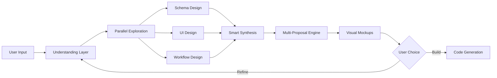
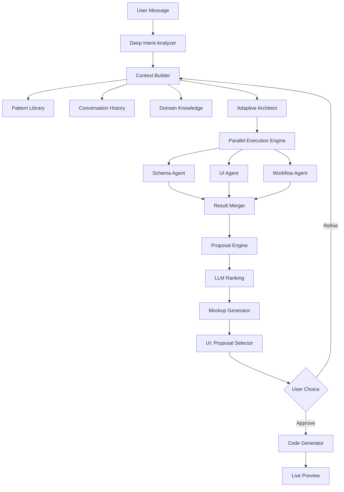

# Dynamic AI Pipeline Evolution

## Vision: True Vibe-Coding with LLMs

Transform your app builder from a **sequential question-answer flow** to a **collaborative design partner** that thinks ahead, proposes smart options, and handles complexity gracefully—all while keeping the UI clean and minimal.

## Core Philosophy

**Current approach**: Linear phases → Ask user → Wait for approval → Next phase

**New approach**: Parallel exploration → Smart proposals → Visual feedback → Continuous refinement

**Key principle**: The LLM should make 90% of decisions autonomously based on best practices, only involving the user for creative/strategic choices.

---

## 1. Continuous Refinement Loop (No Fixed Phases)

### Problem

Current system forces users through rigid phases: intent → schema → ui → code. Users must approve each step before proceeding. This is inflexible and slow.

### Solution: Fluid State Machine

Replace phases with a **continuous refinement loop** where work happens in parallel:



**Implementation approach**:

- **Replace phase enum** with `readinessScore` (0-100) indicating how ready each aspect is
- **Parallel agent execution**: Schema, UI, and Workflow agents work simultaneously
- **Smart checkpointing**: System auto-saves "good states" that user can revert to
- **Continuous preview**: UI updates in real-time as decisions are made

**Example flow**:

```
User: "I want a project tracker like Trello but simpler"

Parallel execution:
├─ Schema Agent: Detects entities (projects, tasks, columns)
├─ UI Agent: Starts designing kanban layout
└─ Workflow Agent: Identifies drag-drop interactions

→ After 2 seconds: Show mockup with all three integrated
→ User can refine any aspect without "going back to schema phase"
```

---

## 2. Context-Aware Understanding Engine

### Problem

Current system doesn't understand references ("like Trello"), can't learn from patterns, and treats each request in isolation.

### Solution: Semantic Context Builder

**Enhanced Intent Engine** that:

1. **Reference understanding**: "Like Trello" → Load known patterns for Trello-style apps
2. **Entity extraction**: Detect multi-entity apps automatically ("projects with tasks")
3. **Workflow detection**: Understand automations ("archive when done")
4. **Complexity estimation**: Route simple vs. complex requests differently
5. **Domain knowledge**: Recognize app categories (CRM, tracker, dashboard, etc.)

**Implementation**:

```typescript
interface EnhancedIntent {
  // Core understanding
  primaryGoal: string;
  appCategory: 'tracker' | 'crm' | 'dashboard' | 'workflow' | 'content' | 'social';
  complexityScore: number; // 1-10
  
  // Entity detection
  entities: {
    name: string;
    role: 'primary' | 'secondary';
    relationships: string[];
  }[];
  
  // Pattern matching
  referenceApps: {
    name: string; // e.g., "Trello", "Notion"
    aspects: string[]; // What to borrow: ["kanban_layout", "drag_drop"]
    confidence: number;
  }[];
  
  // Workflow understanding
  workflows: {
    trigger: string;
    action: string;
    description: string;
  }[];
  
  // Layout hints
  layoutHints: {
    structure: 'dashboard' | 'sidebar' | 'kanban' | 'simple';
    components: string[];
  };
}
```

**LLM Prompt Enhancement**:

Instead of just classifying intent, have the LLM do deep analysis:

```
Analyze this app request in depth:
"I want to track projects with tasks. Each task should have subtasks. 
Show me a dashboard with charts."

Extract:
1. Entity hierarchy (projects → tasks → subtasks)
2. Required views (dashboard, task detail)
3. Visualizations (charts for progress)
4. Likely workflows (task completion, progress tracking)
5. Similar known apps (Asana, Jira features)

Provide a rich context object with all extracted information.
```

---

## 3. Multi-Proposal System with Visual Previews

### Problem

Current system shows ONE schema proposal, ONE layout proposal. Users can't explore alternatives.

### Solution: Generate 2-3 Options, Let User Choose Direction

**Proposal Engine**:

```typescript
interface ProposalSet {
  proposals: Proposal[];
  reasoning: string;
  recommendedIndex: number; // LLM's top pick
}

interface Proposal {
  id: string;
  name: string; // "Minimalist", "Feature-rich", "Dashboard-focused"
  description: string;
  preview: MockupSVG; // Visual representation
  schema: Schema[];
  layout: LayoutNode;
  tradeoffs: {
    pros: string[];
    cons: string[];
  };
  bestFor: string; // "Best for simple tracking"
}
```

**Visual-First Mockups**:

Generate SVG wireframes showing:

- Component placement
- Data flow
- Key interactions
- Responsive behavior

Hide technical details (field types, validations) in expandable sections.

**Example UI**:

```
┌─────────────────────────────────────────────────────┐
│ Here are 3 approaches for your project tracker:    │
├─────────────────────────────────────────────────────┤
│                                                     │
│  ┌─────────────┐  ┌─────────────┐  ┌─────────────┐│
│  │ Minimalist  │  │ Dashboard   │  │ Kanban      ││
│  │             │  │             │  │             ││
│  │ [Wireframe] │  │ [Wireframe] │  │ [Wireframe] ││
│  │             │  │             │  │             ││
│  │ Simple list │  │ Stats + viz │  │ Drag & drop ││
│  │ Best for:   │  │ Best for:   │  │ Best for:   ││
│  │ Quick tasks │  │ Analytics   │  │ Workflows   ││
│  │             │  │             │  │             ││
│  │   [Pick]    │  │ [Pick] ★    │  │   [Pick]    ││
│  └─────────────┘  └─────────────┘  └─────────────┘│
└─────────────────────────────────────────────────────┘
```

**LLM-driven proposal generation**:

```
Given this user request and context, generate 3 distinct approaches:

1. Minimalist: Simplest possible implementation
2. Balanced: Good features, moderate complexity (RECOMMEND THIS)
3. Advanced: Full-featured with workflows

For each, provide:
- Complete schema design
- Layout configuration
- Visual mockup description
- Trade-offs (pros/cons)
- Best use case

Generate proposals that are genuinely different, not just variations.
```

---

## 4. Intelligent Schema Design (Hide Technical Details)

### Problem

Current system exposes field types, validations, and technical details. This is too technical for "vibe-coding."

### Solution: Natural Language Schema Communication

**In the UI, show**:

```
Your project tracker will store:

Projects
├─ Basic info: name, description
├─ Status tracking: current status, progress percentage
├─ Team: assigned members
└─ Dates: start date, deadline

Tasks (within each project)
├─ Task details: title, description, priority
├─ Assignment: who's working on it
└─ Progress: completion status, time spent
```

**Behind the scenes** (agent decides):

```typescript
{
  name: "project",
  fields: [
    { name: "name", type: "string", required: true, maxLength: 100 },
    { name: "description", type: "text", required: false },
    { name: "status", type: "enum", options: ["Planning", "Active", "Complete"] },
    { name: "progress", type: "number", validation: { min: 0, max: 100 } },
    // ... agent decides all technical details
  ]
}
```

**LLM decides**:

- Appropriate field types
- Validation rules
- Required vs. optional
- Default values
- Searchable fields
- Indexes for performance

**User only sees**:

- High-level structure
- Relationships between entities
- Key capabilities

**User can refine with natural language**:

```
"Add priority to tasks" → Agent decides: enum with High/Medium/Low
"Track time spent" → Agent decides: number field with decimal support
"Team members" → Agent decides: array of strings with autocomplete
```

---

## 5. Adaptive Architect with Decision Graph

### Problem

Current architect does simple routing. It doesn't coordinate parallel work or handle complex scenarios.

### Solution: Smart Coordination Layer

**Decision Graph** (not linear flow):

```typescript
interface OrchestrationDecision {
  parallelActions: AgentAction[]; // Multiple agents can work simultaneously
  dependencies: { [actionId: string]: string[] }; // What depends on what
  priority: number; // Urgent vs. can wait
  estimatedTime: number; // Seconds
  userInteractionNeeded: boolean;
  reasoning: string;
}
```

**Example coordination**:

```
User: "Make the form simpler and add a chart"

Architect analyzes:
- "simpler form" → UI Agent can handle independently
- "add chart" → Requires Schema Agent (need numeric field) + UI Agent

Decision:
1. Parallel execution:
   ├─ UI Agent: Simplify form (independent)
   └─ Schema Agent: Ensure numeric field exists
2. Sequential:
   └─ UI Agent: Add chart component (after schema check)

Execute both tracks simultaneously, merge results
```

**LLM prompt for orchestration**:

```
Given user input: "Add charts and make it mobile-friendly"
Current state: [schema with fields X, Y, Z], [layout with components A, B]

Determine:
1. Which agents need to act? (UI agent for both requests)
2. Can they work in parallel? (Yes - both are UI changes)
3. Any blockers? (Charts need numeric field - check schema first)
4. What should user see? (Preview of both changes together)
5. Estimated completion: 3-5 seconds

Generate orchestration plan with dependencies and execution order.
```

---

## 6. Smart Defaults & Proactive Suggestions

### Problem

Current system asks too many questions. LLMs can make most decisions.

### Solution: Decide First, Ask Only When Necessary

**Decision-making hierarchy**:

1. **Auto-decide** (90% of cases):

   - Field types: "age" → number, "email" → string with email validation
   - Component placement: Forms on left, data on right (best practice)
   - Responsive behavior: Stack on mobile (universal pattern)
   - Validations: Email → email regex, phone → phone format
   - Colors/styling: Use app's design system

2. **Smart inference** (8% of cases):

   - "Track expenses" → Detect amount (number), category (enum), date
   - "Team members" → Infer: name (string), role (enum), email (string)
   - "Status tracking" → Infer common statuses: Todo/In Progress/Done

3. **Ask user** (2% of cases):

   - Genuinely ambiguous: "Should priority be 1-5 or Low/Medium/High?"
   - Strategic choices: "Dashboard or kanban layout?"
   - Domain-specific: "What expense categories do you want?"

**Proactive suggestions**:

After user describes basic app, LLM suggests enhancements:

```
Great! I've designed your expense tracker.

You might also want:
✓ Monthly budget limits (I can add this)
✓ Category-based charts (popular for expense tracking)
✓ Receipt photo uploads (useful feature)

Just say "add budgets" or "add charts" to include them.
```

**Implementation**:

```typescript
interface ProactiveSuggestion {
  id: string;
  feature: string;
  reasoning: string;
  confidence: number;
  implementation: {
    schemaChanges: Partial<Schema>[];
    layoutChanges: Partial<LayoutNode>;
    effort: 'trivial' | 'easy' | 'moderate';
  };
}

// LLM generates 3-5 suggestions ranked by relevance
// User can accept with one click
```

---

## 7. Workflow & Automation Understanding

### Problem

Current system only handles CRUD. No support for workflows, automations, or state transitions.

### Solution: Workflow Agent

Detect and implement:

**State machines**:

```
"When task is marked done, move to archive after 7 days"
→ Status field with enum, computed field for archival date, automatic transition
```

**Automations**:

```
"Send notification when deadline approaches"
→ Date field, computed field for "days until deadline", trigger logic
```

**Computed fields**:

```
"Show project completion percentage"
→ Computed from tasks: (completed tasks / total tasks) * 100
```

**Cascading actions**:

```
"When project is deleted, delete all its tasks"
→ Relationship cascade rule
```

**Implementation**:

```typescript
interface WorkflowDefinition {
  trigger: {
    type: 'field_change' | 'time_based' | 'manual';
    field?: string;
    condition: string;
  };
  actions: {
    type: 'update_field' | 'send_notification' | 'create_record' | 'delete_record';
    target: string;
    value?: unknown;
  }[];
}
```

**LLM prompt**:

```
Analyze user request for automation patterns:
"When a task is completed, update the project's progress percentage"

Extract:
1. Trigger: Task status changes to "Complete"
2. Action: Recalculate project.progress
3. Formula: count(tasks where status=Complete) / count(tasks) * 100
4. Implementation: Computed field with dependency tracking

Generate workflow definition and necessary schema changes.
```

---

## 8. Natural Language Refinement

### Problem

Users must understand system structure to request changes ("change the schema" vs. "change the layout").

### Solution: Understand Intent Behind Requests

**User says anything, system routes intelligently**:

```
"Make it simpler" → 
  LLM analyzes current state
  → Too many fields? Remove optional ones (Schema Agent)
  → Complex layout? Simplify to form + table (UI Agent)
  → Too much code? Reduce to essentials (Code Agent)

"Add charts" →
  → Need numeric field? Add one (Schema Agent)
  → Add chart component (UI Agent)
  → Generate chart code (Code Agent)

"Like a dashboard" →
  → Reorganize: Stats at top, charts + table below (UI Agent)
  → Add metric calculations (Schema Agent - computed fields)
  → Update component hierarchy (UI Agent)
```

**Smart refinement prompts**:

```
User: "Add more details"

LLM interprets based on context:
- In schema phase → Add more fields
- In UI phase → Add more components to display
- In preview phase → Show more information per item

Generate appropriate action without asking user to clarify.
```

---

## 9. Visual Mockup Generator

### Problem

Text descriptions of layouts are hard to visualize.

### Solution: Real-time SVG Wireframes

**Generate wireframes as designs evolve**:

```typescript
interface Mockup {
  svg: string;
  annotations: {
    component: string;
    description: string;
    position: { x: number; y: number };
  }[];
  interactions: {
    trigger: string;
    effect: string;
  }[];
}
```

**Example mockup** (simplified ASCII for illustration):

```
┌────────────────────────────────────────┐
│  Project Tracker                    ⚙️ │
├────────────────────────────────────────┤
│                                        │
│  ┌──────────┐  ┌──────────┐  ┌──────┐│
│  │ Active   │  │ Complete │  │ 75%  ││
│  │    12    │  │     8    │  │ Done ││
│  └──────────┘  └──────────┘  └──────┘│
│                                        │
│  ┌─────────────────────────────────┐  │
│  │ Add Project              [Form] │  │
│  │ ┌─────────────────────────────┐ │  │
│  │ │ Name: [____________]        │ │  │
│  │ │ Status: [▼ Active]          │ │  │
│  │ │ Team: [____________]        │ │  │
│  │ │              [Add Project]  │ │  │
│  │ └─────────────────────────────┘ │  │
│  └─────────────────────────────────┘  │
│                                        │
│  Projects                    🔍 Filter │
│  ┌─────────────────────────────────┐  │
│  │ Website Redesign      Active    │  │
│  │ Mobile App             Planning │  │
│  │ Marketing Campaign     Complete │  │
│  └─────────────────────────────────┘  │
└────────────────────────────────────────┘
```

**LLM generates mockup**:

```
Given this layout tree, generate an SVG wireframe showing:
- Component positions and sizes
- Visual hierarchy
- Data flow
- Key interactions (hover states, clicks)
- Responsive breakpoints

Use simple shapes: rectangles for containers, form inputs, buttons.
Add labels and annotations.
```

---

## 10. Implementation Strategy

### Phase 1: Enhanced Orchestration (Highest Impact)

**Files to modify**:

- [`src/lib/scaffolder-v2/agents/architect.ts`](src/lib/scaffolder-v2/agents/architect.ts) - Add parallel execution, decision graph
- [`src/lib/scaffolder-v2/types.ts`](src/lib/scaffolder-v2/types.ts) - Add new types for parallel actions, proposals
- [`src/app/api/scaffolder-v2/route.ts`](src/app/api/scaffolder-v2/route.ts) - Support parallel agent execution

**Changes**:

1. Replace `ConversationPhase` enum with `readiness: { schema: number; ui: number; workflow: number }`
2. Add `parallelActions` to `ArchitectDecision`
3. Support executing multiple agents simultaneously
4. Merge results from parallel execution

### Phase 2: Context Understanding

**New files**:

- `src/lib/scaffolder-v2/agents/intent-engine.ts` - Deep intent analysis
- `src/lib/scaffolder-v2/context/builder.ts` - Semantic context graph
- `src/lib/scaffolder-v2/patterns/reference-library.ts` - Known app patterns

**Capabilities**:

- Detect references ("like Trello")
- Extract entities and relationships automatically
- Understand workflows from description
- Estimate complexity

### Phase 3: Multi-Proposal System

**Files to create**:

- `src/lib/scaffolder-v2/proposals/engine.ts` - Generate multiple proposals
- `src/lib/scaffolder-v2/mockup/generator.ts` - SVG wireframe generation
- `src/components/scaffolder-v2/ProposalSelector.tsx` - UI for choosing proposals

**Features**:

- Generate 2-3 alternative designs
- Visual mockups for each
- LLM-ranked recommendations
- Quick switching between proposals

### Phase 4: Natural Language Refinement

**Enhancements**:

- Smart intent classification for refinements
- Route changes to appropriate agents automatically
- Understand comparative language ("simpler", "more detailed")
- Context-aware suggestions

### Phase 5: Workflow & Automation

**New agent**:

- `src/lib/scaffolder-v2/agents/workflow-agent.ts` - Detect and implement automations

**Capabilities**:

- State machine detection
- Computed field generation
- Trigger-action patterns
- Relationship cascades

---

## UI Considerations (Maintaining Design Language)

**Keep**:

- Dark theme (#0a0a0a background, red accents)
- Minimal code display in main panel
- Clean chat interface
- Side-by-side preview

**Enhance**:

```
┌─────────────────────────────────────────────────────┐
│ Chat Panel              │ Visual Preview Panel      │
├─────────────────────────┼───────────────────────────┤
│                         │                           │
│ User: Track projects    │  [Live Mockup Preview]    │
│                         │                           │
│ Assistant:              │   ┌─────────────────────┐ │
│ I've designed...        │   │   Project Tracker   │ │
│                         │   │                     │ │
│ [3 Proposals]           │   │  Stats Cards        │ │
│ ┌──────┐ ┌──────┐       │   │  ┌────┐ ┌────┐    │ │
│ │Option│ │Option│       │   │  │ 12 │ │ 8  │    │ │
│ │  1   │ │  2   │       │   │  └────┘ └────┘    │ │
│ └──────┘ └──────┘       │   │                     │ │
│                         │   │  Form + Table       │ │
│ User: Pick option 1     │   │  [____________]     │ │
│                         │   │  [____________]     │ │
│ Assistant: Great!       │   │                     │ │
│ Any refinements?        │   │  [ Project List ]   │ │
│                         │   └─────────────────────┘ │
│ [Suggested tweaks]      │                           │
│ • Add charts            │  < Live updates as you    │
│ • Make it simpler       │    chat >                 │
│ • Add team members      │                           │
│                         │                           │
└─────────────────────────┴───────────────────────────┘
```

**Key UI principles**:

1. **Visual-first**: Show mockup alongside text
2. **Progressive disclosure**: Hide technical details, show on demand
3. **Inline refinement**: Edit directly in preview when possible
4. **Smart suggestions**: Proactive options, not questions
5. **One-click actions**: "Add charts", "Make it simpler"

---

## Success Metrics

Track improvements:

1. **Speed**: Time from start to finalized app (target: 50% reduction)
2. **User satisfaction**: Post-build rating (target: 4.5+ / 5)
3. **Complexity handled**: % of complex apps successfully built (multi-entity, workflows)
4. **Refinement cycles**: Average number of iterations (target: 3-4 vs. current 6-8)
5. **LLM autonomy**: % of decisions made by LLM vs. asked to user (target: 90%+)
6. **Completion rate**: % of started sessions that result in built app (target: 80%+)

---

## Technical Architecture Summary



---

## Example: Full Flow with New System

**User**: "I want to track projects like Trello but simpler"

**System** (parallel execution, 2-3 seconds):

1. **Intent Engine**:

   - Detects reference: "like Trello" → Load kanban pattern
   - Entities: Projects, Tasks (implicit columns/statuses)
   - Simplification requested: Fewer features than Trello

2. **Context Builder**:

   - Retrieves Trello pattern: kanban layout, drag-drop, status columns
   - Applies "simpler" filter: Remove due dates, attachments, labels
   - Core features: Columns (To Do, Doing, Done), Cards (tasks)

3. **Parallel Agents**:

   - **Schema Agent**: Designs Project + Task entities, status enum
   - **UI Agent**: Proposes kanban layout with 3 columns
   - **Workflow Agent**: Detects drag-drop requirement

4. **Proposal Engine**:

Generates 3 options:

   - **Minimal**: Just list view (simplest)
   - **Kanban** ★: 3-column board (recommended, matches "like Trello")
   - **Hybrid**: Kanban + table view (more views)

5. **UI Shows**:
   ```
   Here's your simplified project tracker:
   
   [Kanban Mockup]     [List View]     [Hybrid View]
      ★ Recommended
   
   Kanban board with 3 columns: To Do, Doing, Done.
   Drag tasks between columns to update status.
   
   [Pick This] [Refine] [Build Now]
   ```

6. **User**: "Perfect, build it!"

7. **Code Generation**: Produces working kanban app

**Total time**: ~5 seconds

**User inputs**: 2 (initial description + approval)

**Refinements**: 0 (nailed it first try)

---

## Key Differentiators from Current System

| Aspect | Current (v2) | New (Dynamic) |

|--------|-------------|---------------|

| **Flow** | Sequential phases | Continuous refinement |

| **Agents** | One at a time | Parallel execution |

| **Proposals** | Single option | 2-3 alternatives with mockups |

| **Complexity** | Simple CRUD only | Workflows, multi-entity, automations |

| **User input** | Many approvals | Minimal, smart defaults |

| **Visual feedback** | Text descriptions | SVG mockups |

| **References** | Not understood | "Like Trello" works |

| **Refinement** | "Change schema" (technical) | "Make it simpler" (natural) |

| **Decision making** | Ask user often | LLM decides 90% |

| **Time to build** | 8-10 interactions | 3-4 interactions |

---

## Next Steps

**Immediate (High ROI)**:

1. Enhanced architect with parallel execution
2. Multi-proposal system with visual mockups
3. Smart defaults (reduce questions by 70%)

**Medium-term**:

4. Context-aware intent engine
5. Natural language refinement
6. Proactive suggestions

**Long-term**:

7. Workflow & automation support
8. Reference pattern library
9. Advanced multi-entity relationships

Start with #1-3 for maximum impact with minimal code changes.