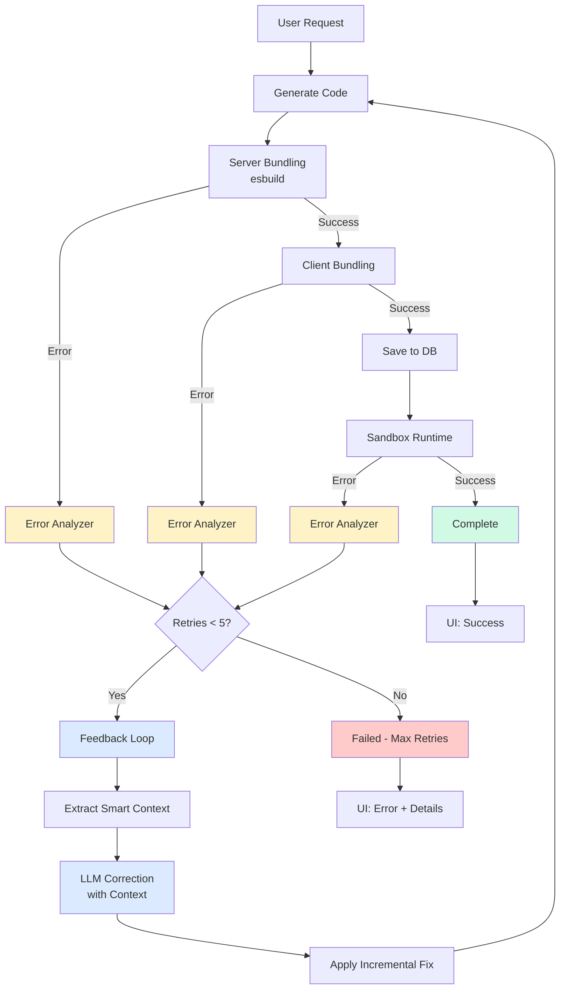

# Error Feedback Loop Implementation Plan

## Overview

Create a production-ready feedback loop that automatically detects, analyzes, and fixes code generation errors using LLM-powered corrections. The system will integrate with your existing error infrastructure and provide real-time visibility into the correction process.

## Architecture



## Key Components

### 1. Error Detection Service

**File:** [`src/lib/scaffolder-v2/error-detection-service.ts`](src/lib/scaffolder-v2/error-detection-service.ts)

Create a centralized service that monitors all error sources:

- **Server bundling errors** (esbuild syntax/transpilation)
- **Client bundling errors** (code structure issues)  
- **Runtime errors** (sandbox execution failures)

**Key Features:**

- Wraps bundling operations with try-catch
- Captures runtime errors via sandbox API callback
- Normalizes error formats for consistent processing
- Extracts line/column info from stack traces

**Integration Points:**

- Integrate into [`generate-stream/route.ts`](src/app/api/apps/generate-stream/route.ts) at bundling stages
- Monitor sandbox errors via postMessage from iframe
- Use existing `ErrorAnalyzer` to categorize errors

### 2. Smart Context Extractor

**File:** [`src/lib/scaffolder-v2/smart-context-extractor.ts`](src/lib/scaffolder-v2/smart-context-extractor.ts)

Intelligent context extraction to minimize token usage:

```typescript
interface SmartContext {
  errorLocation: { line: number; column: number };
  surroundingCode: string; // ±10 lines
  relevantImports: string[]; // Only imports used in error region
  affectedFunction: string; // Function/component containing error
  minimalReproduction: string; // Smallest code snippet demonstrating issue
}
```

**Token Optimization:**

- Extract only ±10 lines around error location
- Include only imports referenced in error region
- Identify and extract just the problematic function/component
- Strip comments and whitespace for token efficiency

### 3. Incremental Fix Generator

**File:** [`src/lib/scaffolder-v2/incremental-fix-generator.ts`](src/lib/scaffolder-v2/incremental-fix-generator.ts)

Generate targeted fixes instead of regenerating entire apps:

**Strategy:**

1. **Identify error scope** - Is it a function, component, or isolated statement?
2. **Extract problematic section** - Pull out the specific code block
3. **LLM regeneration** - Only regenerate the problematic section with error context
4. **Surgical replacement** - Replace just the fixed section in original code
5. **Validation** - Quick syntax check before returning

**Prompting Strategy:**

```
CONTEXT: Fixing a syntax error in generated React code

ERROR DETAILS:
Category: {category}
Location: Line {line}, Column {column}
Message: {errorMessage}

PROBLEMATIC CODE SECTION:
{smartContext.affectedFunction}

SURROUNDING CONTEXT:
{smartContext.surroundingCode}

TASK: Fix ONLY the problematic section. Preserve:
- The function signature
- Variable names and types
- The overall structure

Return ONLY the fixed code section.
```

### 4. Enhanced Feedback Loop Manager

**File:** Extend [`src/lib/scaffolder-v2/feedback-loop.ts`](src/lib/scaffolder-v2/feedback-loop.ts)

Add new methods to existing `FeedbackLoop` class:

```typescript
class FeedbackLoop {
  // ... existing code ...
  
  /**
   * Generate incremental fix prompt with smart context
   */
  generateIncrementalFixPrompt(
    smartContext: SmartContext,
    analysis: AnalyzedError
  ): string;
  
  /**
   * Check if should attempt incremental vs full regeneration
   */
  shouldUseIncrementalFix(): boolean;
  
  /**
   * Track token usage per iteration
   */
  getTokenUsageStats(): {
    totalTokens: number;
    avgTokensPerIteration: number;
  };
}
```

### 5. Streaming Route Integration

**File:** [`src/app/api/apps/generate-stream/route.ts`](src/app/api/apps/generate-stream/route.ts)

Wrap the generation pipeline with retry logic:

**Changes:**

```typescript
// After server bundling (line ~190)
if (!serverBundle.success) {
  const shouldRetry = await feedbackLoop.addError(
    serverBundle.errors,
    'server_bundling',
    currentAttempt
  );
  
  if (shouldRetry && currentAttempt < MAX_RETRIES) {
    sendEvent({
      type: 'retry',
      data: {
        attempt: currentAttempt + 1,
        stage: 'bundling',
        errorCategory: analysis.category,
        message: `Fixing ${analysis.category} error...`
      }
    });
    
    // Generate fix and retry
    const fix = await generateIncrementalFix(
      fullCode, 
      serverBundle.errors,
      feedbackLoop
    );
    
    fullCode = fix;
    currentAttempt++;
    continue; // Retry from bundling step
  }
}
```

**New SSE Event Type:**

```typescript
type: 'retry',
data: {
  attempt: number;
  maxAttempts: number;
  stage: 'bundling' | 'runtime';
  errorCategory: ErrorCategory;
  errorMessage: string;
  fix: string; // What was changed
}
```

### 6. Runtime Error Monitor

**File:** [`src/lib/runtime/runtime-error-monitor.ts`](src/lib/runtime/runtime-error-monitor.ts)

Monitor sandbox runtime errors and feed back to generation loop:

**Implementation:**

- Add error event listener in sandbox iframe
- Send errors back to parent via postMessage
- Parent notifies generation API via callback
- Trigger regeneration with runtime context

**Sandbox Integration:**

```typescript
// In iframe sandbox
window.onerror = (message, source, lineno, colno, error) => {
  window.parent.postMessage({
    type: 'runtime_error',
    data: {
      message,
      line: lineno,
      column: colno,
      stack: error?.stack
    }
  }, '*');
};
```

### 7. UI Components

#### Retry Progress Indicator

**File:** [`src/components/scaffolder/RetryProgressIndicator.tsx`](src/components/scaffolder/RetryProgressIndicator.tsx)

Visual component showing retry attempts:

```typescript
interface RetryAttempt {
  attempt: number;
  stage: string;
  errorCategory: ErrorCategory;
  errorMessage: string;
  status: 'in_progress' | 'success' | 'failed';
  timestamp: Date;
}

// Shows:
// - Current attempt (e.g., "Attempt 2 of 5")
// - Error category badge (syntax/semantic/runtime)
// - Compact error message
// - Animated progress bar
// - Collapsible error details
```

#### Error Detail Panel

**File:** [`src/components/scaffolder/ErrorDetailPanel.tsx`](src/components/scaffolder/ErrorDetailPanel.tsx)

Expandable panel for deep error inspection:

- **Error location** - Line/column with syntax highlighting
- **Analyzed cause** - From ErrorAnalyzer
- **Suggested fix** - What the LLM will attempt
- **Code diff** - Before/after comparison (if applicable)
- **Manual override** - Let user edit and retry

#### Enhanced Code Stream Viewer

**File:** Extend [`src/components/scaffolder/CodeStreamViewer.tsx`](src/components/scaffolder/CodeStreamViewer.tsx)

Add retry visualization:

- Show which sections are being regenerated (highlight)
- Display incremental changes as they're applied
- Indicate successful fixes with checkmarks

### 8. Configuration & Observability

**File:** [`src/lib/scaffolder-v2/feedback-config.ts`](src/lib/scaffolder-v2/feedback-config.ts)

Centralized configuration:

```typescript
export const FEEDBACK_CONFIG = {
  MAX_RETRIES: 5,
  RETRY_STRATEGIES: {
    INCREMENTAL_THRESHOLD: 3, // Use incremental after 3 attempts
    CONTEXT_WINDOW_LINES: 10,
    MIN_CODE_LENGTH_FOR_INCREMENTAL: 50,
  },
  TOKEN_LIMITS: {
    MAX_CONTEXT_TOKENS: 2000,
    MAX_FIX_TOKENS: 1500,
  },
  TIMEOUTS: {
    BUNDLING_TIMEOUT_MS: 30000,
    LLM_TIMEOUT_MS: 60000,
  },
};
```

**Observability:**

- Log each retry attempt with error category
- Track token usage per iteration
- Measure fix success rate by error type
- Store feedback sessions in database for analytics

## Implementation Sequence

### Phase 1: Core Infrastructure (High Priority)

1. Create `error-detection-service.ts` with bundling error capture
2. Extend `feedback-loop.ts` with incremental fix support
3. Create `smart-context-extractor.ts` for token optimization
4. Add `incremental-fix-generator.ts` with surgical code replacement

### Phase 2: Integration (High Priority)

5. Modify `generate-stream/route.ts` to wrap bundling with retry logic
6. Add SSE 'retry' event type to stream
7. Update `useCodeStream` hook to handle retry events
8. Integrate `ErrorAnalyzer` and `FeedbackLoop` into generation pipeline

### Phase 3: UI Updates (Medium Priority)

9. Create `RetryProgressIndicator.tsx` component
10. Create `ErrorDetailPanel.tsx` for error inspection
11. Update `FreeformCreator.tsx` to display retry progress
12. Enhance `CodeStreamViewer.tsx` with diff highlighting

### Phase 4: Runtime Monitoring (Medium Priority)

13. Create `runtime-error-monitor.ts` for sandbox errors
14. Add postMessage error reporting in sandbox iframe
15. Connect runtime errors back to feedback loop
16. Test end-to-end: generation → runtime error → auto-fix

### Phase 5: Polish & Optimization (Lower Priority)

17. Add `feedback-config.ts` with tunable parameters
18. Implement analytics and observability logging
19. Add database schema for storing feedback sessions
20. Create admin dashboard for monitoring fix success rates

## Token Optimization Strategy

### Smart Context Extraction

Instead of sending entire file:

**Before (wasteful):**

```
Total tokens: ~2000 for entire file
```

**After (optimized):**

```typescript
const context = {
  imports: extractRelevantImports(errorLine),     // ~50 tokens
  surroundingCode: getLines(errorLine - 10, +10), // ~200 tokens
  errorMessage: error.message,                    // ~20 tokens
  // Total: ~270 tokens (87% reduction)
}
```

### Incremental Fixes

Instead of regenerating entire component:

**Before:**

```typescript
// Regenerate entire 200-line App component
const newCode = await llm.complete(entireComponent); // ~3000 tokens
```

**After:**

```typescript
// Regenerate only the problematic function
const fixedFunction = await llm.complete({
  prompt: extractFunction(errorLocation),  // ~500 tokens (83% reduction)
  context: smartContext
});
mergeFunction(originalCode, fixedFunction);
```

### Progressive Strategy

- **Attempts 1-2:** Quick incremental fixes (500-1000 tokens/attempt)
- **Attempts 3-4:** Broader context with ±20 lines (1000-2000 tokens)
- **Attempt 5:** Full regeneration if incremental fails (3000-5000 tokens)

**Expected Token Savings:** 60-80% compared to full regeneration every attempt

## Error Handling Edge Cases

1. **Max retries exceeded** - Show detailed error report with suggestions
2. **LLM timeout** - Fall back to simpler fix prompt or skip retry
3. **Same error repeated** - Switch from incremental to full regeneration
4. **Runtime error after successful bundling** - Capture and retry with runtime context
5. **User cancellation** - Allow cancel during retry loop

## Success Metrics

- **Fix success rate** by error category (target: >70% within 3 attempts)
- **Average token usage** per successful fix (target: <2000 tokens)
- **User satisfaction** - Track manual intervention rate
- **Time to resolution** - Average time from error to fix (target: <30s)

## Files to Modify

### New Files

- `src/lib/scaffolder-v2/error-detection-service.ts`
- `src/lib/scaffolder-v2/smart-context-extractor.ts`
- `src/lib/scaffolder-v2/incremental-fix-generator.ts`
- `src/lib/scaffolder-v2/feedback-config.ts`
- `src/lib/runtime/runtime-error-monitor.ts`
- `src/components/scaffolder/RetryProgressIndicator.tsx`
- `src/components/scaffolder/ErrorDetailPanel.tsx`

### Existing Files to Modify

- [`src/lib/scaffolder-v2/feedback-loop.ts`](src/lib/scaffolder-v2/feedback-loop.ts) - Add incremental fix methods
- [`src/app/api/apps/generate-stream/route.ts`](src/app/api/apps/generate-stream/route.ts) - Integrate retry logic
- [`src/hooks/useCodeStream.ts`](src/hooks/useCodeStream.ts) - Handle retry events
- [`src/components/scaffolder/FreeformCreator.tsx`](src/components/scaffolder/FreeformCreator.tsx) - Display retry UI
- [`src/components/scaffolder/CodeStreamViewer.tsx`](src/components/scaffolder/CodeStreamViewer.tsx) - Show diff highlights

## Testing Strategy

1. **Unit tests** for context extraction and incremental fixes
2. **Integration tests** for full retry loop with mock LLM
3. **E2E tests** covering all error stages (bundling, runtime)
4. **Load tests** to ensure performance under retry load
5. **Token usage benchmarks** to validate optimization

## Rollout Plan

1. **Dev testing** - Internal testing with intentional errors
2. **Beta flag** - Enable for subset of users (`ENABLE_ERROR_FEEDBACK=true`)
3. **Gradual rollout** - Monitor success rates, adjust thresholds
4. **Full release** - Enable for all users once stable