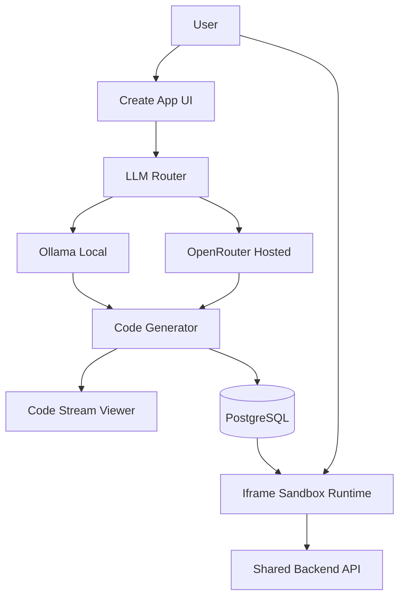
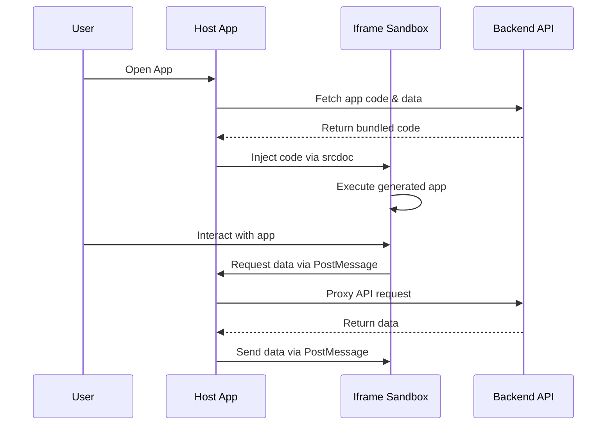
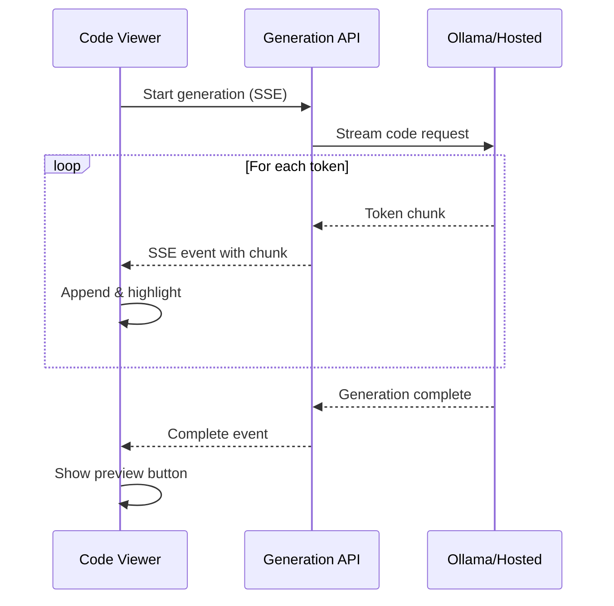
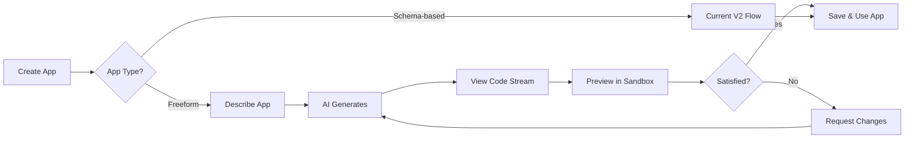

# Flexible AI App Hosting with Ollama & Iframe Sandboxing

## Architecture Overview

We'll build a multi-layered system that allows completely AI-designed apps to run in isolated iframe sandboxes, with support for both local (Ollama) and hosted LLMs, and real-time code streaming.



## 1. Ollama Integration Layer

### New Files

- [`src/lib/llm/ollama-client.ts`](src/lib/llm/ollama-client.ts) - Ollama client with streaming support
- [`src/lib/llm/router.ts`](src/lib/llm/router.ts) - Smart LLM router with fallback logic
- [`src/lib/llm/types.ts`](src/lib/llm/types.ts) - Shared LLM types

### Changes

- Refactor [`src/lib/qwen/client.ts`](src/lib/qwen/client.ts) to be provider-agnostic
- Add health checks for Ollama availability
- Implement automatic fallback: Ollama → Hosted if local fails

### Environment Variables

```env
# Ollama Configuration
OLLAMA_ENABLED=true
OLLAMA_API_URL=http://localhost:11434
OLLAMA_MODEL=qwen3-coder:30b
OLLAMA_SMALL_MODEL=qwen3:4b

# LLM Router Settings
LLM_PROVIDER=ollama  # ollama | openrouter | auto
LLM_FALLBACK_ENABLED=true
```

**Key Features:**

- Auto-detect Ollama availability on startup
- Use `qwen3-coder:30b` for complex generation, `qwen3:4b` for quick tasks
- Graceful degradation to OpenRouter when Ollama unavailable
- Per-request provider override capability

## 2. Iframe Sandbox Runtime System

### New Files

- [`src/components/runtime/IframeSandbox.tsx`](src/components/runtime/IframeSandbox.tsx) - Secure iframe container
- [`src/components/runtime/SandboxBridge.ts`](src/components/runtime/SandboxBridge.ts) - PostMessage communication layer
- [`src/app/sandbox/[appId]/page.tsx`](src/app/sandbox/[appId]/page.tsx) - Sandboxed app entry point
- [`src/lib/runtime/code-bundler.ts`](src/lib/runtime/code-bundler.ts) - Bundle generated code for iframe execution
- [`src/lib/runtime/sandbox-api.ts`](src/lib/runtime/sandbox-api.ts) - Safe API wrapper for sandboxed apps

### Architecture

The sandbox system uses a two-layer approach:

**Layer 1: Host Application** (main Cumulonimbus app)

- Renders the iframe container
- Manages communication via PostMessage
- Controls permissions and data access

**Layer 2: Sandboxed App** (runs in iframe at `/sandbox/[appId]`)

- Executes AI-generated code
- Has restricted access to parent context
- Communicates only via PostMessage bridge



**Security Features:**

- `sandbox` attribute with restricted permissions
- No access to parent window
- CSP headers for XSS protection
- PostMessage validation with origin checks

## 3. Enhanced Code Generation System

### Changes to Existing Files

- [`src/lib/scaffolder-v2/agents/code-generator.ts`](src/lib/scaffolder-v2/agents/code-generator.ts) - Remove schema rigidity, add full freedom mode
- [`src/app/api/scaffolder-v2/route.ts`](src/app/api/scaffolder-v2/route.ts) - Add streaming code generation endpoint

### New Files

- [`src/app/api/scaffolder-v2/generate-free/route.ts`](src/app/api/scaffolder-v2/generate-free/route.ts) - Free-form generation endpoint
- [`src/lib/scaffolder-v2/agents/freeform-generator.ts`](src/lib/scaffolder-v2/agents/freeform-generator.ts) - Unconstrained code generator

### Free-form Generation Flow

Instead of following rigid schema → layout → code pipeline, allow LLM complete freedom:

1. **Intent Understanding**: User describes what they want
2. **Design Proposal**: LLM proposes complete app design (data, UI, interactions)
3. **Code Generation**: LLM generates complete React app with no constraints
4. **Bundle & Store**: Package code into executable bundle, store in DB

**Example Prompt Pattern:**

```
User: "Create a Kanban board like Trello with drag-and-drop"

LLM generates:
- Complete React components with react-beautiful-dnd
- Custom hooks for state management
- Tailwind-styled UI
- LocalStorage or API integration
- Full interactivity
```

## 4. Code Streaming Viewer

### New Files

- [`src/components/scaffolder/CodeStreamViewer.tsx`](src/components/scaffolder/CodeStreamViewer.tsx) - Real-time code display with syntax highlighting
- [`src/hooks/useCodeStream.ts`](src/hooks/useCodeStream.ts) - Hook for consuming SSE code streams

### Features

- **Live Code Display**: Show code as it's generated token-by-token
- **Syntax Highlighting**: Use Prism.js or Shiki for highlighting
- **File Tabs**: Switch between multiple generated files
- **Progress Indicator**: Visual feedback on generation status
- **Copy Button**: Easy code copying



## 5. User Settings & Configuration

### New Files

- [`src/app/(main)/settings/page.tsx`](src/app/\\(main)/settings/page.tsx) - User settings page
- [`src/components/settings/LLMProviderSettings.tsx`](src/components/settings/LLMProviderSettings.tsx) - LLM configuration UI

### Database Changes

Update [`prisma/schema.prisma`](prisma/schema.prisma):

```prisma
model User {
  // ... existing fields
  
  // LLM Preferences
  preferredLLMProvider  String? @default("auto") // "ollama" | "openrouter" | "auto"
  ollamaEndpoint        String? @default("http://localhost:11434")
  ollamaModel           String? @default("qwen3-coder:30b")
  ollamaSmallModel      String? @default("qwen3:4b")
}
```

### Settings UI Features

- **Provider Selection**: Radio buttons for Ollama / Hosted / Auto
- **Ollama Endpoint**: Input field with validation
- **Model Selection**: Dropdowns for primary and small models
- **Connection Test**: Button to test Ollama connectivity
- **Fallback Toggle**: Enable/disable automatic fallback

## 6. Enhanced V2 Runtime with Sandbox

### Changes

- Update [`src/app/apps/[appId]/page.tsx`](src/app/apps/[appId]/page.tsx) to detect sandbox-enabled apps
- Create [`src/app/apps/[appId]/V2SandboxRuntime.tsx`](src/app/apps/[appId]/V2SandboxRuntime.tsx) for iframe-based execution
- Update [`prisma/schema.prisma`](prisma/schema.prisma) to add `executionMode` field

### App Types

**Type 1: Schema-based Apps** (current V2 apps)

- Use predefined schema
- Run with V2Runtime component
- Backward compatible

**Type 2: Sandbox Apps** (new freeform apps)

- Completely AI-generated
- Run in iframe sandbox
- No schema requirements
- Stored as complete code bundle
```prisma
model App {
  // ... existing fields
  
  executionMode     String  @default("schema") // "schema" | "sandbox"
  bundledCode       String? // Complete JS bundle for sandbox apps
  sandboxPermissions Json?  // Permissions configuration
}
```


## 7. Streaming Code Generation API

### New Endpoint

[`src/app/api/apps/generate-stream/route.ts`](src/app/api/apps/generate-stream/route.ts)

**Features:**

- Server-Sent Events (SSE) for real-time streaming
- Progressive code generation with file markers
- Error handling and recovery
- Cancellation support

**SSE Event Format:**

```typescript
{
  type: 'chunk' | 'file' | 'complete' | 'error',
  filename?: string,
  content?: string,
  progress?: number,
  error?: string
}
```

## Implementation Strategy

### Phase 1: Ollama Integration (Foundation)

1. Create Ollama client and router
2. Add health checks and fallback logic
3. Update qwen client to use router
4. Add environment variables
5. Test with existing code generation

### Phase 2: Sandbox Runtime (Core Infrastructure)

1. Build IframeSandbox component
2. Create sandbox entry point route
3. Implement PostMessage bridge
4. Create code bundler for iframe injection
5. Add security headers and CSP
6. Test with simple React component

### Phase 3: Free-form Generation (AI Freedom)

1. Create freeform generator agent
2. Remove schema constraints
3. Add streaming generation endpoint
4. Implement code bundler for storage
5. Update App model with executionMode
6. Test end-to-end generation

### Phase 4: Code Streaming Viewer (UX Enhancement)

1. Build CodeStreamViewer component
2. Create useCodeStream hook
3. Add syntax highlighting
4. Implement file tabs
5. Add copy/preview functionality

### Phase 5: User Settings (Configuration)

1. Add user preferences to schema
2. Create settings page
3. Build LLM configuration UI
4. Add connection testing
5. Wire up settings to router

### Phase 6: Integration & Polish

1. Update V2 app creation flow
2. Add sandbox app selector in UI
3. Implement app type migration
4. Add documentation
5. Performance optimization
6. Security audit

## Security Considerations

### Iframe Sandbox Restrictions

```html
<iframe 
  sandbox="allow-scripts allow-same-origin"
  csp="default-src 'self'; script-src 'unsafe-eval' 'unsafe-inline';"
/>
```

### Code Validation

- Lint generated code before execution
- Validate imports (only allow approved libraries)
- Sanitize user inputs
- Rate limit generation requests

### API Access Control

- Sandbox apps can only access their own data
- PostMessage validation with HMAC signatures
- Strict origin checking
- Token-based authentication for sandbox API

## Performance Optimizations

1. **Code Bundling**: Pre-bundle common dependencies
2. **Caching**: Cache Ollama responses for similar requests
3. **Lazy Loading**: Load iframe content on-demand
4. **Stream Chunking**: Optimize SSE chunk sizes
5. **Model Selection**: Use smaller model (qwen3:4b) for simple tasks

## Testing Strategy

1. **Unit Tests**: LLM router, sandbox bridge, code bundler
2. **Integration Tests**: End-to-end generation flow
3. **Security Tests**: XSS, injection, PostMessage exploits
4. **Performance Tests**: Generation speed, iframe overhead
5. **Fallback Tests**: Ollama failure scenarios

## Migration Path

### Existing Apps

- Remain schema-based (executionMode: "schema")
- Continue using V2Runtime
- No changes required

### New Apps

- Users choose between schema-based or freeform
- Freeform apps use new sandbox runtime
- Clear distinction in UI

## User Experience Flow



## Success Metrics

1. **Generation Success Rate**: % of apps that generate without errors
2. **Ollama Usage**: % of requests handled by local LLM
3. **Fallback Rate**: % of requests falling back to hosted
4. **Average Generation Time**: Time from request to runnable app
5. **User Satisfaction**: Feedback on freeform vs schema apps

## Future Enhancements

1. **Multi-File Apps**: Support complex apps with multiple routes
2. **Package Installation**: Allow AI to npm install libraries on-demand
3. **Backend Generation**: Generate API routes in sandbox
4. **App Marketplace**: Share and remix freeform apps
5. **Collaborative Editing**: Multi-user app building
6. **Version Control**: Git-like history for app iterations