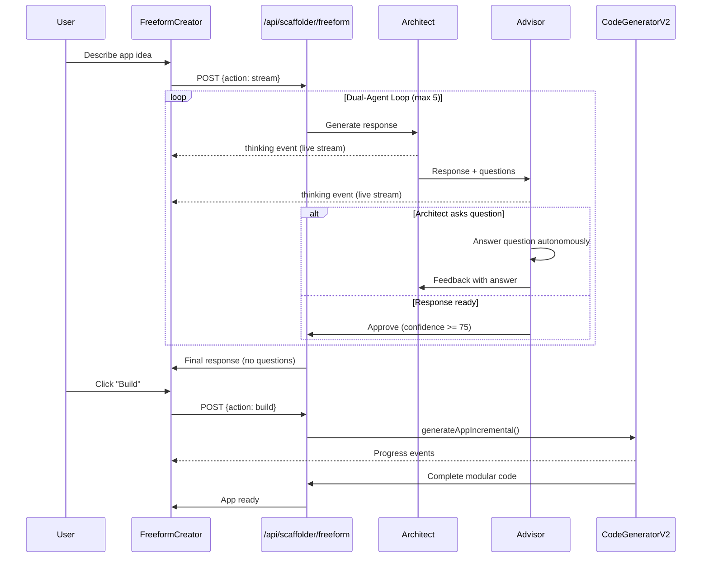

# Freeform Intelligence Upgrade

## Problem Analysis

The current Freeform mode has several issues:

1. Uses the basic V1 code generator (`code-generator.ts`) instead of the advanced V2 modular generator
2. Internal Architect/Advisor dialogue is only shown after completion, not live-streamed
3. Architect lacks platform-specific context (doesn't understand Cumulonimbus hosted web app architecture)
4. Advisor only validates responses instead of making autonomous decisions
5. Questions are forwarded to users when the Advisor could answer them

## Architecture Changes

### 1. Fix Freeform Generation Pipeline

**File:** [`src/app/api/scaffolder/freeform/route.ts`](src/app/api/scaffolder/freeform/route.ts)

The `handleBuild()` function currently uses the basic V1 code generator:

```516:549:src/app/api/scaffolder/freeform/route.ts
    for await (const chunk of generateAppCode(projectSpec as any, app.id)) {
      // ...basic single-page generation
    }
    if (hadError || !generatedCode.pageComponent) {
      generatedCode.pageComponent = generateFallbackCode(projectSpec as any, app.id);
    }
```

**Changes:**

- Import and use `CodeGeneratorAgent` from V2: `src/lib/scaffolder-v2/agents/code-generator.ts`
- Convert `FreeformState.spec` to V2 `Schema` format
- Use `generateAppIncremental()` for modular component generation
- Pass full conversation context to enhance code quality

### 2. Live-Stream Internal Dialogue

**File:** [`src/components/scaffolder/FreeformCreator.tsx`](src/components/scaffolder/FreeformCreator.tsx)

Current behavior: Internal dialogue is captured but only shown after message completion in a collapsed debug view.

**Changes:**

- Add new state for live internal dialogue: `liveInternalDialogue: InternalTurn[]`
- Display a "Thinking" panel that updates in real-time as `internal` events arrive
- Make the panel collapsible/expandable (default expanded during streaming)
- Style it distinctly to show the Architect-Advisor conversation live

### 3. Upgrade Architect System Prompt

**File:** [`src/lib/scaffolder/freeform-architect.ts`](src/lib/scaffolder/freeform-architect.ts)

Add platform-specific context to `ARCHITECT_SYSTEM_PROMPT`:

```typescript
## PLATFORM CONTEXT - CRITICAL
You are building hosted web apps for the Cumulonimbus platform.

PLATFORM ARCHITECTURE:
- Apps run as isolated React components inside the platform's sandbox
- Data is automatically persisted via /api/apps/{appId}/data endpoints
- No external cloud storage needed - the platform handles all persistence
- No authentication/login needed - handled by platform
- Available API: GET (fetch all), POST (create), PUT (update), DELETE (remove)

DO NOT ASK ABOUT:
- Cloud storage providers (AWS, GCP, Firebase) - not needed
- Database choices (Postgres, MongoDB) - handled by platform
- Authentication providers - handled by platform
- Deployment/hosting - automatic

ALWAYS INFER:
- Data persistence: Platform's built-in data API
- File storage: Platform's built-in storage
- User context: Available via platform injection
```

### 4. Transform Advisor into Autonomous Decision-Maker

**File:** [`src/lib/scaffolder/advisor-agent.ts`](src/lib/scaffolder/advisor-agent.ts)

Rewrite `ADVISOR_SYSTEM_PROMPT` to be an autonomous decision-maker:

```typescript
## YOUR NEW ROLE
You are not just a validator - you are the USER'S ADVOCATE making decisions on their behalf.

When the Architect asks questions, YOU answer them instead of forwarding to the user.

## DECISION-MAKING AUTHORITY
- Answer technical questions using best practices
- Choose UI patterns based on modern minimalist aesthetics  
- Select data structures based on functionality requirements
- Make all decisions the user would find tedious or confusing

## AESTHETIC PRINCIPLES
Your design sense follows sleek modern artistic minimalism:
- Clean lines, generous whitespace
- Subtle shadows and elegant transitions
- Monochromatic base with single accent color
- Typography hierarchy over visual clutter
- Function-forward design

## PRIORITY ORDER
1. Robustness: App should work reliably
2. Functionality: Features should be complete
3. Usability: Intuitive without explanation
4. Aesthetics: Beautiful but not at cost of above
```

### 5. Modify Dual-Agent Orchestrator for Autonomous Q&A

**File:** [`src/lib/scaffolder/dual-agent-orchestrator.ts`](src/lib/scaffolder/dual-agent-orchestrator.ts)

Change the flow:

- When Architect poses a question, Advisor intercepts and answers it
- Advisor's answer gets incorporated into the next iteration
- Only forward to user if Advisor explicitly marks as "NEEDS_USER_INPUT"

Add new event type:

```typescript
export type OrchestratorEvent =
  | { type: 'thinking'; agent: 'architect' | 'advisor'; content: string; ... }  // New: live thinking
  | { type: 'internal'; ... }
  | { type: 'chunk'; content: string }
  | ...
```

### 6. Improve Icons

**File:** [`src/components/scaffolder/FreeformCreator.tsx`](src/components/scaffolder/FreeformCreator.tsx)

Update imports and icon usage:

- Architect: `Lightbulb` or `Compass` (represents creative ideation)
- Advisor: `Scale` or `Shield` (represents balanced decision-making)

## Key Files to Modify

| File | Changes |

|------|---------|

| `src/lib/scaffolder/freeform-architect.ts` | Add platform context to system prompt |

| `src/lib/scaffolder/advisor-agent.ts` | Rewrite as autonomous decision-maker |

| `src/lib/scaffolder/dual-agent-orchestrator.ts` | Add Q&A interception, live thinking events |

| `src/app/api/scaffolder/freeform/route.ts` | Use V2 code generator, stream thinking events |

| `src/components/scaffolder/FreeformCreator.tsx` | Live thinking UI, new icons |

## Data Flow After Changes

