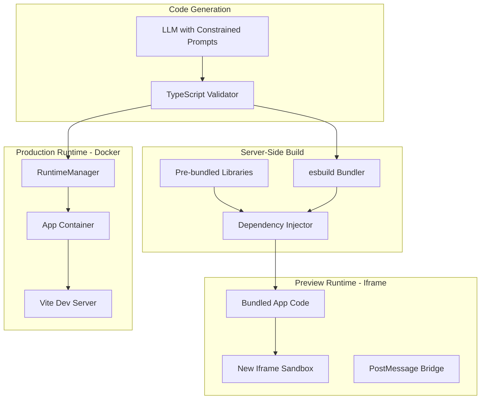

# Hybrid Runtime System for Generated Apps

## Problem Summary

The current system fails because:

- LLM generates code with imports that don't exist in the iframe
- No server-side transpilation/bundling step
- Docker RuntimeManager exists but is disconnected from the rendering flow
- Babel standalone in the browser can't handle complex TypeScript patterns

## Architecture Overview



## Phase 1: Pre-bundled Dependency System

Create a module that pre-bundles approved dependencies that the LLM is constrained to use.

### Comprehensive Approved Dependencies Allowlist

This allowlist is designed to be permissive and enable creative freedom while maintaining platform security and performance. All dependencies are:

- Pure JavaScript/TypeScript (no native bindings)
- Client-side safe (no server-only APIs)
- Reasonably sized (no mega-bundles)
- Tree-shakeable where possible

#### Core (Always Available)

- `react` - React library (via CDN)
- `react-dom` - React DOM rendering (via CDN)

#### Icons & Visual Assets

- `lucide-react` - Modern icon library (~1MB tree-shakeable)
- `react-icons` - Popular icon library aggregator
- `heroicons` - Tailwind's icon set

#### Date & Time Utilities

- `date-fns` - Modern date utility library (~70KB tree-shakeable)
- `dayjs` - Lightweight alternative to moment.js (~2KB)
- `ms` - Millisecond conversion utility

#### UI Component Libraries

- `@radix-ui/react-*` - Accessible, unstyled component primitives (select specific components)
- `@headlessui/react` - Unstyled accessible UI components
- `react-aria` - Adobe's accessible component library
- `framer-motion` - Animation library (~60KB)
- `react-spring` - Spring-physics based animation library

#### Form & Validation

- `react-hook-form` - Performant form library (~40KB)
- `zod` - TypeScript-first validation (~50KB)
- `yup` - Schema validation
- `validator` - String validation utilities

#### Data Visualization & Charts

- `recharts` - React charts built on D3 (~400KB)
- `victory` - Alternative React chart library
- `react-chartjs-2` + `chart.js` - Chart.js wrapper
- `nivo` - Rich data visualization components
- `d3` - Low-level data visualization (allow but encourage recharts)

#### Utility Libraries

- `lodash-es` - Modular utilities (tree-shakeable)
- `just-*` - Micro utility libraries (just-debounce, just-throttle, etc.)
- `clsx` - Conditional className utility (~1KB)
- `tailwind-merge` - Merge Tailwind classes intelligently
- `nanoid` - Tiny ID generator (~200B)
- `uuid` - UUID generator
- `classnames` - Dynamic class names utility

#### State Management (Lightweight)

- `zustand` - Tiny state management (~1KB)
- `jotai` - Atomic state management (~3KB)
- `valtio` - Proxy-based state management
- NOT redux/mobx (too heavy, use built-in hooks instead)

#### Data Fetching (Optional, since we have useAppData)

- `swr` - Lightweight data fetching (~5KB)
- `@tanstack/react-query` - Powerful async state management (~40KB)
- Note: LLM should prefer built-in `useAppData` hook for CRUD

#### Text & String Utilities

- `markdown-to-jsx` - Render markdown as JSX
- `react-markdown` - Markdown component
- `slugify` - URL-safe slug generation
- `pluralize` - Pluralization utility

#### Number & Math

- `numeral` - Number formatting
- `big.js` - Arbitrary precision math
- `accounting` - Money/currency formatting

#### Color Utilities

- `tinycolor2` - Color manipulation
- `colord` - Modern color manipulation (~3KB)
- `chroma-js` - Color scales and conversions

#### Drag & Drop

- `@dnd-kit/core` + `@dnd-kit/sortable` - Modern drag and drop
- `react-beautiful-dnd` - Accessible drag and drop

#### Tables & Data Display

- `@tanstack/react-table` - Headless table library (~14KB)
- `react-window` - Efficient list virtualization
- `react-virtualized` - Alternative virtualization

#### File & Media

- `react-dropzone` - File upload component
- `browser-image-compression` - Client-side image compression

#### Routing (Limited - not full Next.js routing)

- `wouter` - Tiny router (~1.5KB) for single-page nav within app
- NOT react-router-dom (we control page routing)

#### Storage & Persistence (Client-side only)

- `idb` - IndexedDB wrapper
- `localforage` - localStorage/IndexedDB abstraction
- Note: Should use SandboxAPI for server persistence

#### Miscellaneous

- `react-confetti` - Fun confetti animation
- `qrcode.react` - QR code generation
- `react-hot-toast` - Lightweight toast notifications
- `sonner` - Modern toast component
- `react-toastify` - Toast notification library

### Explicitly BLOCKED Dependencies

**Security/Safety Risks:**

- Any package with native bindings (`.node` files)
- `eval`, `Function`, `vm` usage
- Filesystem access (`fs`, `fs-extra`, `node:fs`)
- Server frameworks (`express`, `fastify`, `koa`, `hapi`)
- Database drivers (`pg`, `mysql`, `mongodb`, `sqlite3`)
- Process/OS access (`child_process`, `os`, `cluster`)

**Performance/Size Concerns:**

- `moment` (deprecated, use date-fns or dayjs)
- `redux` + `react-redux` (too heavy, use zustand/jotai)
- `mobx` (too complex, use lighter alternatives)
- `rxjs` (too large for most use cases)
- Full `lodash` (use lodash-es for tree-shaking)
- `three.js` (too large, specialized use case)

**Redundant (We Provide Better Alternatives):**

- `axios` - Use built-in `SandboxAPI.fetch` or native `fetch`
- `react-query` for CRUD - Use built-in `useAppData` hook
- `react-router` - We control routing

### Implementation

**Create:** `src/lib/runtime/dependency-bundle.ts`

- Use esbuild to create separate bundles by category (icons, charts, forms, etc.)
- Lazy-load bundles based on imports detected in user code
- Expose as `window.AppDependencies.{category}.{package}` in the iframe
- Generate TypeScript declarations for autocomplete

**Create:** `scripts/build-dependencies.ts`

- Build script that bundles all approved dependencies
- Output to `public/runtime-deps/` for CDN serving
- Generate manifest with bundle sizes and exports
- Run during deployment and cache aggressively

**Bundle Strategy:**

```
core.js (React, hooks) - Always loaded
icons.js (lucide-react, react-icons) - Lazy load on import
charts.js (recharts, victory) - Lazy load on import
forms.js (react-hook-form, zod) - Lazy load on import
utils.js (date-fns, lodash-es, clsx) - Always loaded
animations.js (framer-motion, react-spring) - Lazy load
advanced.js (d3, radix-ui, dnd-kit) - Lazy load on import
```

## Phase 2: Server-Side Code Processing

Replace client-side Babel with server-side esbuild transpilation.

**New Files:**

```typescript:src/lib/runtime/server-bundler.ts
// Server-side bundler using esbuild
// - Validates TypeScript
// - Transpiles to browser-compatible JS
// - Injects dependency imports as globals
// - Returns bundled code or detailed errors
```

**Key Functions:**

- `bundleAppCode(code: string): Promise<BundleResult>`
- `validateTypeScript(code: string): ValidationResult`
- `transformImports(code: string): string` - rewrites imports to use `window.AppDependencies`

## Phase 3: New Iframe Preview Runtime

Replace `IframeSandbox.tsx` with a new implementation.

**Changes:**

- Remove Babel standalone loading (transpilation happens server-side)
- Inject pre-bundled dependencies
- Better error handling with source maps
- Hot reload capability for development

**Delete:** [`src/components/runtime/IframeSandbox.tsx`](src/components/runtime/IframeSandbox.tsx)

**Create:** `src/components/runtime/PreviewRuntime.tsx`

## Phase 4: Connect Docker RuntimeManager

Wire the existing [`RuntimeManager`](src/lib/runtime-manager/manager.ts) into the app flow for published apps.

**Changes to RuntimeManager:**

- Add method: `deployAndServe(appId, bundledCode)`
- Install only approved dependencies (fast, cached)
- Use Vite for the dev server (faster than ts-node)
- Return the proxied URL to the client

**New API Route:** `src/app/api/runtime/[appId]/route.ts`

- `POST` - Create/start container for app
- `GET` - Get container status and URL
- `DELETE` - Stop and destroy container

## Phase 5: Update LLM Prompts

Modify all code generation prompts to constrain imports to the approved allowlist.

**Files to Update:**

- [`src/lib/scaffolder-v2/agents/freeform-generator.ts`](src/lib/scaffolder-v2/agents/freeform-generator.ts)
- [`src/lib/scaffolder-v2/agents/code-generator.ts`](src/lib/scaffolder-v2/agents/code-generator.ts)
- [`src/lib/scaffolder/code-generator.ts`](src/lib/scaffolder/code-generator.ts)

**Prompt Addition:**

```
AVAILABLE IMPORTS - You have access to these pre-bundled dependencies:

CORE & BUILT-INS (prefer these):
- React hooks: useState, useEffect, useCallback, useMemo, useRef, useReducer, useContext
- useAppData() hook: Built-in hook for CRUD operations (prefer over react-query)
- SandboxAPI.fetch(): Built-in fetch wrapper (prefer over axios)

ICONS:
- lucide-react: <Heart />, <CheckCircle />, <Menu />, etc.
- react-icons: Icon components from multiple libraries

DATES:
- date-fns: format, parseISO, differenceInDays, addDays, subDays, etc.
- dayjs: Lightweight date manipulation

FORMS & VALIDATION:
- react-hook-form: useForm, Controller, etc.
- zod: z.object, z.string, z.number, etc.
- yup: Alternative validation

CHARTS & VISUALIZATION:
- recharts: LineChart, BarChart, PieChart, AreaChart, etc.
- victory: Alternative chart library
- react-chartjs-2 + chart.js: Chart.js wrapper

UI COMPONENTS:
- @radix-ui/react-*: Dialog, Dropdown, Tooltip, etc.
- @headlessui/react: Menu, Listbox, Switch, etc.
- framer-motion: motion components, animations

UTILITIES:
- clsx: Conditional className utility
- tailwind-merge: Merge Tailwind classes
- lodash-es: debounce, throttle, groupBy, etc. (import from lodash-es)
- nanoid: Tiny unique ID generator

STATE MANAGEMENT (if needed beyond useState):
- zustand: create, useStore
- jotai: atom, useAtom

TABLES:
- @tanstack/react-table: useReactTable, flexRender, etc.

DRAG & DROP:
- @dnd-kit/core: DndContext, useDraggable, useDroppable
- @dnd-kit/sortable: SortableContext, useSortable

OTHER:
- react-markdown: Render markdown
- react-hot-toast or sonner: Toast notifications
- react-confetti: Confetti animations

EXPLICITLY AVOID:
- axios (use SandboxAPI.fetch or native fetch)
- @tanstack/react-query for CRUD (use useAppData hook)
- moment (use date-fns or dayjs)
- redux/mobx (use zustand or jotai if needed)
- Any server frameworks (express, fastify)
- Any database drivers (pg, mysql, mongodb)
- File system libraries (fs, fs-extra)
- Any package not listed above

IMPORT SYNTAX:
import { useState, useEffect } from 'react';
import { Heart, Menu } from 'lucide-react';
import { format } from 'date-fns';
import { z } from 'zod';
import { LineChart, Line, XAxis, YAxis } from 'recharts';

If you need a package not listed, consider if you can accomplish it with vanilla JavaScript or built-in tools first.
```

## Phase 6: App Page Integration

Update [`src/app/apps/[appId]/page.tsx`](src/app/apps/[appId]/page.tsx) to use the new runtimes.

**Logic:**

```
if (app.status === 'ACTIVE' && user wants production):
  -> Use Docker runtime via RuntimeManager
else:
  -> Use new PreviewRuntime (iframe with server-bundled code)
```

## Phase 7: Cleanup

**Delete files:**

- `src/components/runtime/IframeSandbox.tsx`
- `src/lib/runtime/code-bundler.ts` (replace with server-bundler)

**Update files:**

- `src/components/runtime/index.ts` - export new components
- `src/app/apps/[appId]/V2SandboxRuntime.tsx` - use PreviewRuntime

## Security Safeguards

**Philosophy:** Be maximally permissive for user creativity while protecting server infrastructure. Users should have full authority over their apps' behavior within their sandbox.

### 1. Resource Limits (Docker)

**Isolation Strategy:**

- Memory: 512MB default, 1GB max (prevents OOM on host)
- CPU: 1 core default, 2 cores max (prevents CPU exhaustion)
- Network: isolated bridge, no external network access by default
- Filesystem: read-only root, writable /tmp only (max 100MB)

**Why these are safe:**

- Each container is isolated - user code cannot affect other containers
- Resource limits prevent DOS attacks on host
- Users can run CPU-intensive charts, animations, etc. within their quota
- Network isolation prevents SSRF attacks

### 2. Dependency Safety Analysis

**All approved dependencies are safe because:**

- Pure JavaScript/TypeScript - no native code execution
- Client-side libraries - no filesystem/process access
- Well-maintained, popular packages with security audits
- Tree-shakeable - users only load what they import

**Potential concerns addressed:**

- `d3` - Large but client-side, doesn't affect server
- `framer-motion` - Animation-heavy but contained in iframe/container
- `@dnd-kit` - DOM manipulation only, no security risk
- `lodash-es` - Utility functions, completely safe
- `zustand/jotai` - Client-side state, no server interaction

**Attack vectors blocked:**

- No `eval` or `Function` constructor (caught at build time)
- No filesystem access (`fs` blocked)
- No process spawning (`child_process` blocked)
- No native bindings (`.node` files rejected)
- No arbitrary npm install (only pre-bundled allowlist)

### 3. Code Validation Pipeline

**Build-time validation (esbuild):**

- TypeScript compilation catches syntax errors
- Import analysis rejects non-allowlisted packages
- Static analysis for dangerous patterns
- Bundle size limits (5MB max per app)

**Runtime validation (iframe sandbox):**

- CSP headers prevent XSS
- No `eval`, `Function` constructor access
- Sandboxed origin (no cookie access to main site)
- PostMessage bridge for controlled communication

### 4. Container Lifecycle Management

**Auto-scaling & cleanup:**

- Auto-terminate after 30 minutes idle
- Max 10 containers per user (expandable for paid tiers)
- Max 100 total containers across platform (adjust based on hardware)
- Cleanup job runs every 5 minutes
- Force-kill containers exceeding limits

**Monitoring:**

- Track CPU/memory usage per container
- Alert if aggregate usage > 80% of host capacity
- Automatic container throttling if host under pressure

### 5. Network Isolation

**Iframe (Preview):**

- Sandboxed iframe origin
- PostMessage-only communication
- API requests proxied through parent
- CDN dependencies only (no arbitrary URLs)

**Docker (Production):**

- Isolated bridge network
- No external network access (can be relaxed for paid tiers)
- Allowlist specific APIs if needed (e.g., allow fetch to public APIs)
- DNS queries logged and rate-limited

### 6. Rate Limiting

**Per user:**

- Max 10 app generations per hour
- Max 5 Docker containers running simultaneously
- Max 100 API requests per minute per app

**Per platform:**

- Max 1000 concurrent Docker containers
- Max 10,000 API requests per minute across all apps

### Creative Freedom Assessment

**What users CAN do (safely):**

- Build complex, animated UIs with framer-motion
- Create rich data visualizations with recharts/d3
- Implement drag-and-drop interfaces
- Use any UI component library from allowlist
- Run CPU-intensive calculations (within quota)
- Store data in IndexedDB/localStorage (client-side)
- Make controlled API calls through SandboxAPI

**What users CANNOT do (and shouldn't):**

- Access server filesystem
- Spawn processes or run shell commands
- Mine cryptocurrency (CPU limits prevent profitability)
- Attack other users (isolation prevents cross-contamination)
- DOS the server (resource limits + rate limiting)
- Exfiltrate data from other apps (network isolation)

**Conclusion:** The allowlist is comprehensive enough for rich app development while maintaining strong security boundaries. Users have creative freedom within their sandbox without compromising platform integrity.

## Dependency Bundle Size Estimates

Reference for build optimization and lazy-loading decisions:

| Bundle | Packages | Approx Size | Load Strategy |

|--------|----------|-------------|---------------|

| `core.js` | React, hooks | 45KB (CDN) | Always load |

| `utils.js` | date-fns, lodash-es, clsx, nanoid | ~100KB | Always load |

| `icons.js` | lucide-react, react-icons | ~80KB | Lazy (on import) |

| `forms.js` | react-hook-form, zod, yup | ~90KB | Lazy (on import) |

| `charts.js` | recharts, victory | ~400KB | Lazy (on import) |

| `animations.js` | framer-motion, react-spring | ~80KB | Lazy (on import) |

| `ui.js` | radix-ui, headlessui | ~200KB | Lazy (on import) |

| `tables.js` | @tanstack/react-table, react-window | ~30KB | Lazy (on import) |

| `dnd.js` | @dnd-kit/core, @dnd-kit/sortable | ~40KB | Lazy (on import) |

| `state.js` | zustand, jotai | ~5KB | Lazy (on import) |

**Total if all loaded:** ~1.1MB minified + gzipped

**Typical app:** ~250KB (core + utils + 2-3 feature bundles)

## Implementation Roadmap

### Phase 1: Dependency Bundling (2-3 hours)

1. Install all approved dependencies
2. Create bundle configuration for each category
3. Build with esbuild to `public/runtime-deps/`
4. Generate TypeScript declarations
5. Test bundle loading in isolation

### Phase 2: Server-Side Bundler (3-4 hours)

1. Implement esbuild-based transpiler
2. Import rewriting (npm → `window.AppDependencies`)
3. TypeScript validation
4. Error handling with source maps
5. Test with sample generated apps

### Phase 3: Preview Runtime (2-3 hours)

1. Build new PreviewRuntime component
2. Dynamic bundle loading based on imports
3. PostMessage bridge integration
4. Error overlay with source maps
5. Hot reload support

### Phase 4: Docker Integration (3-4 hours)

1. Extend RuntimeManager with `deployAndServe`
2. Create Vite-based dev server template
3. Build API routes for container lifecycle
4. Implement health checks and auto-cleanup
5. Test container isolation and resource limits

### Phase 5: LLM Prompt Updates (1-2 hours)

1. Update freeform-generator prompts
2. Update code-generator prompts
3. Update legacy scaffolder prompts
4. Add validation for import compliance
5. Test with various generation scenarios

### Phase 6: App Page Integration (1-2 hours)

1. Update app page routing logic
2. Add "Publish" button for Docker deployment
3. Status indicators for preview vs production
4. Error handling for both runtimes

### Phase 7: Testing & Cleanup (2-3 hours)

1. End-to-end tests with generated apps
2. Load testing with multiple containers
3. Delete old IframeSandbox code
4. Update documentation
5. Deploy and monitor

**Total estimated time:** 14-21 hours

## File Summary

| Action | File |

|--------|------|

| Create | `src/lib/runtime/server-bundler.ts` |

| Create | `src/lib/runtime/dependency-bundle.ts` |

| Create | `src/components/runtime/PreviewRuntime.tsx` |

| Create | `src/app/api/runtime/[appId]/route.ts` |

| Create | `scripts/build-dependencies.ts` |

| Create | `public/runtime-deps/` (directory for bundles) |

| Delete | `src/components/runtime/IframeSandbox.tsx` |

| Delete | `src/lib/runtime/code-bundler.ts` |

| Modify | `src/lib/runtime-manager/manager.ts` |

| Modify | `src/lib/scaffolder-v2/agents/freeform-generator.ts` |

| Modify | `src/lib/scaffolder-v2/agents/code-generator.ts` |

| Modify | `src/lib/scaffolder/code-generator.ts` |

| Modify | `src/app/apps/[appId]/page.tsx` |

| Modify | `src/app/apps/[appId]/V2SandboxRuntime.tsx` |

| Modify | `package.json` (add approved dependencies) |