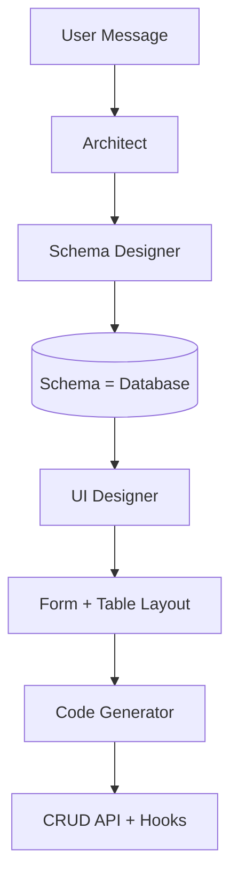
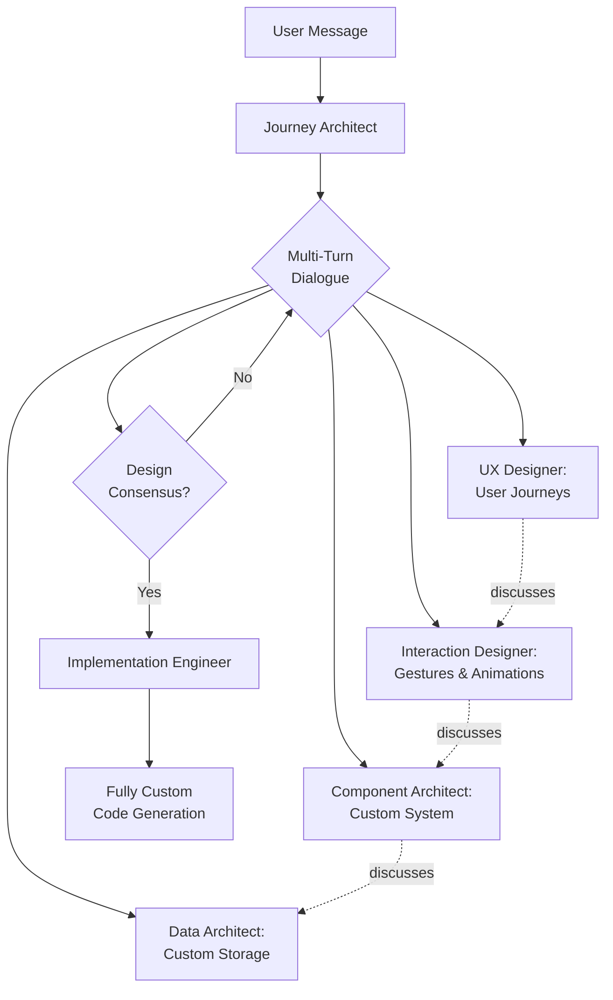

# Journey-First Architecture Transformation

## Current Architecture Problems

The v2 pipeline is still fundamentally CRUD-focused:



**Problems:**

1. Schema drives everything (database-first thinking)
2. Components are hardcoded types (ComponentType enum)
3. Code generation has CRUD templates
4. Single-pass per agent (no true dialogue)
5. No holistic journey design

---

## New Architecture Vision



**Key Principles:**

- **Journey-First**: Design the user experience before data
- **Multi-Turn Dialogue**: Agents discuss and refine collaboratively
- **Zero Templates**: No pre-built patterns, everything custom
- **Holistic Design**: Complete flows, not isolated components

---

## Implementation Plan

### Phase 1: Remove All CRUD Infrastructure

**Goal**: Eliminate all pre-built patterns and templates

#### 1.1 Delete Template-Based Generation

**File**: [`src/lib/scaffolder-v2/agents/code-generator.ts`](src/lib/scaffolder-v2/agents/code-generator.ts)

Remove these methods entirely:

- `generateAPIClient()` (lines 500-543)
- `generateHooks()` (lines 549-623)
- `generateValidators()` (lines 460-498)
- `generateAPIRoute()` (lines 845-931)
- `getComponentTemplate()` (lines 1654-1709)
- `generateFallbackForm()` and `generateFallbackTable()`

These are CRUD templates that bias the system toward database thinking.

#### 1.2 Remove ComponentType Enum

**File**: [`src/lib/scaffolder-v2/types.ts`](src/lib/scaffolder-v2/types.ts)

Replace:

```typescript
export type ComponentType = 'form' | 'table' | 'chart' | ... | 'custom';
```

With:

```typescript
export interface ComponentSpec {
  name: string;
  purpose: string;           // What does this component do?
  userInteractions: string[];  // How do users interact with it?
  visualStyle: string;       // How should it look?
  animations: string[];      // What animations/transitions?
  dataNeeds: string[];       // What data does it need?
  suggestedLibraries?: string[];
}
```

No predefined types. Each component is designed from scratch.

#### 1.3 Remove Schema as Starting Point

**File**: [`src/lib/scaffolder-v2/state.ts`](src/lib/scaffolder-v2/state.ts)

Current state structure:

```typescript
{
  schemas: Schema[];  // ❌ Database-first
  layout: LayoutNode;
  ...
}
```

New state structure:

```typescript
{
  userJourney: JourneySpec;      // ✅ Experience-first
  interactions: InteractionSpec[];
  componentSystem: ComponentSystemSpec;
  dataLayer?: DataLayerSpec;     // Designed AFTER UX
  ...
}
```

---

### Phase 2: Create New Agent Roles

Instead of Schema Designer → UI Designer → Code Generator, we need:

#### 2.1 Journey Architect

**New File**: `src/lib/scaffolder-v2/agents/journey-architect.ts`

**Responsibility**: Orchestrates multi-turn design dialogue

Methods:

- `initiateDesignSession()` - Starts multi-agent dialogue
- `facilitateDiscussion()` - Manages agent turns
- `evaluateConsensus()` - Checks if agents agree on design
- `synthesizeDesign()` - Combines agent inputs into final spec

#### 2.2 UX Designer Agent

**New File**: `src/lib/scaffolder-v2/agents/ux-designer.ts`

**Responsibility**: Designs complete user journeys

Output:

```typescript
interface UserJourney {
  flows: Flow[];  // e.g., Onboarding, Main Use, Settings
  states: State[];  // Empty, Loading, Error, Success
  transitions: Transition[];  // How users move between views
  keyMoments: Moment[];  // Critical interaction points
}
```

#### 2.3 Interaction Designer Agent

**New File**: `src/lib/scaffolder-v2/agents/interaction-designer.ts`

**Responsibility**: Specifies gestures, animations, micro-interactions

Output:

```typescript
interface InteractionSpec {
  gestures: Gesture[];  // Swipe, drag, long-press, etc.
  animations: Animation[];  // Entry, exit, transition effects
  feedback: Feedback[];  // Visual/haptic responses to actions
  transitions: PageTransition[];  // How views connect
}
```

#### 2.4 Component Architect Agent

**New File**: `src/lib/scaffolder-v2/agents/component-architect.ts`

**Responsibility**: Designs the component system FOR THIS SPECIFIC APP

For a habit tracker, might design:

- `ContributionGrid` - GitHub-style heatmap with hover states
- `StreakCounter` - Animated number with fireworks on milestones
- `DailyCheckIn` - Floating button with satisfying completion animation
- `HabitConfigPanel` - Slide-in drawer for settings

NOT reusing predefined "heatmap" component - designing custom ones.

#### 2.5 Data Architect Agent

**New File**: `src/lib/scaffolder-v2/agents/data-architect.ts`

**Responsibility**: Designs data layer AFTER UX is defined

Based on what the UX needs:

- What data operations are required?
- How should data be structured?
- What persistence strategy?
- Custom API design for this app's needs

#### 2.6 Implementation Engineer Agent

**New File**: `src/lib/scaffolder-v2/agents/implementation-engineer.ts`

**Responsibility**: Generates code from the complete design spec

NO templates. Generates:

- Custom components from component specs
- Custom data layer from data architect's design
- All animations and interactions specified
- Complete app based on journey design

---

### Phase 3: Multi-Turn Dialogue System

#### 3.1 Integrate Dialogue Orchestrator

**File**: [`src/app/api/scaffolder-v2/route.ts`](src/app/api/scaffolder-v2/route.ts)

Replace `executeParallelPipeline()` with `executeDesignDialogue()`:

```typescript
async function executeDesignDialogue(
  userMessage: string,
  state: JourneyConversationState,
  userSettings?: UserLLMSettings
): Promise<JourneyConversationState> {
  const journeyArchitect = new JourneyArchitect();
  
  // Phase 1: Multi-turn design exploration
  const session = await journeyArchitect.initiateDesignSession({
    userRequest: userMessage,
    state,
    agents: [
      new UXDesigner(),
      new InteractionDesigner(),
      new ComponentArchitect(),
      new DataArchitect(),
    ],
  });
  
  // Agents discuss until consensus (3-5 turns minimum)
  while (!session.hasConsensus && session.turns < 10) {
    await journeyArchitect.facilitateDiscussion(session);
  }
  
  // Phase 2: Synthesize final design
  const design = await journeyArchitect.synthesizeDesign(session);
  
  // Phase 3: Generate implementation
  const engineer = new ImplementationEngineer();
  const code = await engineer.implement(design);
  
  return {
    ...state,
    design,
    generatedCode: code,
  };
}
```

#### 3.2 Example Dialogue Flow

For "habit tracker with GitHub heatmap":

**Turn 1: UX Designer**

```
I propose three core flows:
1. First-time setup: Add your first habit
2. Daily use: Check in with one tap
3. Progress viewing: See your streak on the heatmap

The primary view should be the heatmap (your progress), 
with a floating button for daily check-in.
```

**Turn 2: Interaction Designer** (responding to UX)

```
For the daily check-in button:
- Floating bottom-right with drop shadow
- On tap: Bounce animation + confetti burst
- Haptic feedback on completion
- Button transforms into checkmark for 2 seconds

For the heatmap:
- Cells fade in with stagger (left to right)
- On hover: Tooltip with date and count
- On tap: Zoom animation showing that day's details
```

**Turn 3: Component Architect** (responding to Interaction)

```
I'll design these custom components:

ContributionGrid:
- 52 weeks × 7 days grid
- Color intensity based on completion count
- Framer Motion for animations
- Custom tooltip component
- Libraries: framer-motion, date-fns

DailyCompletionFAB:
- Floating action button with custom animations
- React Spring for bounce physics
- Canvas-based confetti particle system
- Libraries: react-spring, canvas-confetti

HabitDetailSlideIn:
- Bottom sheet that slides up on grid cell tap
- Shows stats: current streak, best streak, completion rate
- Edit button to modify habit
```

**Turn 4: Data Architect** (responding to Component needs)

```
Based on the component requirements:

Data structure:
{
  habits: { id, name, createdAt }
  completions: { habitId, date, note? }
}

Operations needed:
- createHabit(name)
- markComplete(habitId, date)
- getCompletions(habitId, startDate, endDate)
- calculateStreak(completions[])

NO update/delete CRUD operations - they're not needed for the 
primary flow. Add them only if user requests edit functionality.

Storage: Simple array in app.data, indexed by date for fast lookups.
```

**Turn 5: Journey Architect** (synthesizes)

```
Design consensus achieved. Final spec:
- Primary view: ContributionGrid (80% viewport)
- Floating action: DailyCompletionFAB (bottom-right)
- Progressive disclosure: HabitDetailSlideIn (on demand)
- Onboarding: Simple "Add first habit" modal on empty state
- Data: Minimal schema focused on completions, not full CRUD
```

---

### Phase 4: Custom Code Generation

#### 4.1 Zero-Template Implementation

**File**: `src/lib/scaffolder-v2/agents/implementation-engineer.ts`

Instead of filling templates, the engineer:

1. **Receives complete design spec** from dialogue
2. **Generates unique code** for each component
3. **Implements all animations** exactly as specified
4. **Creates custom data layer** per data architect's design

Example prompt to LLM:

```
Generate a ContributionGrid component with these exact specifications:

Purpose: Display 52 weeks of daily habit completions as a GitHub-style heatmap
Interactions:
- Hover shows tooltip with date and completion count
- Click opens detail view for that day
Animations:
- Cells fade in with 50ms stagger delay (left to right)
- Hover: gentle scale(1.05) transform
- Click: ripple effect from center
Visual Style:
- Dark theme background (#0a0a0a)
- Cells: 10px × 10px with 2px gap
- Color gradient: #161b22 (none) → #0e4429 (1-2) → #006d32 (3-5) → #26a641 (6+)
Libraries: framer-motion for animations, date-fns for date calculations

Generate the complete React component with TypeScript.
```

No templates. Fresh generation every time.

#### 4.2 Data Layer Generation

Similarly, generate custom data layer:

```typescript
// NOT this (template):
export async function createHabit(input: HabitInput): Promise<Habit> {...}
export async function updateHabit(id: string, input: Partial<HabitInput>): Promise<Habit> {...}

// THIS (custom for this app):
export async function markHabitComplete(habitId: string, date: Date): Promise<void> {
  // Custom implementation for THIS app's needs
  const completions = await getCompletions();
  const key = `${habitId}-${date.toISOString().split('T')[0]}`;
  
  if (!completions[key]) {
    completions[key] = { habitId, date, timestamp: Date.now() };
    await saveCompletions(completions);
    
    // Custom logic: Check for streak milestone
    const streak = calculateStreak(habitId, completions);
    if (streak % 7 === 0) {
      // Trigger celebration animation
      triggerStreakCelebration(streak);
    }
  }
}
```

---

### Phase 5: Update Main Pipeline

#### 5.1 New Pipeline Flow

**File**: [`src/app/api/scaffolder-v2/route.ts`](src/app/api/scaffolder-v2/route.ts)

Replace current architect flow:

```typescript
// OLD (single-pass):
const decision = await architect.process(message, state);
await executeParallelPipeline(decision, state, message);

// NEW (multi-turn dialogue):
const designSession = await journeyArchitect.initiateDesignSession({
  userRequest: message,
  currentState: state,
});

// Agents discuss (3-10 turns)
while (!designSession.hasConsensus && designSession.turn < 10) {
  const nextAgent = designSession.getNextAgent();
  const response = await nextAgent.contribute(designSession);
  designSession.addContribution(response);
  
  // Check if other agents want to respond
  for (const agent of designSession.agents) {
    if (agent.wantsToRespond(response)) {
      const rebuttal = await agent.respond(response);
      designSession.addContribution(rebuttal);
    }
  }
  
  designSession.turn++;
}

// Synthesize and implement
const finalDesign = await journeyArchitect.synthesizeDesign(designSession);
const code = await implementationEngineer.generate(finalDesign);
```

---

## Key Files to Modify

| File | Action |

|------|--------|

| [`src/lib/scaffolder-v2/agents/code-generator.ts`](src/lib/scaffolder-v2/agents/code-generator.ts) | Remove ALL template methods, rename to `implementation-engineer.ts` |

| [`src/lib/scaffolder-v2/types.ts`](src/lib/scaffolder-v2/types.ts) | Remove ComponentType enum, add Journey/Interaction/ComponentSystem types |

| [`src/lib/scaffolder-v2/state.ts`](src/lib/scaffolder-v2/state.ts) | Replace schema-first state with journey-first state |

| [`src/app/api/scaffolder-v2/route.ts`](src/app/api/scaffolder-v2/route.ts) | Replace single-pass execution with multi-turn dialogue loop |

| [`src/lib/scaffolder-v2/agents/adaptive-architect.ts`](src/lib/scaffolder-v2/agents/adaptive-architect.ts) | Remove or repurpose as JourneyArchitect |

## New Files to Create

| File | Purpose |

|------|---------|

| `src/lib/scaffolder-v2/agents/journey-architect.ts` | Orchestrates multi-turn design dialogue |

| `src/lib/scaffolder-v2/agents/ux-designer.ts` | Designs user journeys and flows |

| `src/lib/scaffolder-v2/agents/interaction-designer.ts` | Specifies gestures, animations, transitions |

| `src/lib/scaffolder-v2/agents/component-architect.ts` | Designs custom component system per app |

| `src/lib/scaffolder-v2/agents/data-architect.ts` | Designs data layer after UX |

| `src/lib/scaffolder-v2/agents/implementation-engineer.ts` | Generates code from complete design spec |

| `src/lib/scaffolder-v2/design-session.ts` | Manages multi-turn dialogue state |

| `src/lib/scaffolder-v2/journey-types.ts` | New type definitions for journey-first design |

---

## Migration Strategy

Since this is a breaking change:

1. **Keep v2 endpoint** but rename internals to v2-legacy
2. **Create v3 endpoint** with new architecture
3. **Test v3 thoroughly** with real use cases
4. **Gradually migrate** users from v2 to v3

OR

1. **Feature flag** the new architecture in v2
2. **A/B test** with subset of users
3. **Roll out** when stable

---

## Expected Behavior After Transformation

### For "habit tracker with GitHub heatmap":

**Current (CRUD):**

- Schema Designer creates Habit entity with 10+ fields
- UI Designer proposes form + table
- Code Generator creates full CRUD API
- Result: Generic data entry interface

**After (Journey-First):**

- UX Designer designs: Onboarding → Daily Check-in → Progress View
- Interaction Designer specifies: Floating button, confetti animation, haptic feedback
- Component Architect designs: ContributionGrid, DailyCompletionFAB, HabitDetailSlideIn
- Data Architect creates minimal ops: markComplete, getCompletions
- Implementation Engineer generates custom components
- Result: Delightful habit tracker with GitHub-style heatmap

### For "expense tracker":

**Current:**

- Form to add expenses, table to list them

**After:**

- Visual pie chart as primary view (see spending breakdown immediately)
- Swipe gestures to categorize expenses
- Timeline view showing spending over time
- Quick-add floating button with smart category suggestions
- Custom animations for adding/removing expenses

---

## Success Criteria

1. **Zero CRUD Templates**: No pre-built API/hook/component templates exist
2. **Multi-Turn Dialogue**: Agents have 3-10 turn conversations before building
3. **Custom Components**: Every app gets unique component architecture
4. **Journey-First**: User experience designed before data model
5. **Sophisticated UX**: Generated apps feel polished with animations and transitions