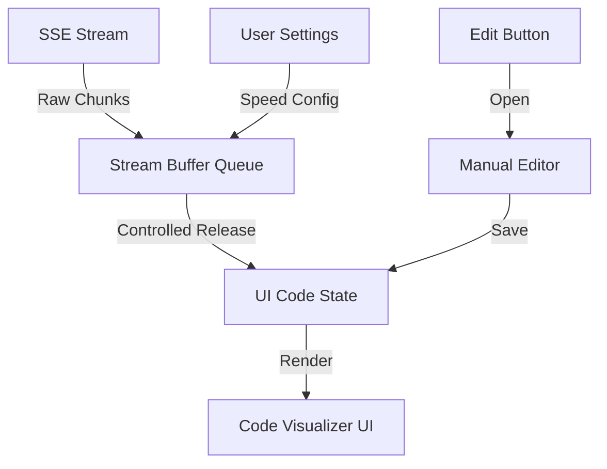

### Overview

The goal is to transform the current `CodeViewer` into a high-end, industry-standard code streaming experience. This includes a modern UI, smooth word-by-word or character-by-character streaming, and a manual edit capability.

### Architectural Changes

#### 1. Enhanced `CodeViewer` Component

We will significantly upgrade `src/components/scaffolder/CodeViewer.tsx` (or create a new version if preferred, but updating the existing one is more direct).

- **Modern UI**: Use a dark-themed, sleek editor-like interface with proper line numbers, file icons, and a "glassmorphism" header.
- **Smooth Streaming**: Implement a `StreamBuffer` logic to handle incoming chunks and release them at a consistent rate (word-by-word or char-by-char).
- **Syntax Highlighting**: Integrate `prismjs` or a similar lightweight library for dynamic syntax highlighting that applies after generation.
- **Manual Edit**: Add an "Edit" button that opens a `Modal` with a text area (or a more advanced editor if available) to allow manual code overrides.

#### 2. Streaming Logic

- **Buffer System**: A queue-based system that takes raw SSE chunks and feeds them into the UI state at a controlled speed.
- **Settings**: Add a settings menu (or simple toggle) to switch between "Instant" (chunk-based), "Smooth Word", and "Smooth Character" streaming.

#### 3. Manual Edit Pop-up

- Create a new component `CodeEditorModal.tsx` or integrate it into `CodeViewer.tsx` using the existing `Modal` component.
- Allow the user to save changes, which will update the local code state.

### Implementation Steps

#### Phase 1: UI & Base Streaming

- [ ] Update `CodeViewer` layout to match modern IDE aesthetics.
- [ ] Implement the `useStreamBuffer` hook to manage smooth text output.
- [ ] Add a "Settings" dropdown for streaming speed.

#### Phase 2: Syntax Highlighting & Polish

- [ ] Add a post-processing step for syntax highlighting once streaming stops.
- [ ] Add a "blinking cursor" effect at the end of the stream.
- [ ] Improve scroll-to-bottom behavior with smooth animation.

#### Phase 3: Manual Editing

- [ ] Add "Edit Code" button to the header.
- [ ] Implement the edit modal using `src/components/ui/Modal.tsx`.
- [ ] Ensure edited code is correctly passed back to the parent component via `onComplete`.

### Key Files

- [`src/components/scaffolder/CodeViewer.tsx`](src/components/scaffolder/CodeViewer.tsx): Primary component for code visualization.
- [`src/components/ui/Modal.tsx`](src/components/ui/Modal.tsx): For the manual edit pop-up.
- `[src/app/(main)/create/page.tsx](src/app/\\\(main)/create/page.tsx)`: To ensure the updated `CodeViewer` is correctly integrated.

### Mermaid Diagram of Streaming Flow

