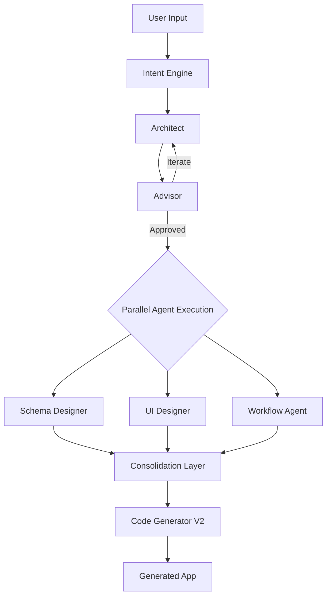

# V2 Agent Pipeline Integration

## Architecture Overview

The enhanced freeform pipeline will follow this flow:



## Phase 1: Intent Engine Integration

### File: [`src/app/api/scaffolder/freeform/route.ts`](src/app/api/scaffolder/freeform/route.ts)

**Current State**: The `handleStream()` function immediately calls `orchestrateDualAgent()` without understanding user intent deeply.

**Changes**:

1. Add Intent Engine as first step before dual-agent orchestration
2. Pass enhanced intent to Architect/Advisor for context-aware refinement
3. Stream intent analysis events to UI
```typescript
import { intentEngine } from '@/lib/scaffolder-v2/agents/intent-engine';
import type { EnhancedIntent } from '@/lib/scaffolder-v2/types';

async function handleStream(
  state: FreeformState,
  userMessage: string,
  userId: string,
  userSettings: UserLLMSettings,
  res: NextResponse
): Promise<void> {
  const stream = new TransformStream();
  const writer = stream.writable.getWriter();
  
  // PHASE 1: Intent Analysis
  await sendEvent(writer, { 
    type: 'agent_start', 
    agent: 'intent-engine', 
    phase: 'understanding' 
  });
  
  const intentResponse = await intentEngine.process(userMessage, {
    schemas: [],
    messages: state.messages,
  });
  
  const enhancedIntent = intentResponse.data.intent as EnhancedIntent;
  
  await sendEvent(writer, { 
    type: 'intent_result', 
    intent: enhancedIntent,
    confidence: intentResponse.data.intent.complexityScore 
  });
  
  // PHASE 2: Dual-Agent Refinement (with intent context)
  await sendEvent(writer, { 
    type: 'agent_start', 
    agent: 'architect', 
    phase: 'refinement' 
  });
  
  const dualAgentResult = await orchestrateDualAgent(
    state,
    userMessage,
    userSettings,
    enhancedIntent, // Pass intent for context
    writer // Stream internal dialogue
  );
  
  // Continue with schema/UI/workflow agents...
}
```


### File: [`src/lib/scaffolder/dual-agent-orchestrator.ts`](src/lib/scaffolder/dual-agent-orchestrator.ts)

**Changes**:

1. Accept `EnhancedIntent` as optional parameter
2. Include intent context in Architect system prompt
3. Remove deprecation notice (hybrid approach keeps this valuable)
```typescript
export async function orchestrateDualAgent(
  state: FreeformState,
  userMessage: string,
  userSettings: UserLLMSettings,
  enhancedIntent?: EnhancedIntent,
  streamWriter?: WritableStreamDefaultWriter
): Promise<DualAgentResult> {
  // Include intent context in system prompt
  const contextAdditions = enhancedIntent ? `
INTENT CONTEXT:
- App Category: ${enhancedIntent.appCategory}
- Complexity: ${enhancedIntent.complexityScore}/10
- Detected Entities: ${enhancedIntent.entities.map(e => e.name).join(', ')}
- Reference Apps: ${enhancedIntent.referenceApps.map(r => r.name).join(', ')}
- Suggested Layout: ${enhancedIntent.layoutHints.structure}
` : '';
  
  // Rest of orchestration with context...
}
```


## Phase 2: Parallel Specialized Agents

### File: [`src/app/api/scaffolder/freeform/route.ts`](src/app/api/scaffolder/freeform/route.ts)

**Changes**: After dual-agent refinement, run specialized agents in parallel.

```typescript
// PHASE 3: Parallel Specialized Agent Execution
await sendEvent(writer, { 
  type: 'parallel_agents_start', 
  agents: ['schema-designer', 'ui-designer', 'workflow-agent'] 
});

const [schemaResult, uiResult, workflowResult] = await Promise.all([
  // Schema Designer
  (async () => {
    await sendEvent(writer, { type: 'agent_start', agent: 'schema-designer' });
    const result = await schemaDesignerAgent.process(
      dualAgentResult.finalResponse,
      { 
        schemas: [], 
        messages: state.messages,
        enhancedIntent 
      }
    );
    await sendEvent(writer, { 
      type: 'agent_complete', 
      agent: 'schema-designer',
      result: result.data 
    });
    return result;
  })(),
  
  // UI Designer
  (async () => {
    await sendEvent(writer, { type: 'agent_start', agent: 'ui-designer' });
    // Wait for schema first (UI depends on schema)
    const schema = (await schemaResult).data.schemas[0];
    const result = await uiDesignerAgent.process(
      dualAgentResult.finalResponse,
      { 
        schemas: [schema], 
        messages: state.messages,
        enhancedIntent 
      }
    );
    await sendEvent(writer, { 
      type: 'agent_complete', 
      agent: 'ui-designer',
      result: result.data 
    });
    return result;
  })(),
  
  // Workflow Agent
  (async () => {
    await sendEvent(writer, { type: 'agent_start', agent: 'workflow-agent' });
    const schema = (await schemaResult).data.schemas[0];
    const result = await workflowAgent.process(
      dualAgentResult.finalResponse,
      { 
        schemas: [schema], 
        messages: state.messages,
        enhancedIntent 
      }
    );
    await sendEvent(writer, { 
      type: 'agent_complete', 
      agent: 'workflow-agent',
      result: result.data 
    });
    return result;
  })(),
]);
```

### New File: `src/lib/scaffolder/agent-consolidator.ts`

**Purpose**: Consolidate results from parallel agents into unified state.

```typescript
/**
 * Agent Result Consolidator
 * Merges results from Intent Engine, Schema Designer, UI Designer, and Workflow Agent
 */

import type { 
  EnhancedIntent, 
  Schema, 
  LayoutNode, 
  WorkflowDefinition,
  ComputedField 
} from '@/lib/scaffolder-v2/types';
import type { FreeformState } from './freeform-architect';

export interface ConsolidatedAgentResult {
  schema: Schema;
  layout: LayoutNode;
  workflows: WorkflowDefinition[];
  computedFields: ComputedField[];
  metadata: {
    intent: EnhancedIntent;
    confidence: number;
    agentTimings: Record<string, number>;
  };
}

export async function consolidateAgentResults(
  intentResult: EnhancedIntent,
  schemaResult: { schemas: Schema[] },
  uiResult: { layout: LayoutNode },
  workflowResult: { workflows: WorkflowDefinition[]; computedFields: ComputedField[] }
): Promise<ConsolidatedAgentResult> {
  // Merge schema with computed fields from workflow agent
  const enrichedSchema: Schema = {
    ...schemaResult.schemas[0],
    computedFields: workflowResult.computedFields,
  };
  
  // Validate layout references schema fields
  const validatedLayout = validateLayoutAgainstSchema(
    uiResult.layout, 
    enrichedSchema
  );
  
  return {
    schema: enrichedSchema,
    layout: validatedLayout,
    workflows: workflowResult.workflows,
    computedFields: workflowResult.computedFields,
    metadata: {
      intent: intentResult,
      confidence: calculateOverallConfidence(intentResult, schemaResult, uiResult),
      agentTimings: {}, // Populated during execution
    },
  };
}

function validateLayoutAgainstSchema(
  layout: LayoutNode,
  schema: Schema
): LayoutNode {
  // Recursively validate that layout components reference valid schema fields
  // Replace invalid references with fallbacks
  // Return validated layout
}

function calculateOverallConfidence(
  intent: EnhancedIntent,
  schemaResult: unknown,
  uiResult: unknown
): number {
  // Calculate weighted confidence score
  return Math.round(
    (intent.complexityScore * 0.3) + 
    (0.7 * 100) // Assume high confidence from specialized agents
  );
}
```

## Phase 3: UI Visualization

### File: [`src/components/scaffolder/FreeformCreator.tsx`](src/components/scaffolder/FreeformCreator.tsx)

**Changes**: Add real-time visualization of all agent activity.

```typescript
interface AgentActivity {
  id: string;
  agent: 'intent-engine' | 'architect' | 'advisor' | 'schema-designer' | 'ui-designer' | 'workflow-agent' | 'code-generator';
  status: 'queued' | 'running' | 'complete' | 'error';
  output?: unknown;
  startTime?: number;
  endTime?: number;
}

function FreeformCreator() {
  const [agentActivities, setAgentActivities] = useState<AgentActivity[]>([]);
  const [currentPhase, setCurrentPhase] = useState<'understanding' | 'refinement' | 'specialization' | 'generation'>('understanding');
  
  // Handle SSE events
  const handleAgentEvent = (event: ServerSentEvent) => {
    switch (event.type) {
      case 'agent_start':
        setAgentActivities(prev => [...prev, {
          id: generateId(),
          agent: event.agent,
          status: 'running',
          startTime: Date.now(),
        }]);
        break;
      
      case 'agent_complete':
        setAgentActivities(prev => prev.map(a => 
          a.agent === event.agent && a.status === 'running'
            ? { ...a, status: 'complete', output: event.result, endTime: Date.now() }
            : a
        ));
        break;
      
      case 'intent_result':
        // Show intent visualization
        setIntentVisualization(event.intent);
        break;
      
      // ... other event types
    }
  };
  
  return (
    <div className="agent-pipeline">
      {/* Phase Indicator */}
      <PhaseBanner currentPhase={currentPhase} />
      
      {/* Agent Activity Stream */}
      <AgentTimeline activities={agentActivities} />
      
      {/* Intent Visualization */}
      {intentVisualization && (
        <IntentCard intent={intentVisualization} />
      )}
      
      {/* Schema Preview */}
      {schemaResult && (
        <SchemaPreview schema={schemaResult.schema} />
      )}
      
      {/* UI Layout Preview */}
      {layoutResult && (
        <LayoutPreview layout={layoutResult.layout} />
      )}
      
      {/* Workflow Summary */}
      {workflowResult && (
        <WorkflowSummary workflows={workflowResult.workflows} />
      )}
      
      {/* Code Generation */}
      {buildPhase === 'generating' && (
        <CodeGenerationView />
      )}
    </div>
  );
}
```

### New Component: `src/components/scaffolder/AgentTimeline.tsx`

**Purpose**: Real-time visualization of agent pipeline with status indicators.

```typescript
import { Clock, CheckCircle, Circle, AlertCircle } from 'lucide-react';

interface AgentTimelineProps {
  activities: AgentActivity[];
}

const AGENT_ICONS = {
  'intent-engine': '🎯',
  'architect': '💡',
  'advisor': '⚖️',
  'schema-designer': '📊',
  'ui-designer': '🎨',
  'workflow-agent': '⚙️',
  'code-generator': '💻',
};

const AGENT_LABELS = {
  'intent-engine': 'Understanding Intent',
  'architect': 'Architect',
  'advisor': 'Advisor',
  'schema-designer': 'Schema Designer',
  'ui-designer': 'UI Designer',
  'workflow-agent': 'Workflow Agent',
  'code-generator': 'Code Generator',
};

export function AgentTimeline({ activities }: AgentTimelineProps) {
  return (
    <div className="agent-timeline">
      <h3 className="text-lg font-medium mb-4">Agent Pipeline</h3>
      <div className="space-y-3">
        {activities.map((activity) => (
          <div key={activity.id} className="flex items-center gap-3 p-3 bg-surface-elevated rounded-lg">
            <div className="text-2xl">{AGENT_ICONS[activity.agent]}</div>
            <div className="flex-1">
              <div className="flex items-center gap-2">
                <span className="font-medium">{AGENT_LABELS[activity.agent]}</span>
                {activity.status === 'running' && (
                  <div className="animate-spin">
                    <Circle className="w-4 h-4" />
                  </div>
                )}
                {activity.status === 'complete' && (
                  <CheckCircle className="w-4 h-4 text-green-500" />
                )}
                {activity.status === 'error' && (
                  <AlertCircle className="w-4 h-4 text-red-500" />
                )}
              </div>
              {activity.startTime && activity.endTime && (
                <div className="text-xs text-text-tertiary flex items-center gap-1">
                  <Clock className="w-3 h-3" />
                  {((activity.endTime - activity.startTime) / 1000).toFixed(1)}s
                </div>
              )}
              {activity.output && (
                <div className="mt-2 text-sm">
                  <AgentOutputPreview agent={activity.agent} output={activity.output} />
                </div>
              )}
            </div>
          </div>
        ))}
      </div>
    </div>
  );
}
```

## Phase 4: Backward Compatibility

### File: [`src/app/api/scaffolder/freeform/route.ts`](src/app/api/scaffolder/freeform/route.ts)

**Changes**: Add feature flag to enable/disable new pipeline.

```typescript
// Feature flag for gradual rollout
const USE_V2_PIPELINE = process.env.FREEFORM_V2_PIPELINE === 'true' || 
                        process.env.NODE_ENV === 'development';

async function handleStream(...) {
  if (USE_V2_PIPELINE) {
    return await handleStreamV2(...);
  } else {
    return await handleStreamV1(...);
  }
}

// Legacy V1 pipeline (current implementation)
async function handleStreamV1(...) {
  // Current dual-agent only approach
}

// New V2 pipeline (full agent integration)
async function handleStreamV2(...) {
  // New implementation with all agents
}
```

## Implementation Order

### Todo 1: Intent Engine Integration

- Add Intent Engine as first step in pipeline
- Pass intent context to Architect/Advisor
- Stream intent analysis to UI
- Create [`IntentCard`](src/components/scaffolder/IntentCard.tsx) component

### Todo 2: Agent Consolidator

- Create [`agent-consolidator.ts`](src/lib/scaffolder/agent-consolidator.ts)
- Implement result merging logic
- Add schema/layout validation
- Handle agent failures gracefully

### Todo 3: Parallel Agent Execution

- Integrate Schema Designer agent
- Integrate UI Designer agent (depends on schema)
- Integrate Workflow Agent (depends on schema)
- Add proper error handling for parallel execution

### Todo 4: UI Visualization

- Create [`AgentTimeline.tsx`](src/components/scaffolder/AgentTimeline.tsx) component
- Add real-time event handling in FreeformCreator
- Create preview components for each agent's output
- Add phase indicators and progress tracking

### Todo 5: Code Generator Integration

- Pass consolidated results to Code Generator V2
- Ensure all schema fields, layouts, and workflows are included
- Stream code generation progress
- Test end-to-end pipeline

### Todo 6: Feature Flag & Testing

- Add environment variable for V2 pipeline toggle
- Test both V1 and V2 pipelines side by side
- Create comprehensive test cases
- Document new pipeline architecture

## Key Files to Modify

| File | Purpose | Changes |

|------|---------|---------|

| [`src/app/api/scaffolder/freeform/route.ts`](src/app/api/scaffolder/freeform/route.ts) | Main API route | Add 6-phase pipeline orchestration |

| [`src/lib/scaffolder/dual-agent-orchestrator.ts`](src/lib/scaffolder/dual-agent-orchestrator.ts) | Architect/Advisor loop | Accept intent context, remove deprecation |

| [`src/components/scaffolder/FreeformCreator.tsx`](src/components/scaffolder/FreeformCreator.tsx) | UI | Add agent timeline visualization |

| `src/lib/scaffolder/agent-consolidator.ts` | NEW | Consolidate parallel agent results |

| `src/components/scaffolder/AgentTimeline.tsx` | NEW | Real-time agent activity visualization |

| `src/components/scaffolder/IntentCard.tsx` | NEW | Display enhanced intent analysis |

## Benefits

1. **Better Understanding**: Intent Engine provides deep app comprehension upfront
2. **Specialized Expertise**: Each agent focuses on its domain (schema, UI, workflows)
3. **Parallel Performance**: Schema/UI/Workflow agents run simultaneously
4. **Full Transparency**: Users see all agent reasoning and decisions
5. **Higher Quality**: Specialized agents produce better schemas, UIs, and workflows
6. **Backward Compatible**: Feature flag allows gradual rollout

## Success Metrics

- Pipeline completion time < 30 seconds for simple apps
- Intent classification accuracy > 90%
- Schema quality score > 85%
- UI layout appropriateness > 80%
- Zero regressions in existing apps