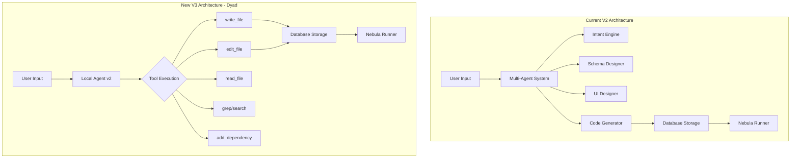
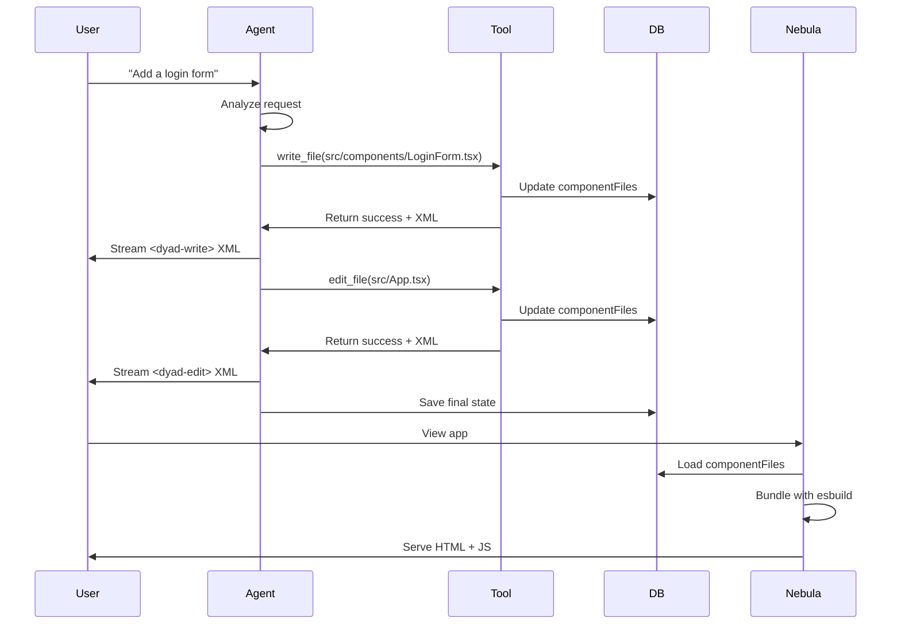

# V3 Scaffolder - Dyad Integration Plan

## Overview

This plan integrates Dyad's complete architecture into Cumulonimbus as the v3 scaffolder. The integration adapts Dyad's file-based approach to work with Cumulonimbus' database-backed storage and Nebula hosting system.

## Architecture Comparison



### Key Differences

**Current V2**: Multi-agent generates complete app in one pass

- Parallel agent execution
- Schema → UI → Code generation
- Monolithic code generation
- Database-backed custom components

**New V3**: Iterative tool-based editing

- Single agent with tools
- Incremental file operations
- Edit existing files (not just overwrite)
- Vite + React + Shadcn scaffold
- Real-time streaming of changes

## Phase 1: Base Scaffold Integration

### 1.1 Copy Dyad's Scaffold Template

**Source**: `/tmp/dyad/scaffold/` → **Target**: [`src/scaffolds/vite-react-shadcn/`](src/scaffolds/vite-react-shadcn/)

Copy the entire base scaffold:

- `package.json` - Vite dependencies
- `vite.config.ts` - Vite configuration
- `tsconfig.json` - TypeScript config
- `tailwind.config.ts` - Tailwind setup
- `index.html` - Entry point
- `src/` - Base source files
  - `App.tsx` - Root component
  - `main.tsx` - Entry point
  - `globals.css` - Global styles
  - `components/ui/` - All Shadcn components
  - `lib/utils.ts` - Utility functions
  - `pages/` - Page templates

**Modifications needed**:

- Add Nebula data API integration to scaffold
- Update `package.json` to include data persistence hooks
- Create `lib/nebula-client.ts` for API communication

### 1.2 Create Scaffold Metadata

Create [`src/scaffolds/vite-react-shadcn/scaffold.json`](src/scaffolds/vite-react-shadcn/scaffold.json):

```json
{
  "id": "vite-react-shadcn",
  "name": "Vite + React + Shadcn/UI",
  "version": "1.0.0",
  "description": "Modern React app with Vite, TypeScript, and Shadcn/UI",
  "entryPoint": "index.html",
  "buildCommand": "npm run build",
  "devCommand": "npm run dev",
  "packageManager": "npm",
  "framework": "vite",
  "dependencies": {}
}
```

## Phase 2: Tool Definitions & Implementations

### 2.1 Core Tool System

Create [`src/lib/scaffolder-v3/tools/`](src/lib/scaffolder-v3/tools/) directory with:

**Tool Base Types** - [`types.ts`](src/lib/scaffolder-v3/tools/types.ts):

```typescript
export interface ToolDefinition<TArgs = any> {
  name: string;
  description: string;
  inputSchema: z.ZodSchema<TArgs>;
  defaultConsent: 'always' | 'ask' | 'never';
  modifiesState: boolean;
  execute: (args: TArgs, ctx: AgentContext) => Promise<ToolResult>;
  buildXml?: (args: Partial<TArgs>, isComplete: boolean) => string | undefined;
  getConsentPreview?: (args: TArgs) => string;
  isEnabled?: (ctx: AgentContext) => boolean;
}

export interface AgentContext {
  appId: string;
  userId: string;
  conversationId: string;
  componentFiles: Record<string, string>; // In-memory file system
  packageJson: any;
  onXmlStream: (xml: string) => void;
  onXmlComplete: (xml: string) => void;
}
```

### 2.2 File Operation Tools

**Source reference**: `/tmp/dyad/src/pro/main/ipc/handlers/local_agent/tools/`

Create database-backed versions:

**[`write_file.ts`](src/lib/scaffolder-v3/tools/write_file.ts)** - Create/overwrite files

```typescript
// Stores file content in componentFiles map
// Instead of: fs.writeFileSync(fullPath, content)
// Do: ctx.componentFiles[filePath] = content
```

**[`edit_file.ts`](src/lib/scaffolder-v3/tools/edit_file.ts)** - Incremental edits (KEY FEATURE)

```typescript
// Uses Dyad's turbo-file-edit approach
// Reads from ctx.componentFiles
// Applies diff-style edits
// Saves back to ctx.componentFiles
```

**[`delete_file.ts`](src/lib/scaffolder-v3/tools/delete_file.ts)** - Remove files

```typescript
// Instead of: fs.unlinkSync(fullPath)
// Do: delete ctx.componentFiles[filePath]
```

**[`rename_file.ts`](src/lib/scaffolder-v3/tools/rename_file.ts)** - Rename/move files

```typescript
// Move key in componentFiles map
// Update all import statements referencing the file
```

**[`read_file.ts`](src/lib/scaffolder-v3/tools/read_file.ts)** - Read file contents

```typescript
// Instead of: fs.readFileSync(fullPath)
// Do: return ctx.componentFiles[filePath]
```

**[`list_files.ts`](src/lib/scaffolder-v3/tools/list_files.ts)** - List directory contents

```typescript
// Instead of: fs.readdirSync()
// Do: Object.keys(ctx.componentFiles).filter(...)
```

### 2.3 Code Analysis Tools

**[`grep.ts`](src/lib/scaffolder-v3/tools/grep.ts)** - Search code by pattern

```typescript
// Search within ctx.componentFiles using regex
```

**[`code_search.ts`](src/lib/scaffolder-v3/tools/code_search.ts)** - Semantic code search

```typescript
// Search for functions, classes, imports
// Parse TypeScript AST from componentFiles
```

### 2.4 Dependency Management

**[`add_dependency.ts`](src/lib/scaffolder-v3/tools/add_dependency.ts)** - Add npm packages

```typescript
// Update ctx.packageJson.dependencies
// Store in database
```

### 2.5 Helper Tools

**[`set_chat_summary.ts`](src/lib/scaffolder-v3/tools/set_chat_summary.ts)** - Set conversation title

**[`update_todos.ts`](src/lib/scaffolder-v3/tools/update_todos.ts)** - Track task progress

## Phase 3: System Prompts & Agent

### 3.1 System Prompts

Create [`src/lib/scaffolder-v3/prompts/`](src/lib/scaffolder-v3/prompts/):

**[`system-prompt.ts`](src/lib/scaffolder-v3/prompts/system-prompt.ts)** - Adapt from Dyad:

- Copy Dyad's `LOCAL_AGENT_SYSTEM_PROMPT`
- Update tech stack section for Vite scaffold
- Add Nebula data API documentation
- Keep tool calling guidelines
- Update file structure documentation

**Key sections to adapt**:

```typescript
const TECH_STACK_RULES = `
# Tech Stack
- You are building a React application with Vite.
- Use TypeScript for all files.
- Use React Router for navigation (routes in src/App.tsx).
- Always put source code in the src/ folder.
- Put pages into src/pages/
- Put components into src/components/
- The main page is src/pages/Index.tsx
- Use Shadcn/UI components (all pre-installed)
- Use Tailwind CSS for styling

# Data Persistence
- Apps use the Nebula data API for persistence
- Import: import { useNebulaData } from '../lib/nebula-client'
- CRUD operations: create, read, update, delete
- No need for external databases - built-in storage
`;
```

### 3.2 Agent Implementation

**[`agent.ts`](src/lib/scaffolder-v3/agent.ts)** - Main agent orchestrator

Based on Dyad's `local_agent_handler.ts`, create:

```typescript
export async function executeAgentStream({
  conversationId,
  userMessage,
  appId,
  userId,
  onChunk,
  onComplete,
  abortSignal
}: AgentStreamParams) {
  // 1. Load app context (componentFiles from DB)
  // 2. Build tool set
  // 3. Stream LLM with tools via AI SDK
  // 4. Execute tools as called
  // 5. Save componentFiles back to DB
  // 6. Stream XML output to frontend
}
```

**Key differences from Dyad**:

- Load/save from Prisma database instead of filesystem
- Use Cumulonimbus auth context
- Store in `App.componentFiles` (JSON column)
- Integrate with existing conversation system

## Phase 4: Database Schema Updates

### 4.1 Update Prisma Schema

Add to [`prisma/schema.prisma`](prisma/schema.prisma):

```prisma
model App {
  // ... existing fields ...
  
  // V3 Scaffolder fields
  scaffoldVersion     String?     @default("v3")
  scaffoldId          String?     @default("vite-react-shadcn")
  viteComponentFiles  String?     // JSON: Record<string, string>
  vitePackageJson     String?     // JSON: package.json contents
  viteScaffoldConfig  String?     // JSON: scaffold metadata
}

model Conversation {
  // ... existing fields ...
  
  // V3 fields
  agentToolHistory    String?     @default("[]") // Tool execution log
  componentFilesCache String?     // Cached file system state
}
```

### 4.2 Create Migration

```bash
npx prisma migrate dev --name add_v3_scaffolder_fields
```

## Phase 5: API Routes

### 5.1 Main V3 API Endpoint

**[`src/app/api/scaffolder-v3/route.ts`](src/app/api/scaffolder-v3/route.ts)** - Main chat endpoint

```typescript
export async function POST(req: Request) {
  // 1. Parse request (conversationId, message, appId)
  // 2. Get user session
  // 3. Load or create app
  // 4. Initialize agent with tools
  // 5. Stream response
  // 6. Save results to database
}
```

### 5.2 Code Streaming Endpoint

**[`src/app/api/scaffolder-v3/stream/[conversationId]/route.ts`](src/app/api/scaffolder-v3/stream/[conversationId]/route.ts)** - SSE streaming

```typescript
export async function GET(req: Request, { params }) {
  // Stream XML-formatted tool outputs in real-time
  // Uses Server-Sent Events (SSE)
}
```

### 5.3 File Operations API

**[`src/app/api/scaffolder-v3/files/[appId]/route.ts`](src/app/api/scaffolder-v3/files/[appId]/route.ts)** - Direct file access

```typescript
// GET: List files
// POST: Create file
// PATCH: Update file
// DELETE: Delete file
```

## Phase 6: Nebula Runner Adaptation

### 6.1 Update Nebula Runner

Modify [`src/lib/nebula/runner.ts`](src/lib/nebula/runner.ts):

Add V3 bundling support:

```typescript
async function bundleV3App(viteComponentFiles: Record<string, string>): Promise<string> {
  // 1. Create virtual file system with Vite scaffold base
  // 2. Overlay user's component files
  // 3. Bundle with esbuild
  // 4. Include all Vite dependencies
  // 5. Return bundled HTML + JS
}
```

**Key changes**:

- Detect V3 apps via `scaffoldVersion === 'v3'`
- Bundle Vite scaffold + user components
- Include Shadcn components
- Handle Vite-specific imports (e.g., `import.meta`)
- Inject Nebula data API client

### 6.2 Update executeRequest Function

```typescript
export async function executeRequest(context: AppContext, request: NebulaRequest) {
  if (context.scaffoldVersion === 'v3' && context.viteComponentFiles) {
    // Bundle V3 Vite app
    browserCode = await bundleV3App(JSON.parse(context.viteComponentFiles));
  } else if (context.isV2 && context.componentFiles) {
    // Existing V2 bundling
    browserCode = await bundleV2App(context.componentFiles);
  } else {
    // Existing V1 transpilation
    browserCode = await esbuild.transform(code, {...});
  }
  
  // ... rest of execution
}
```

## Phase 7: Frontend Components

### 7.1 V3 Chat Interface

Create [`src/components/scaffolder-v3/V3Creator.tsx`](src/components/scaffolder-v3/V3Creator.tsx):

Similar to `FreeformCreator` but for V3:

- Chat interface for agent interaction
- Real-time streaming of tool executions
- File explorer showing current project structure
- Live preview of generated app
- Tool consent management UI

### 7.2 XML Rendering Components

Create [`src/components/scaffolder-v3/DyadMarkdown.tsx`](src/components/scaffolder-v3/DyadMarkdown.tsx):

Parse and render Dyad XML tags:

- `<dyad-write>` - Show file creation
- `<dyad-edit>` - Show file edits (diff view)
- `<dyad-delete>` - Show file deletions
- `<dyad-rename>` - Show file renames
- `<dyad-add-dependency>` - Show package additions
- `<dyad-command>` - Show suggested commands

### 7.3 File Explorer Component

Create [`src/components/scaffolder-v3/FileExplorer.tsx`](src/components/scaffolder-v3/FileExplorer.tsx):

Tree view of project files:

- Show all files in `componentFiles`
- Click to view file contents
- Highlight recently modified files
- Show file sizes and types

## Phase 8: Integration & Testing

### 8.1 Update Create Page

Modify [`src/app/(main)/create/page.tsx`](src/app/\\\(main)/create/page.tsx):

Add V3 mode:

```typescript
type CreateMode = 'guided' | 'v2' | 'freeform' | 'v3';

// Add to mode selector
if (mode === 'v3') {
  return <V3Creator onComplete={...} onCancel={...} />;
}
```

### 8.2 Feature Flags

Update [`src/lib/scaffolder-v3/feature-flags.ts`](src/lib/scaffolder-v3/feature-flags.ts):

```typescript
export const V3_FEATURES = {
  enabled: true,
  defaultMode: false, // Don't make default yet
  allowedUsers: [], // Beta users
  tools: {
    editFile: true,
    webSearch: false, // Disable for now
    codeSearch: true,
    grep: true,
  }
};
```

### 8.3 Testing Plan

1. **Unit Tests**: Test each tool in isolation

   - Mock database operations
   - Test file operations on in-memory object
   - Test XML generation

2. **Integration Tests**: Test agent with tools

   - Create simple app (button component)
   - Edit existing app (change button color)
   - Add new feature (form with validation)
   - Delete component
   - Rename file

3. **E2E Tests**: Full workflow

   - User creates app via chat
   - Agent uses tools to generate files
   - App is saved to database
   - Nebula serves the app
   - App runs correctly in browser

## Phase 9: Documentation & Migration

### 9.1 Documentation

Create [`docs/v3-scaffolder.md`](docs/v3-scaffolder.md):

- Architecture overview
- Tool documentation
- System prompt guide
- Migration guide from V2 to V3
- Hosting compatibility notes

### 9.2 Migration Path

For existing users:

- V1/V2 apps continue to work (no breaking changes)
- V3 is opt-in via feature flag
- New "V3 Mode" option in create page
- Conversion tool: V2 → V3 (extract components to Vite structure)

## File Structure Summary

```
src/
├── scaffolds/
│   └── vite-react-shadcn/          # Copied from Dyad
│       ├── package.json
│       ├── vite.config.ts
│       ├── tsconfig.json
│       ├── index.html
│       └── src/
│           ├── App.tsx
│           ├── main.tsx
│           ├── globals.css
│           ├── components/ui/       # All Shadcn components
│           ├── lib/
│           │   ├── utils.ts
│           │   └── nebula-client.ts # NEW: Data API
│           └── pages/
│               └── Index.tsx
├── lib/
│   └── scaffolder-v3/
│       ├── agent.ts                # Main agent
│       ├── prompts/
│       │   └── system-prompt.ts    # Adapted from Dyad
│       ├── tools/
│       │   ├── types.ts
│       │   ├── write_file.ts
│       │   ├── edit_file.ts
│       │   ├── delete_file.ts
│       │   ├── rename_file.ts
│       │   ├── read_file.ts
│       │   ├── list_files.ts
│       │   ├── grep.ts
│       │   ├── code_search.ts
│       │   ├── add_dependency.ts
│       │   ├── set_chat_summary.ts
│       │   └── update_todos.ts
│       └── feature-flags.ts
├── components/
│   └── scaffolder-v3/
│       ├── V3Creator.tsx           # Main UI
│       ├── DyadMarkdown.tsx        # XML renderer
│       └── FileExplorer.tsx        # File tree
└── app/
    └── api/
        └── scaffolder-v3/
            ├── route.ts            # Main endpoint
            ├── stream/
            │   └── [conversationId]/
            │       └── route.ts    # SSE streaming
            └── files/
                └── [appId]/
                    └── route.ts    # File operations
```

## Key Implementation Details

### Tool Execution Flow



### Database Storage Structure

```typescript
// App.viteComponentFiles (JSON string)
{
  "index.html": "<html>...</html>",
  "src/App.tsx": "import React from 'react'...",
  "src/main.tsx": "import ReactDOM from 'react-dom/client'...",
  "src/components/LoginForm.tsx": "export function LoginForm() {...}",
  "src/components/ui/button.tsx": "...",
  "src/lib/utils.ts": "...",
  "src/pages/Index.tsx": "...",
  "package.json": "{...}",
  "vite.config.ts": "..."
}
```

### Nebula Bundling Strategy

1. **Base scaffold files**: Static files from scaffold template
2. **User component files**: From `viteComponentFiles`
3. **Virtual file system**: Combine both for esbuild
4. **Bundle**: Create single HTML page with inline JS
5. **Serve**: Return as HTTP response

### Hosting Compatibility Notes

**Key differences from Dyad**:

- Dyad writes to disk → We store in database
- Dyad runs Vite dev server → We bundle and serve statically
- Dyad uses Electron → We use web-based execution
- Dyad has live reload → We have preview mode

**Advantages**:

- No filesystem needed (works on Vercel)
- Instant deployment (no build step for platform)
- Version history in database
- Multi-tenant (isolated per app)

**Limitations**:

- No HMR (hot module replacement)
- No Vite dev tools
- Bundle size limits (Vercel serverless)

## Success Criteria

- [ ] V3 scaffolder can create a simple app (todo list)
- [ ] Edit tool works (change button color)
- [ ] Generated apps run in Nebula
- [ ] All Shadcn components available
- [ ] File explorer shows project structure
- [ ] Real-time streaming works
- [ ] Database storage persists between sessions
- [ ] Apps are accessible via subdomain
- [ ] Performance: Generate simple app in < 30s
- [ ] Tool execution: < 2s per tool call

## Migration & Rollback

**Beta testing**:

- Enable V3 only for specific users via feature flag
- Keep V2 as default during testing period
- Monitor errors and performance

**Rollback plan**:

- Keep V2 system intact (no breaking changes)
- V3 is additive, can be disabled via feature flag
- Apps created with V3 store `scaffoldVersion: "v3"`
- Can continue to serve V3 apps even if creation is disabled

**Full migration**:

- After successful beta testing
- Set V3 as default for new apps
- Update marketing materials